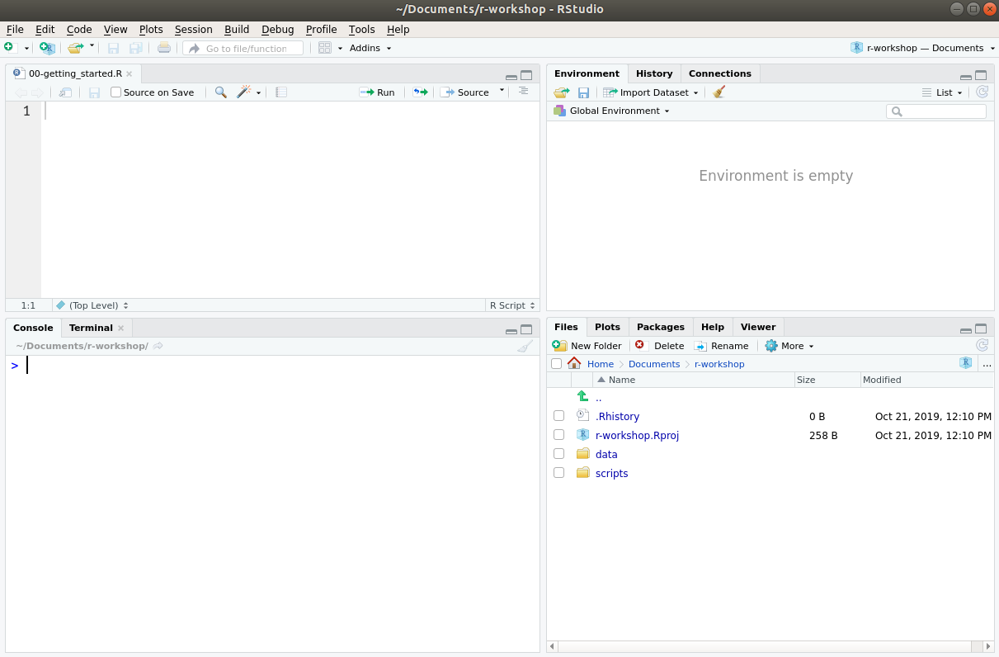
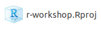

---
# Please do not edit this file directly; it is auto generated.
# Instead, please edit 00-starting_your_project.md in _episodes_rmd/
title: "Introduction to R and RStudio"
teaching: 20
exercises: 5
questions:
- "How to setup and organise an analysis project?"
- "How to interact with R and RStudio?"
- "How to install packages?"
objectives:
- "Navigate the RStudio GUI."
- "Create a new R project."
- "Write your first script run some basic commands."
- "Install additional packages."
keypoints:
- "Create an 'RStudio Project' whenever you are initiating a new analysis."
- "When you come back to work on the project, open the RProj file to resume your work."
- "Ensure your project directory is well structured, for example with directories for scripts and data."
- "To document your analysis write and save your code in scripts."
- "You should try to comment your code. Use `#` to write comments in your scripts."
- "Use `install.packages()` to install (or update) packages."
source: Rmd
---


## What is R? What is RStudio?

The term "**R**" is used to refer to both the programming language and the
software that interprets the scripts written using it.

**RStudio** is an additional software that makes it easier to 
interact with R by providing tools that make programming easier. 
To function correctly, RStudio needs R and therefore both need to be installed on your computer.

Some advantages of using R for your data analysis include:

- Analysis steps are documented with code, allowing for greater reproducibility. 
- There are thousands of packages (extensions) available, making R a very flexible 
  and powerful tool, for a wide range of applications. 
- Analysis can be scaled to large data.
- Can generate a wide range of high-quality graphics for data visualisation.
- There is a large community of contributors.
- It's free and open source.


### The RStudio Interface  

RStudio is divided into four "panes", illustrated below. 
The default layout is:

- Top Left - **Source**: this is where you edit your R scripts 
  (this panel might not appear until you create a script, which we demonstrate below).
- Bottom Left - **Console**: where R will execute commands and print results.
- Top Right - **Environment**: this will show you which objects you create 
  while working with R.
- Bottom Right - **Files**/**Plots**/**Packages**/**Help**: several tabs that allow 
  you to navigate your files, view plots, view installed packages and search help files. 





## Getting set up

It is good practice to keep a set of related data, analyses, and text
self-contained in a single folder called the **working directory** (usually a folder 
on your computer where you have all the files relating to a project you're working on). 
The working directory is an important concept to understand. It is the place
where R will look for and save files.

All of the scripts within this folder can then use *relative paths* to files. 
Relative paths indicate where inside the project a file is located (as opposed to 
absolute paths, which point to where a file is on a specific computer). 
Working this way makes it a lot easier to move your project around on your computer 
and share it with others without having to directly modify file paths in the individual 
scripts.

RStudio provides a helpful set of tools to do this through its **Projects**
interface, which not only creates a working directory for you but also remembers
its location (allowing you to quickly navigate to it). The interface also 
preserves custom settings and open files to make it easier to resume work after 
a break. 


### Creating a new project

Usually, you will already have a folder on your computer for your project, for 
example with some data you collected or downloaded from the web. 

In the [setup page](../setup.html), we gave instructions to download 
the data we'll be working with to a directory called `r-workshop`. 
At the moment, your directory should schematically look like:

```
r-workshop/
└── data
    └── raw
        ├── gapminder1960to2010_socioeconomic.csv
        └── gapminder2010_socioeconomic.csv
```
<p></p>

To create an _R Project_ within the `r-workshop` directory:

- From the upper menu on RStudio click: <kbd>File</kbd> > <kbd>New project</kbd> > <kbd>Existing directory</kbd>.
- Click the <kbd>browse...</kbd> button and navigate and open your `r-workshop` folder. 
- Click on <kbd>Create project</kbd>. This will initiate a fresh R session.

From now on, whenever you want to work on this project, open the the `Rproj` file 
that was created in your `r-workshop` folder, it should look similar to this: 


This will ensure your working directory is automatically set correctly. This also means 
that you can move the project folder to a different location or even different 
computer. As long as you open the `Rproj` file, your working directory will be set correctly. 

If you need to check your working directory, you can run `getwd()` on the console. 
If for some reason your working directory is not what it should be, you can change it in the
RStudio interface by navigating in the file browser (bottom-right panel) to where your working directory should be, clicking on the blue gear icon 
<kbd>More</kbd> > <kbd>Set As Working Directory</kbd>. 
Alternatively, you can run `setwd("/path/to/working/directory")` on the console to 
reset your working directory. However, your scripts should not include this line, 
because it will fail on someone else's computer.


### Organizing your working directory

Using a consistent folder structure across your projects will help keep things
organized and make it easy to find things in the future. In general, you might
create directories (folders) for **scripts**, **data**, and **documents**. Here
are some examples of suggested directories:

- **`data/raw`** Use this folder to store your raw data. 
  For the sake of transparency and [provenance](https://en.wikipedia.org/wiki/Provenance), you
  should *always* keep a copy of your raw data accessible and do as much of
  your data cleanup and preprocessing programmatically (i.e., with scripts,
  rather than manually) as possible.
- **`data/processed`** When you need to modify your raw data,
  it might be useful to store the modified versions of the datasets in a different folder.
- **`documents/`** Used for outlines, drafts, and other text.
- **`fig_output/`** This folder can store the graphics that are generated
  by your scripts.
- **`scripts/`** A place to keep your R scripts for
  different analyses or plotting.

You may want additional directories or subdirectories depending on your project
needs, but these should form the backbone of your working directory.


## Writting your first code 

Now that we have a project, let's run our first commands in R.

On the _console_ panel, type:


~~~
1 + 100
~~~
{: .language-r}

And R will print out the answer, with a preceding `[1]`. Don't worry about
this for now, we'll explain that later. For now think of it as indicating
output.

If you type in an incomplete command, R will wait for you to complete it:

~~~
> 1 +
~~~
{: .language-r}

~~~
+
~~~
{: .output}

Any time you hit return and the console shows a "`+`" instead of a "`>`", it
means it's waiting for you to complete the command. If you want to cancel a
command you can hit <kbd>Esc</kbd> and RStudio will give you back the `>` prompt.

When doing arithmetic operations, the order of those operations is the same as you
would have learned back in school. 
From highest to lowest precedence:

- Parentheses: `(`, `)`
- Exponents: `^`
- Divide: `/`
- Multiply: `*`
- Add: `+`
- Subtract: `-`


~~~
3 + 5 * 2     # 5 * 2 will be evaluated first
(3 + 5) * 2   # 3 + 5 will be evaluated first
~~~
{: .language-r}

The text after each line of code is called a **comment**. 
Anything that follows after the hash `#` symbol is ignored by R when it executes code.
Comments are extremely important part of the code, as they help you document the 
logic of the analysis you are running. 

Really small or large numbers get a scientific notation:


~~~
2/10000
~~~
{: .language-r}


~~~
[1] 2e-04
~~~
{: .output}

The `e` is shorthand for "multiplied by 10<sup>x</sup>". So `2e-4`
is shorthand for `2 * 10^(-4)`.

You can write numbers in scientific notation too:


~~~
5e3  # same as 5 * 10^3
~~~
{: .language-r}


~~~
[1] 5000
~~~
{: .output}


### Creating scripts

So far, we've been typing these commands directly in the R console. However, if we 
closed RStudio and later wanted to recreate these operations, there would be no 
record of them anywhere. 

In practice, we should always write our code in a **script**, which is a plain text 
document with our commands written in it. 
To create a new R script go to <kbd>File</kbd> > <kbd>New File</kbd> > <kbd>R Script</kbd>.

This will open a panel on the top-left. This is a text editor, which in RStudio 
does some syntax highlighting (it colours the code) to help read the code. 

As you're adding code to the script, you can run it interactively on the console 
by pressing the shortcut <kbd>Ctrl</kbd>+<kbd>Enter</kbd>. 


## Installing (or updating) packages

Additional packages can be installed to extend the functionality of R. 
Most packages are available in a central repository called CRAN and can be 
installed from within R using the `install.packages()` function.

For example, to install (or update) the `tidyverse` package, you would run the 
following command on the console:


~~~
install.packages("tidyverse")
~~~
{: .language-r}

Because the install process accesses the CRAN repository, you will need an Internet 
connection to install packages.

After this, you can then load the package to use it in your analysis (we will see 
how to do this later).

There are other repositories available. A very popular one is the [Bioconductor](https://bioconductor.org/)
project, which contains thousands of packages for bioinformatics applications. 
These use a different installation command, but the instructions are always given 
in each package's page. 

> ## Challenge
> 
> Install the package `ggbeeswarm`, which will give you extended functionality for the 
> visualisation package `ggplot2` (which we will cover in a future episode).
>
> > ## Solution 
> > 
> > ~~~
> > # this will download and install the package
> > install.packages("ggbeeswarm")
> > ~~~
> > {: .language-r}
> {: .solution}
{: .challenge}


> ## Data Tip: Organising your Analysis Project
> 
> A key step for a successful analysis is to start with a tidy directory structure. 
> This ensures that you can keep track of what each file is and can avoid many 
> headaches when analysis gets more complex. 
> 
> Here's some practical suggestions: 
> 
> - Early in your project create a few sub-directories such as `scripts`, `data/raw`, 
>   `data/processed`, `figures` and any others that might be relevant for your specific 
>   work. 
> - To ensure reproducibility, save your code in _scripts_ and define file paths 
>   _relative_ to your project's folder.
> - Keep your raw data separate from processed data, so that you can go back to it 
>   if needed. 
> - In RStudio specifically, you can create an "R Project" within your project's folder 
>   (<kbd>File</kbd> > <kbd>New Project...</kbd>). This will ensure you always have 
>   the right working directory set up.
{: .discussion}
