---
# Please do not edit this file directly; it is auto generated.
# Instead, please edit 03-data_vis_ggplot2.md in _episodes_rmd/
title: "Data visualisation with `ggplot2`"
teaching: 50
exercises: 30
questions:
  - "How to build a graph in R?"
  - "What types of visualisation are suitable for different types of data?"
objectives: 
  - "Recognise the necessary elements to build a plot using the `ggplot2` package."
  - "Define data, aesthetics and geometries for a basic graph."
  - "Distinguish when to use or not to use `aes()` to change graph's aesthetics (e.g. colours, shapes)."
  - "Overlay multiple geometries on the same graph and define aesthetics separately for each."
  - "Adjust and customise scales and labels in the graph."
  - "Use `ggplot2` to produce several kinds of visualisations (for continuous and/or discrete data)."
  - "Distinguish which types of visualisation are adequate for different types of data and questions."
  - "Discuss the importance of scales when analysing and/or visualising data"
keypoints:
  - "To build a `ggplot2` graph you need to define: _data_, _aesthetics_, _geometries_ (and _scales_)."
  - "To change an _aesthetic_ of our graph **based on data**, include it **inside `aes()`**."
  - "To **manually** change an _aesthetic_ regardless of data then it goes **outside `aes()`**."
  - "You can overlay multiple geometries in the same graph, and control their aesthetics individually."
  - "Adjust scales of your graph using `scale_*` family of functions."
  - "You can custommise your graphs using pre-defined themes (e.g. `theme_classic()`) or more finely with the `theme()` function."
  - "To save graphs use the `ggsave()` function."
source: Rmd
---


In this lesson we're going to learn how to build graphs using the `ggplot2` package 
(part of `tidyverse`). 
By the end of this lesson, you should be able to recreate some of the graphs below.


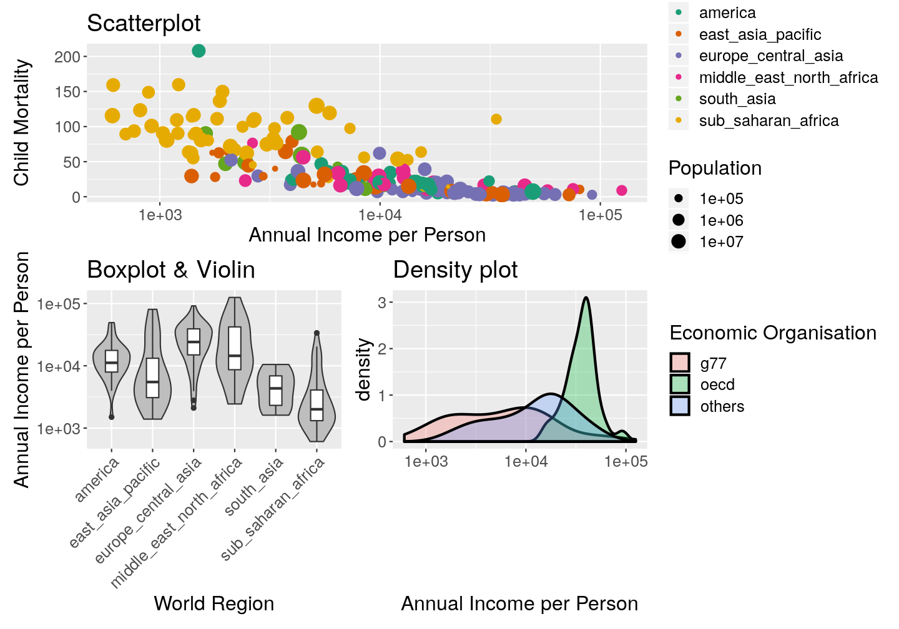


As usual when starting an analysis on a new script, let's start by loading the 
packages and reading the data:


~~~
library(tidyverse)

# Read the data, specifying how missing values are encoded
gapminder2010 <- read_csv("data/raw/gapminder2010_socioeconomic.csv", 
                          na = "")
~~~
{: .language-r}


## Building a `ggplot2` graph

To build a `ggplot2` graph you need 3 basic pieces of information:

- A **data.frame** with data to be plotted
- The variables (columns of `data.frame`) that will be _mapped_ to different 
**aesthetics** of the graph (e.g. axis, colours, shapes, etc.)
- the **geometry** that will be drawn on the graph (e.g. points, lines, 
boxplots, violinplots, etc.)

This translates into the following basic syntax:

``` r
ggplot(data = <data.frame>, 
       mapping = aes(x = <column of data.frame>, y = <column of data.frame>)) +
   geom_<type of geometry>()
```


For our first visualisation, let's try to recreate one of the visualisations 
from [Hans Rosling's talk](https://www.ted.com/talks/hans_rosling_shows_the_best_stats_you_ve_ever_seen?utm_campaign=tedspread&utm_medium=referral&utm_source=tedcomshare).
The question we're interested in is: how much separation is there between 
different world regions in terms of family size and life expectancy? 
We will explore this by using a [scatterplot](https://www.data-to-viz.com/graph/scatter.html)
showing the relationship between `children_per_woman` and `life_expectancy`. 

Let's do it step-by-step to see how `ggplot2` works. 
Start by giving data to `ggplot`:


~~~
ggplot(data = gapminder2010)
~~~
{: .language-r}


That "worked" (as in, we didn't get an error). 
But because we didn't give `ggplot()` any variables to be _mapped_ to _aesthetic_ 
components of the graph, we just got an empty square. 

For **mappping columns to aesthetics**, we use the `aes()` function:


~~~
ggplot(data = gapminder2010, 
       mapping = aes(x = children_per_woman, y = life_expectancy))
~~~
{: .language-r}


That's better, now we have some axis. Notice how `ggplot()` defines the axis based 
on the range of data given. 
But it's still not a very interesting graph, because we didn't tell what it is we 
want to draw on the graph.

This is done by adding (literally `+`) **geometries** to our graph:


~~~
ggplot(data = gapminder2010, 
       mapping = aes(x = children_per_woman, y = life_expectancy)) +
  geom_point()
~~~
{: .language-r}


~~~
Warning: Removed 9 rows containing missing values (geom_point).
~~~
{: .error}

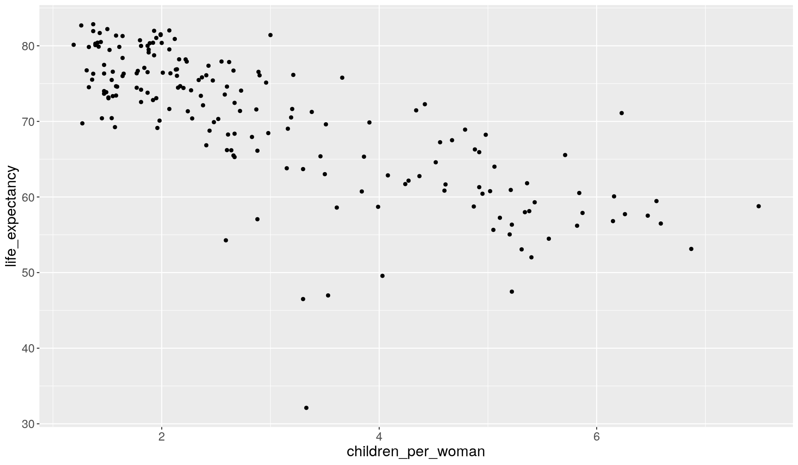

Notice how `geom_point()` warns you that it had to remove some missing values
(if the data is missing for at least one of the variables, then it cannot plot 
the points).


> ## Exercise
> 
> It would be useful to explore the pattern of missing data in these two variables. 
> The `naniar` package provides a ggplot geometry that allows us to do this, 
> by replacing `NA` values with values 10% lower than the minimum in the variable. 
> 
> Try and modify the previous graph, using the `geom_miss_point()` from this package. 
> (hint: don't forget to load the package first using `library()`)
> 
> What can you conclude from this exploration? Are the data missing at random?
> 
> > ## Answer
> > 
> > 
> > ~~~
> > library(naniar) # load the naniar package; this should be placed on top of the script
> > 
> > ggplot(data = gapminder2010, 
> >        mapping = aes(x = children_per_woman, y = life_expectancy)) +
> >   geom_miss_point()
> > ~~~
> > {: .language-r}
> > 
> > 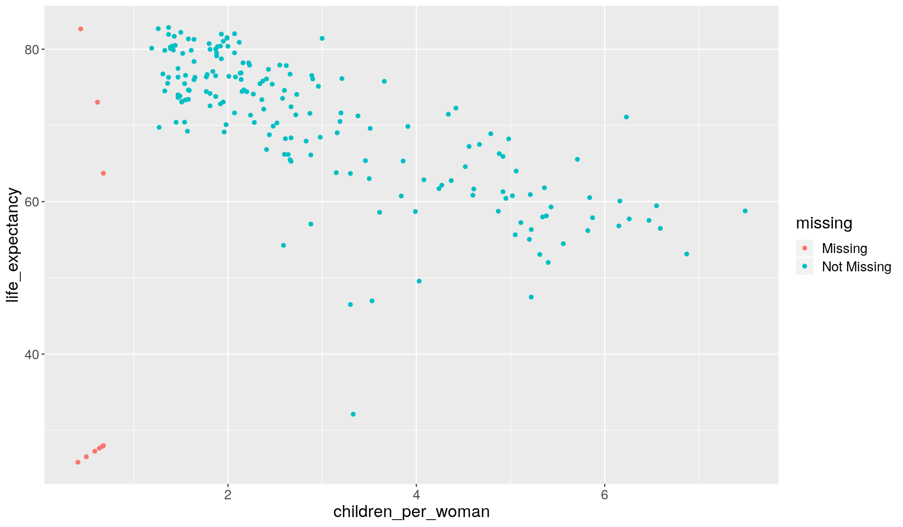
> > 
> > The data do not seem to be missing at random: it seems to be the case that 
> > when data is missing for one variable it is often also missing for the other. 
> > And there seem to be more missing data for `children_per_woman` than `life_expectancy`.
> > However, we only have 9 cases with missing data, so perhaps we should not 
> > make very strong conclusions from this. But it gives us more questions that 
> > we could follow up on: are the countries with missing data generaly lacking 
> > other statistics? Is it harder to obtain data for fertility than 
> > for life expectancy?
> > 
> {: .solution}
{: .challenge}


### Changing how geometries look like

We can change how geometries look like in several ways, for example their transparency, 
colour, size, shape, etc. 

To know which _aesthetic_ components can be changed in a particular geometry, 
look at its documentation (e.g. `?geom_point`) and look under the "Aesthetics" section 
of the help page. For example, the documentation for `?geom_point` says:

> geom_point() understands the following aesthetics (required aesthetics are in bold):
> - **x**
> - **y**
> - alpha
> - colour
> - fill
> - group
> - shape
> - size
> - stroke

For example, we can change the transparency of the points in our scatterplot using 
`alpha` (`alpha` varies between 0-1 with zero being transparent and 1 being opaque):


~~~
ggplot(data = gapminder2010, 
       mapping = aes(x = children_per_woman, y = life_expectancy)) +
  geom_point(alpha = 0.5)
~~~
{: .language-r}

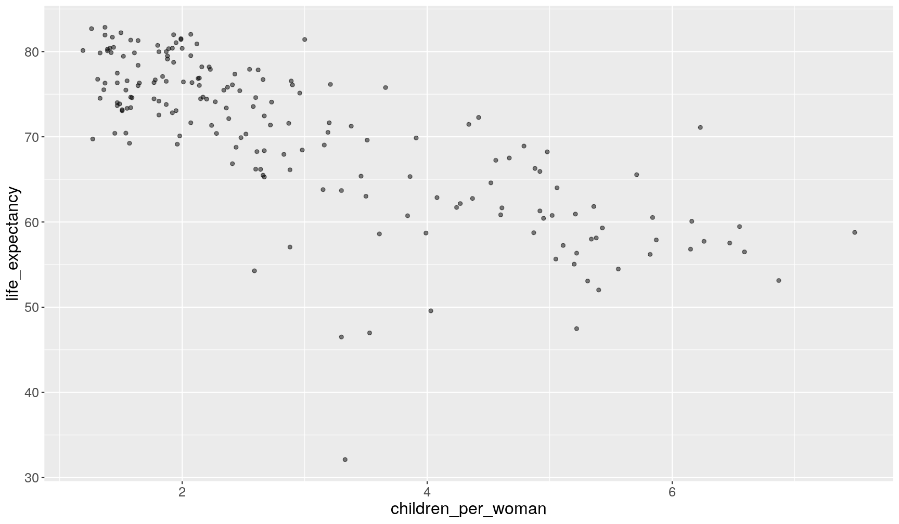

Adding transparency to points is useful when data is very packed, as you can then 
see which areas of the graph are more densely occupied with points. 


> ## Exercise
> 
> Try changing the _size_, _shape_ and _colour_ of the points 
> (hint: web search "ggplot2 point shapes" to see how to make a triangle)
> 
> > ## Solution
> > 
> > 
> > ~~~
> > ggplot(data = gapminder2010, 
> >        mapping = aes(x = children_per_woman, y = life_expectancy)) +
> >   geom_point(size = 3, shape = 6, colour = "brown")
> > ~~~
> > {: .language-r}
> > 
> > 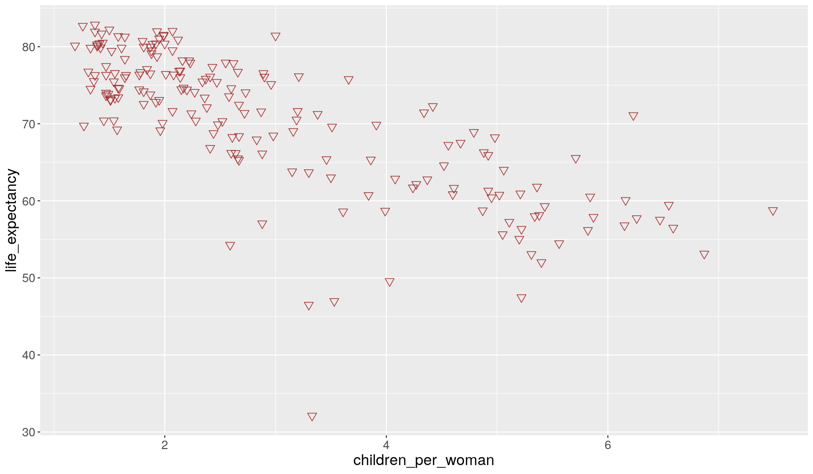
> > 
> {: .solution}
{: .challenge}


### Changing aesthetics based on data

In the above exercise we changed the colour of the points by defining it ourselves. 
However, it would be better if we coloured the points based on a variable of interest. 

For example, to explore our question of how different world regions really are, 
we want to colour the countries in our graph accordingly. 

We can do this by passing this information to the `colour` aesthetic _inside_ the 
`aes()` function:


~~~
ggplot(data = gapminder2010, 
       mapping = aes(x = children_per_woman, y = life_expectancy, colour = world_region)) +
  geom_point()
~~~
{: .language-r}

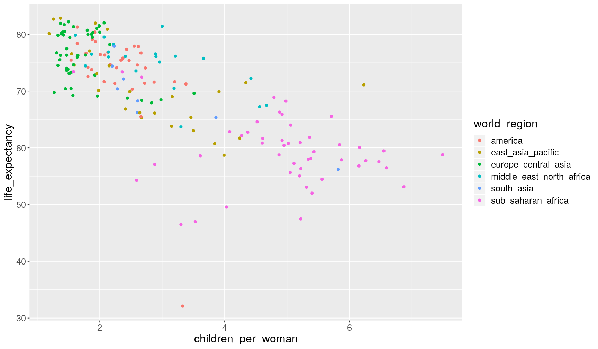

> ## Aesthetics: inside or outside `aes()`?
> 
> The previous examples illustrate an important distinction between _aesthetics_ 
> defined inside or outside of `aes()`:
> 
> - if you want the _aesthetic_ to change **based on the data** it goes **inside `aes()`**
> - if you want to **manually specify** how the geometry should look like, it goes **outside `aes()`**
>
{: .callout}


> ## Exercise
> 
> Make a [boxplot](https://www.data-to-viz.com/caveat/boxplot.html) that
> shows the distribution of `children_per_woman` (y-axis) for each `world_region` 
> (x-axis). (Hint: `geom_boxplot()`)
>
> **Bonus:** Colour the _inside_ of the boxplots by `income_groups`.
> 
> > ## Solution
> > 
> > 
> > ~~~
> > ggplot(data = gapminder2010,
> >        aes(x = world_region, y = children_per_woman)) +
> >   geom_boxplot()
> > ~~~
> > {: .language-r}
> > 
> > 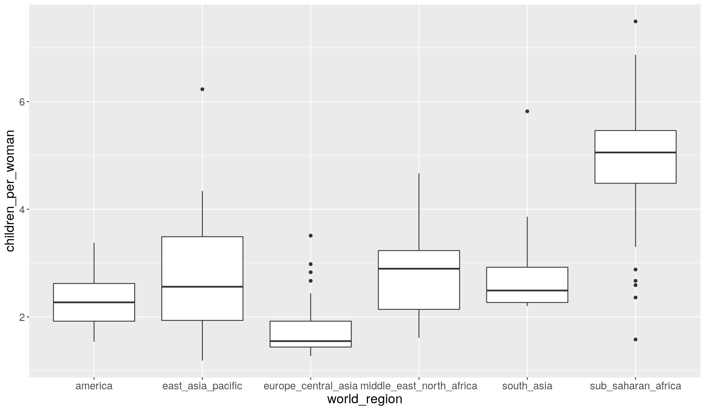
> > 
> > To colour the inside of the boxplot we use the _fill_ geometry. 
> > `ggplot2` will automatically split the data into the groups and make a boxplot 
> > for each.
> > 
> > 
> > ~~~
> > ggplot(data = gapminder2010,
> >        aes(x = world_region, y = children_per_woman, fill = income_groups)) +
> >   geom_boxplot()
> > ~~~
> > {: .language-r}
> > 
> > 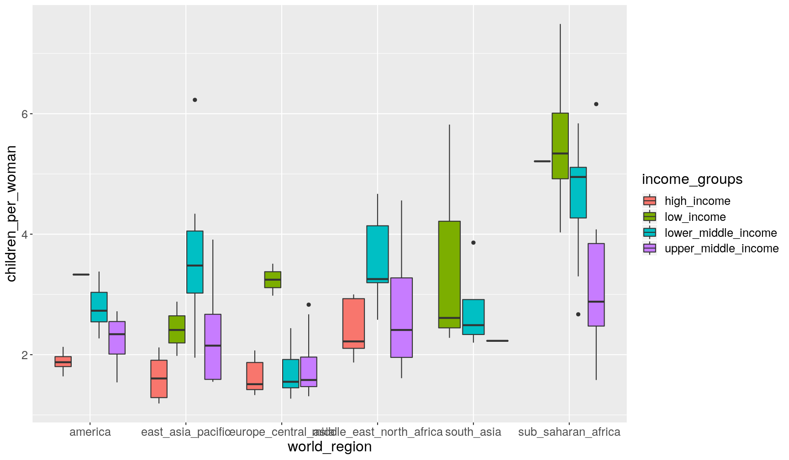
> > 
> > Some groups have too few observations (possibly only 1) and so we get odd boxplots 
> > with only a line representing the median, because there isn't enough variation 
> > in the data to have distinct quartiles.
> > 
> > Also, the labels on the x-axis are all overlapping each other. We will see how 
> > to solve this later. 
> > 
> {: .solution}
{: .challenge}


### Multiple geometries

Often, we may want to overlay several geometries on top of each other. For example, 
add a [violin plot](https://www.data-to-viz.com/graph/violin.html) together with 
a boxplot so that we get both representations of the data in a single graph. 

Let's start by making a violin plot:


~~~
# scale the violins by "width" rather than "area", which is the default
ggplot(gapminder2010, aes(x = world_region, y = children_per_woman)) +
  geom_violin(scale = "width")
~~~
{: .language-r}

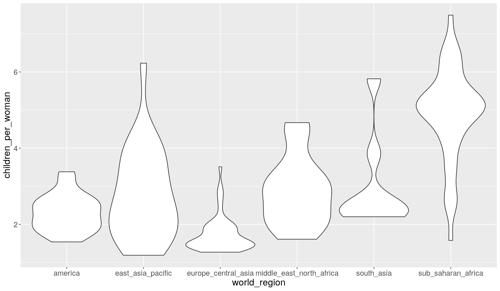

To layer a boxplot on top of it we "add" (with `+`) another geometry to the graph:


~~~
# Make boxplots thinner so the shape of the violins is visible
ggplot(gapminder2010, aes(x = world_region, y = children_per_woman)) +
  geom_violin(scale = "width") +
  geom_boxplot(width = 0.2)
~~~
{: .language-r}

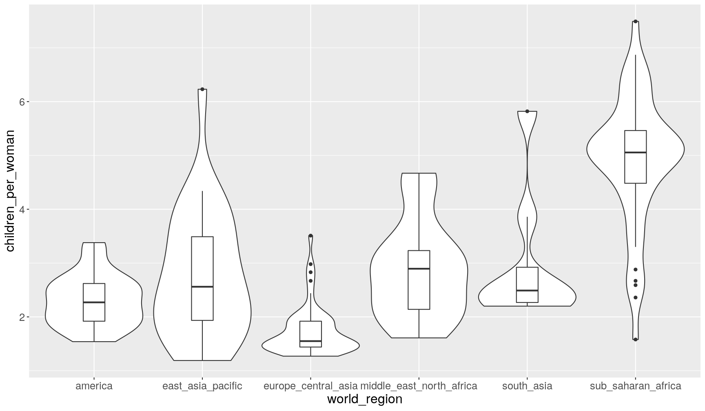

The order in which you add the geometries defines the order they are "drawn" on the graph. 
For example, try swapping their order and see what happens.

Notice how we've shortened our code by omitting the names of the 
options `data = ` and `mapping = ` inside `ggplot()`. Because the data is always 
the first thing given to `ggplot()` and the mapping is always identified by the 
function `aes()`, this is often written in the more compact form as we just did. 


### Controlling aesthetics in individual geometries

Let's say that, in the graph above, we wanted to colour the violins by world region, 
but keep the boxplots without colour. 

As we've learned, because we want to colour our geometries _based on data_, this goes inside the 
`aes()` part of the graph:


~~~
# use the `fill` aesthetic, which colours the **inside** of the geometry
ggplot(gapminder2010, aes(x = world_region, y = children_per_woman, fill = world_region)) +
  geom_violin(scale = "width") +
  geom_boxplot(width = 0.2)
~~~
{: .language-r}

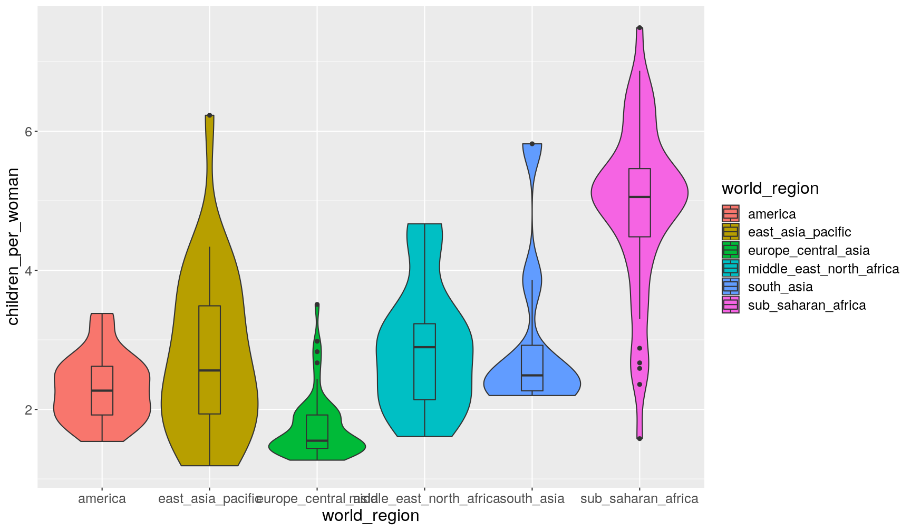

OK, this is not what we wanted. Both _geometries_ (boxplots and violins) got coloured. 

It turns out that we can control aesthetics individually in each geometry, 
by puting the `aes()` inside the geometry function itself.
Like this:


~~~
ggplot(gapminder2010, aes(x = world_region, y = children_per_woman)) +
  geom_violin(aes(fill = world_region), scale = "width") +
  geom_boxplot(width = 0.2)
~~~
{: .language-r}

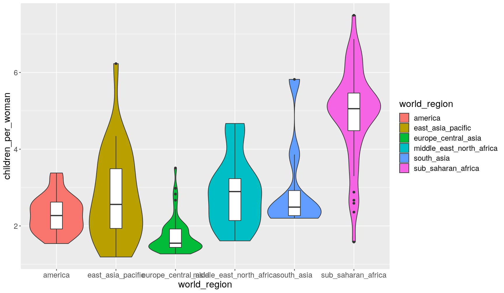


> ## Exercise
> 
> Modify the graph above by colouring the inside of the boxplots by world region 
> and the inside of the violins in grey colour. 
> 
> Although we decided to colour our violin plots, is this colouring necessary?
> 
> > ## Solution
> > 
> > Because we want to define the fill colour of the violin "manually" it goes 
> > _outside_ `aes()`. Whereas for the violin we want the fill to depend on a 
> > column of data, so it goes inside `aes()`.
> > 
> > 
> > ~~~
> > ggplot(gapminder2010, aes(x = world_region, y = children_per_woman)) +
> >   geom_violin(fill = "grey", scale = "width") +
> >   geom_boxplot(aes(fill = world_region), width = 0.2)
> > ~~~
> > {: .language-r}
> > 
> > 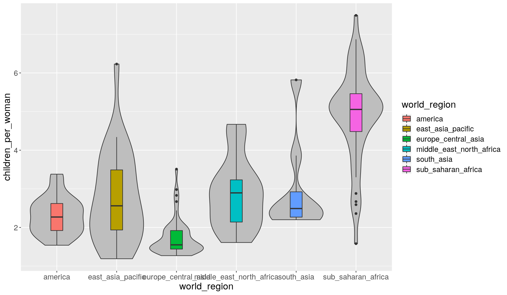
> > 
> > Although this graph looks appealing, the colour is redundant with the x-axis 
> > labels. So, the same information is being shown with multiple _aesthetics_. 
> > This is not necessarily incorrect, but we should generally 
> > [avoid too much gratuitous use of colour in graphs](https://serialmentor.com/dataviz/color-pitfalls.html). 
> > At the very least we should remove the legend from this graph. 
> > 
> {: .solution}
{: .challenge}


## Facets

You can split your plot into multiple panels by using _facetting_. 
There are two types of _facet_ functions:

- `facet_wrap()` arranges a one-dimensional sequence of panels to fit on one page.
- `facet_grid()` allows you to form a matrix of rows and columns of panels.

Both geometries allow to to specify faceting variables specified with `vars()`. 
In general: 

- `facet_wrap(facets = vars(facet_variable))` 
- `facet_grid(rows = vars(row_variable), cols = vars(col_variable))`.

For example, if we want to visualise the scatterplot above split by `income_groups`:


~~~
ggplot(gapminder2010, 
       aes(x = children_per_woman, y = life_expectancy, colour = world_region)) +
  geom_point() +
  facet_wrap(facets = vars(income_groups))
~~~
{: .language-r}

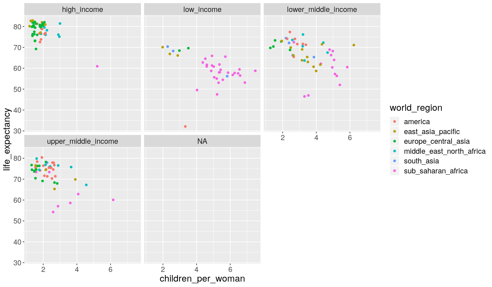

If instead we want a _matrix_ of facets to display `income_groups` and `economic_organisation`, 
then we use `facet_grid()`:


~~~
ggplot(gapminder2010, 
       aes(x = children_per_woman, y = life_expectancy, colour = world_region)) +
  geom_point() +
  facet_grid(rows = vars(income_groups), cols = vars(is_oecd))
~~~
{: .language-r}

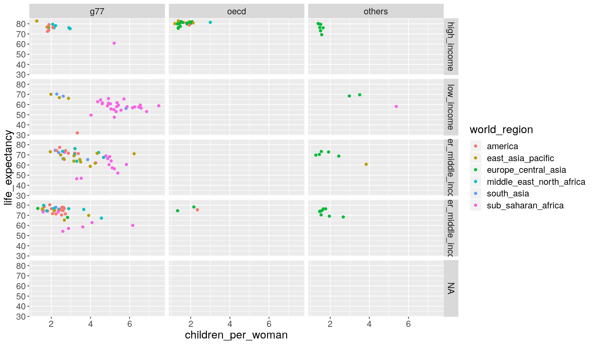

Finally, with `facet_grid()`, you can organise the panels just by rows or just by columns.
Try running this code yourself:


~~~
# One column, facet by rows
ggplot(gapminder2010, 
       aes(x = children_per_woman, y = life_expectancy, colour = world_region)) +
  geom_point() +
  facet_grid(rows = vars(is_oecd))

# One row, facet by column
ggplot(gapminder2010, 
       aes(x = children_per_woman, y = life_expectancy, colour = world_region)) +
  geom_point() +
  facet_grid(cols = vars(is_oecd))
~~~
{: .language-r}


## Modifying scales

Often you want to change how the scales of your plot are defined. 
In `ggplot2` scales can refer to the _x_ and _y_ aesthetics, but also to other 
aesthetics such as _colour_, _shape_, _fill_, etc. 

We modify scales using the _scale_ family of functions. 
These functions always follow the following naming convention: `scale_<aesthetic>_<type>`, 
where:

- `<aesthetic>` refers to the aesthetic for that scale function (e.g. `x`, `y`, 
  `colour`, `fill`, `shape`, etc.)
- `<type>` refers to the type of aesthetic (e.g. `discrete`, `continuous`, `manual`)

Let's see some examples.


### Change a numerical axis scale

Taking the graph from the previous exercise we can modify the x and y axis scales, 
for example to emphasise a particular range of the data and define the breaks of 
the axis ticks. 


~~~
# Emphasise countries with 1-3 children and > 70 years life expectancy
ggplot(gapminder2010, 
       aes(x = children_per_woman, y = life_expectancy)) +
  geom_point() +
  scale_x_continuous(limits = c(1, 3), breaks = seq(0, 3, by = 1)) +
  scale_y_continuous(limits = c(70, 85))
~~~
{: .language-r}

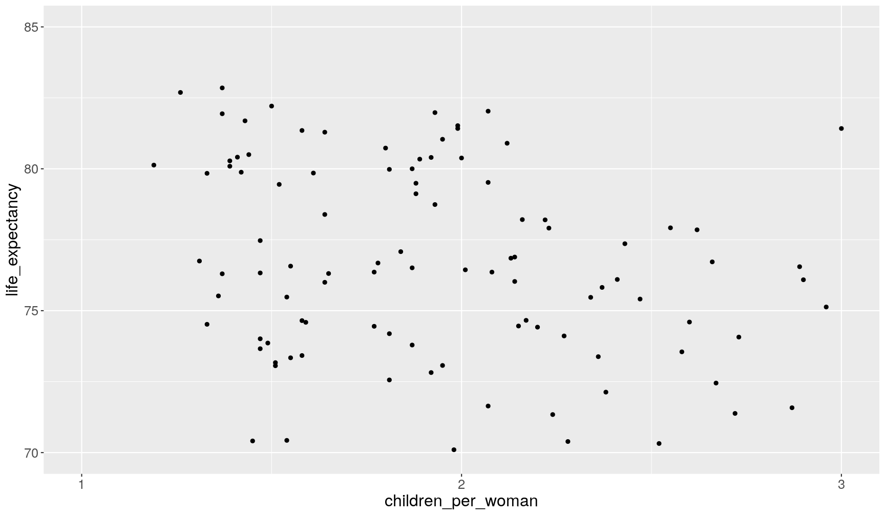

You can also apply transformations to the data. 
For example, consider the distribution of income across countries, represented 
using a [histogram](https://www.data-to-viz.com/graph/histogram.html):


~~~
ggplot(gapminder2010, aes(x = income_per_person)) +
  geom_histogram()
~~~
{: .language-r}


~~~
`stat_bin()` using `bins = 30`. Pick better value with `binwidth`.
~~~
{: .output}

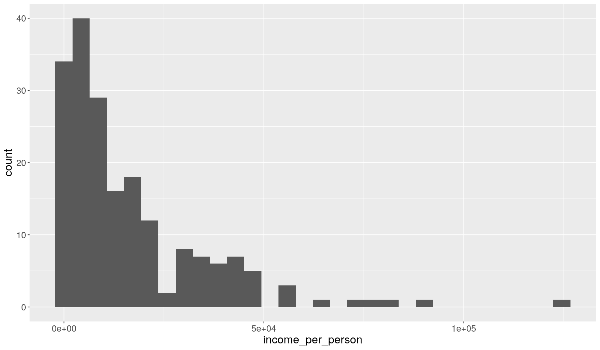

We can see that this distribution is [highly skewed](https://en.wikipedia.org/wiki/Skewness), 
with some countries having very large values, while others having very low values. 
One common data transformation to solve this issue is to log-transform our values. 
We can do this within the scale function:


~~~
ggplot(gapminder2010, aes(x = income_per_person)) +
  geom_histogram() +
  scale_x_continuous(trans = "log10")
~~~
{: .language-r}


~~~
`stat_bin()` using `bins = 30`. Pick better value with `binwidth`.
~~~
{: .output}

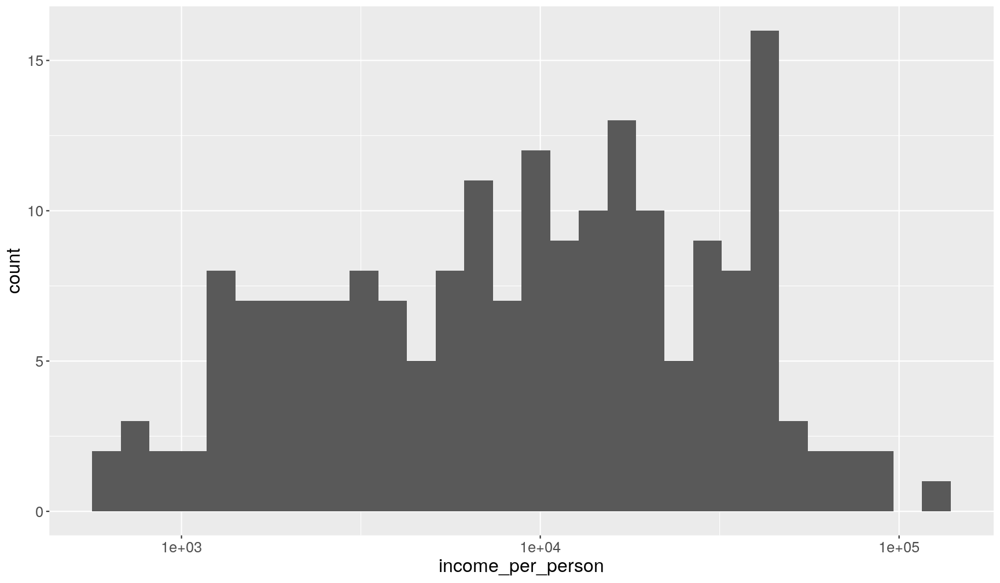

Notice how the interval between the x-axis values is not constant anymore, we go 
from \$1000 to \$10,000 and then to \$100,000. That's because our data is now 
plotted on a log-scale. 

You could transform the data directly in the variable given to x:


~~~
ggplot(gapminder2010, aes(x = log10(income_per_person))) +
  geom_histogram()
~~~
{: .language-r}

This is also fine, but in this case the x-axis scale would show you the log-transformed 
values, rather than the original values. (Try running the code yourself to see the 
difference!)


### Change numerical fill/colour scales

Let's get back to our initial scatterplot and colour the points by income:


~~~
ggplot(data = gapminder2010, 
       mapping = aes(x = children_per_woman, y = life_expectancy)) +
  geom_point(aes(colour = income_per_person))
~~~
{: .language-r}

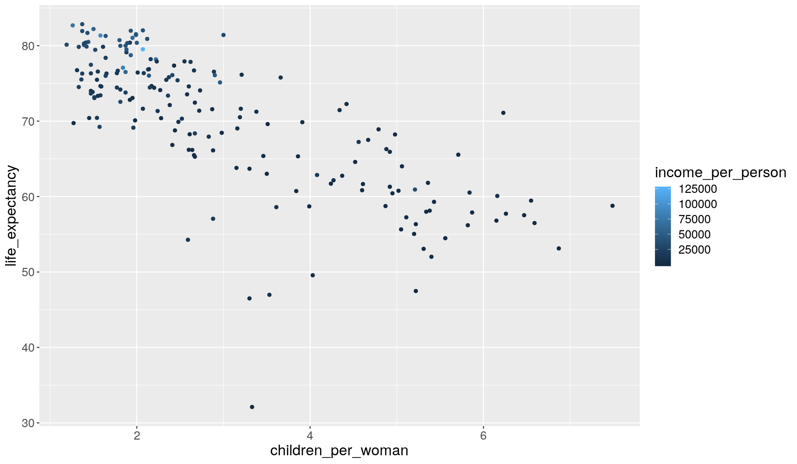

Because `income_per_person` is a continuous variable, _ggplot_ created a _gradient_ 
colour scale. 

We can change the default using `scale_colour_gradient()`, defining two colours 
for the lowest and highest values (and we can also log-transform the data like before):


~~~
ggplot(data = gapminder2010, 
       mapping = aes(x = children_per_woman, y = life_expectancy)) +
  geom_point(aes(colour = income_per_person)) +
  scale_colour_gradient(low = "steelblue", high = "brown", trans = "log10")
~~~
{: .language-r}

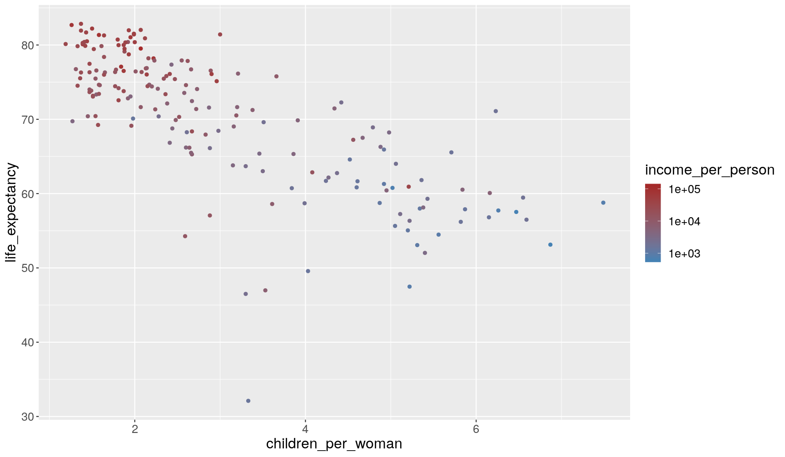

For continuous colour scales we can use the 
[_viridis_ palette](https://cran.r-project.org/web/packages/viridis/vignettes/intro-to-viridis.html), 
which has been developed to be colour-blind friendly and perceptually better:


~~~
ggplot(data = gapminder2010, 
       mapping = aes(x = children_per_woman, y = life_expectancy)) +
  geom_point(aes(colour = income_per_person)) +
  scale_colour_viridis_c(trans = "log10")
~~~
{: .language-r}

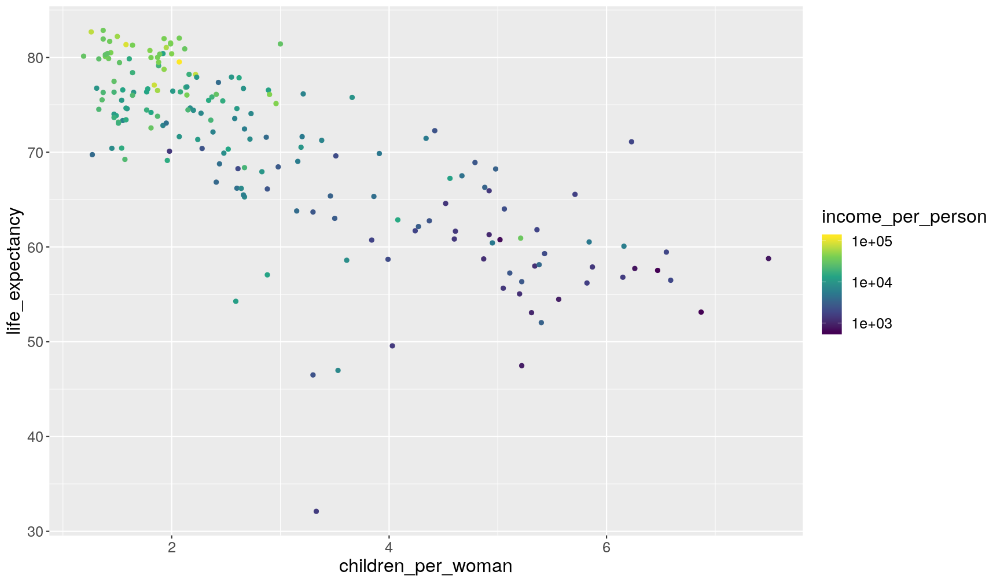


### Change a discrete axis scale

Earlier, when we did our boxplot, the x-axis was a categorical variable. 

For categorical axis scales, you can use the `scale_x_discrete()` and `scale_y_discrete()`
functions. For example, to _limit_ which categories are shown and in which order:


~~~
ggplot(gapminder2010, aes(x = world_region, y = children_per_woman)) +
  geom_boxplot(aes(fill = is_oecd)) +
  scale_x_discrete(limits = c("europe_central_asia", "america"))
~~~
{: .language-r}

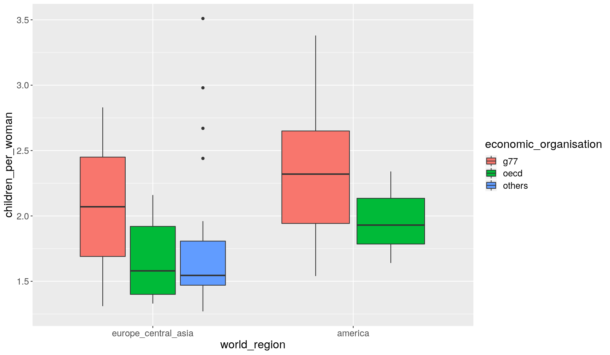


### Change categorical colour/fill scales

Taking the previous plot, let's change the `fill` scale to define custom colours 
"manually". 


~~~
ggplot(gapminder2010, aes(x = world_region, y = children_per_woman)) +
  geom_boxplot(aes(fill = is_oecd)) +
  scale_x_discrete(limits = c("europe_central_asia", "america")) +
  scale_fill_manual(values = c("TRUE" = "brown", 
                               "FALSE" = "green3"))
~~~
{: .language-r}

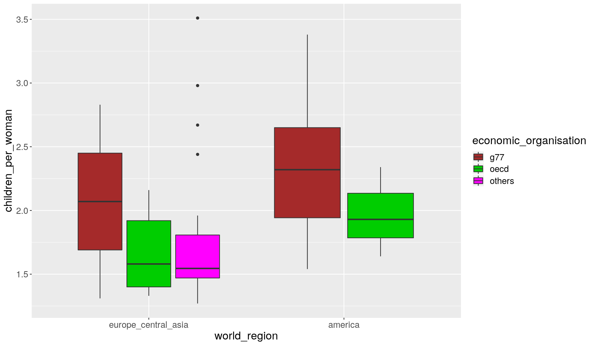

For colour/fill scales there's a very convenient variant of the `scale` function 
("brewer") that has some pre-defined palettes, including colour-blind friendly 
ones:


~~~
# The "Dark2" palette is colour-blind friendly
ggplot(gapminder2010, aes(x = world_region, y = children_per_woman)) +
  geom_boxplot(aes(fill = is_oecd)) +
  scale_x_discrete(limits = c("europe_central_asia", "america")) +
  scale_fill_brewer(palette = "Dark2")
~~~
{: .language-r}

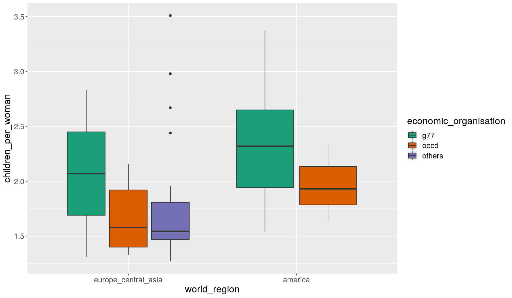

You can see all the available palettes [here](https://r4ds.had.co.nz/graphics-for-communication.html#fig:brewer). 
Note that some palettes only have a limited number of colours and `ggplot` will 
give a warning if it has fewer colours available than categories in the data. 


> ## Exercise
> 
> Modify the following code so that the point size is defined by the population size. 
> The size should be on a log scale. 
> 
> 
> ~~~
> ggplot(data = gapminder2010, 
>        mapping = aes(x = children_per_woman, y = life_expectancy)) +
>   geom_point(aes(colour = world_region)) +
>   scale_colour_brewer(palette = "Dark2")
> ~~~
> {: .language-r}
> 
> 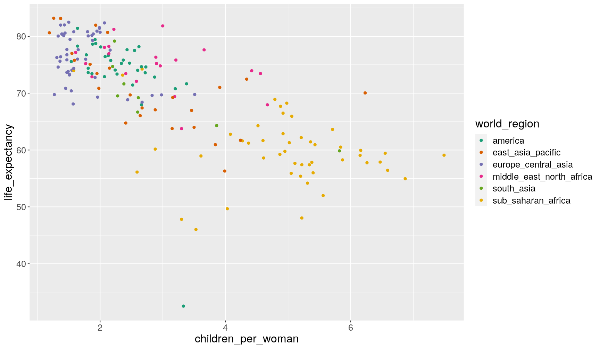
> 
> > ## Solution
> > 
> > To make points change by size, we add the _size_ aesthetic within the `aes()` function:
> > 
> > 
> > ~~~
> > ggplot(data = gapminder2010, 
> >        mapping = aes(x = children_per_woman, y = life_expectancy)) +
> >   geom_point(aes(colour = world_region, size = population)) +
> >   scale_colour_brewer(palette = "Dark2")
> > ~~~
> > {: .language-r}
> > 
> > 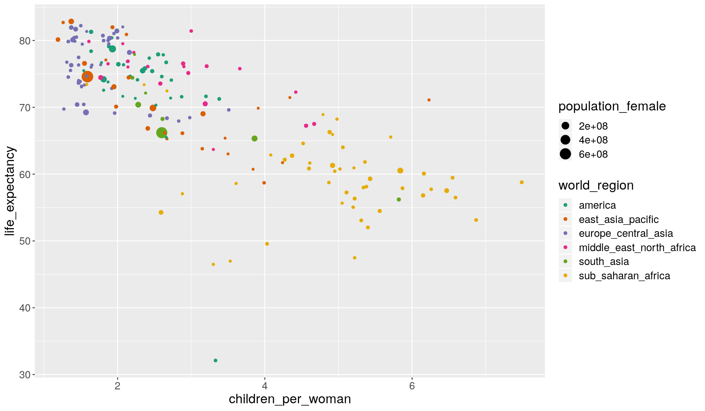
> > 
> > In this case the scale of the point's size is on the original (linear) scale.
> > To transform the scale, we can use `scale_size_continuous()`:
> > 
> > 
> > ~~~
> > ggplot(data = gapminder2010, 
> >        mapping = aes(x = children_per_woman, y = life_expectancy)) +
> >   geom_point(aes(colour = world_region, size = population)) +
> >   scale_colour_brewer(palette = "Dark2") +
> >   scale_size_continuous(trans = "log10")
> > ~~~
> > {: .language-r}
> > 
> > 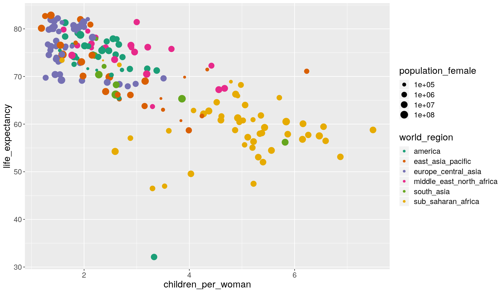
> {: .solution}
{: .challenge}


## Saving graphs

To save a graph, you can use the `ggsave()` function, which needs two pieces of 
information: 

- The _filename_ where it will save the graph to. The extension of this filename 
will determine the format of the file (e.g. `.pdf`, `.png`, `.jpeg`).
- The _plot_ you want to save. This can either be an object with a ggplot or, if 
not specified, it will be the last plot on your plotting window. 

You can also specify options for the size of the graph and dpi (for PNG  or JPEG). 


~~~
# save the plot stored in our "p" object as a PDF
# it will be 15cm x 7cm (default units is inches)
ggsave(filename = "figures/fertility_vs_life_expectancy.pdf",
       plot = p, 
       width = 15, 
       height = 7, 
       units = "cm")
~~~
{: .language-r}


Another easy way to save your graphs is by using RStudio's interface. From the "Plots" 
panel there is an option to "Export" the graph. However, doing it with code like 
above ensures reproducibility, and will allow you to track which files where generated 
from which script. 


## Customising your graphs

Every single element of a ggplot can be modified. This is further covered in a 
[future episode]({{ page.root }}).

---- 

> ## Data Tip: visualising data
> 
> Data visualisation is one of the fundamental elements of data analysis. 
> It allows you to assess variation within variables and relationships between variables. 
> 
> Choosing the right type of graph to answer particular questions (or convey a particular 
> message) can be daunting. The [data-to-viz](https://www.data-to-viz.com/) website can 
> be a great place to get inspiration from.
> 
> Here are some common types of graph you may want to do for particular situations:
> 
> - Look at variation within a single variable using _histograms_ (`geom_histogram()`) or,
>   less commonly (but [quite useful](https://towardsdatascience.com/what-why-and-how-to-read-empirical-cdf-123e2b922480)) 
>   _empirical cumulative density function_ plots (`stat_ecdf`).
> - Look at variation of a variable across categorical groups using _boxplots_ (`geom_boxplot()`), 
>   _violin plots_ (`geom_violin()`) or frequency polygons (`geom_freqpoly()`).
> - Look at the relationship between two numeric variables using _scatterplots_ 
>   (`geom_point()`).
> - If your x-axis is ordered (e.g. year) use a line plot (`geom_line()`) to convey 
>   the change on your y-variable.
>
> Also, make sure you represent data on a suitable scale, for example: 
> 
> - emphasising the right range of values (e.g. 
>   [should your axis start at zero?](https://www.data-to-viz.com/caveat/cut_y_axis.html))
> - use suitable data transformations (e.g. when comparing relative changes, consider 
>   a log-scale - see this [StatQuest video explaining logs](https://youtu.be/VSi0Z04fWj0)).
> 
> When used effectively, aesthetics (colour, shape, size, transparency, etc.) and 
> facets can be used to display many dimensions on a single graph. For example, 
> take the following graph:
> 
> 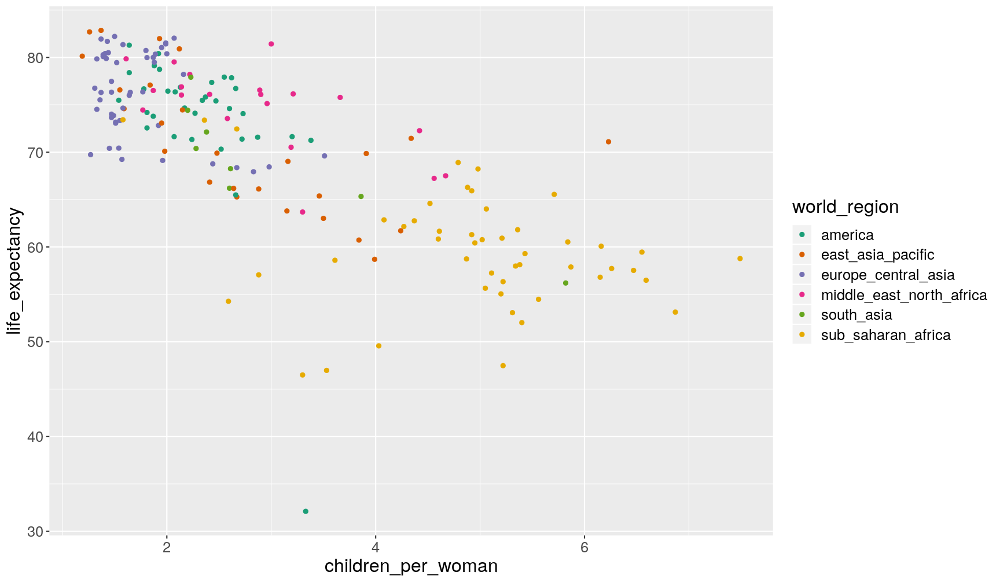
> 
> We were able to display 5 dimensions of our data: income (x-axis), life expectancy 
> (y-axis), fertility rate (colour), economic organisation (point shape), and 
> world region (facets). We also made the x-axis on a log-scale, because 
> this variable is highly skewed and this transformation allows the relationships 
> between the variables to be displayed more clearly. 
>
{: .discussion}


