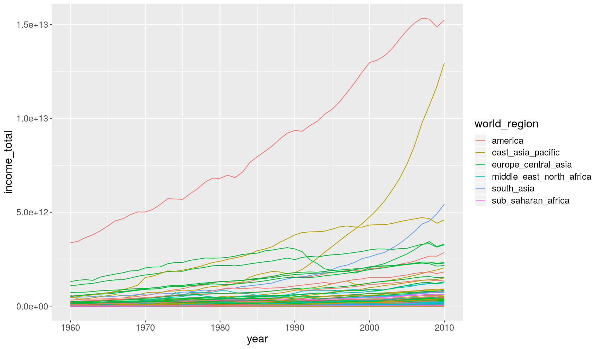

---
# Please do not edit this file directly; it is auto generated.
# Instead, please edit 04-manipulate_variables_dplyr.md in _episodes_rmd/
title: "Manipulating variables (columns) with `dplyr`"
teaching: 30
exercises: 20
questions:
- "How to select and/or rename specific columns from a data frame?"
- "How to create a new column or modify an existing one?"
- "How to 'chain' several commands together with pipes?"
objectives: 
- "Use the `dplyr` package to manipulate tabular data (add or modify variables, select and rename columns)."
- "Apply the functions `select()`, `rename()` and `mutate()` to operate on columns."
- "Understand and use 'pipes' as a way to build a chain of operations on data."
keypoints:
- "Use `dplyr::select()` to select columns from a table."
- "Select a range of columns using `:`, columns matching a string with `contains()`, and _unselect_ columns by using `-`."
- "Rename columns using `dplyr::rename()`."
- "Modify or update columns using `dplyr::mutate()`."
- "Chain several commands together with `%>%` pipes."
source: Rmd
---

In this lesson we're going to learn how to use the `dplyr` package to manipulate columns 
of our data. 

As usual when starting an analysis on a new script, let's start by loading the 
packages and reading the data. In this lesson we're going to start using the 
[full dataset](https://github.com/tavareshugo/r-eda-gapminder/raw/gh-pages/_episodes_rmd/data/raw/gapminder1960to2010_socioeconomic.csv) 
with data from 1960 to 2010:

~~~
library(tidyverse)

# Read the data, specifying how missing values are encoded
gapminder1960to2010 <- read_csv("data/raw/gapminder1960to2010_socioeconomic.csv", 
                                na = "")
~~~
{: .language-r}

## Selecting columns

In an [earlier episode]({{ page.root }}) we've seen how to select columns (and rows) of a data frame 
using the square-bracket operator `[rows, columns]`. 
With the `dplyr` package, there is an alternative function, which offers some flexibility 
in how we choose columns. 

Let's start with a simple example of selecting two columns from our table:

~~~
select(gapminder1960to2010, country, year)
~~~
{: .language-r}

~~~
# A tibble: 9,843 x 2
   country      year
   <chr>       <dbl>
 1 Afghanistan  1960
 2 Afghanistan  1961
 3 Afghanistan  1962
 4 Afghanistan  1963
 5 Afghanistan  1964
 6 Afghanistan  1965
 7 Afghanistan  1966
 8 Afghanistan  1967
 9 Afghanistan  1968
10 Afghanistan  1969
# … with 9,833 more rows
~~~
{: .output}

Using the _base R_ syntax, this is equivalent to `gapminder1960to2010[, c("country", "year")]`. 
Notice that with the `select()` function (and generally with `dplyr` functions) we 
didn't need to quote `"` the column names. This is because the first input to the 
function is the table name, and so everything after is assumed to be column names 
of that table. 

Where `select()` becomes very convenient is when combined with some other helper functions.
For example:

~~~
# Select columns which have the word "life" in their name
select(gapminder1960to2010, contains("life"))
~~~
{: .language-r}

~~~
# A tibble: 9,843 x 3
   life_expectancy life_expectancy_female life_expectancy_male
             <dbl> <chr>                                 <dbl>
 1            39.3 33.314                                 31.7
 2            40.0 33.84                                  32.2
 3            40.8 34.359                                 32.7
 4            41.5 34.866                                 33.2
 5            42.2 35.364                                 33.7
 6            43.0 35.853                                 34.2
 7            43.7 36.338                                 34.7
 8            44.5 36.823                                 35.1
 9            45.2 37.314                                 35.6
10            45.9 37.815                                 36.1
# … with 9,833 more rows
~~~
{: .output}

~~~
# Select all columns between country and year
select(gapminder1960to2010, country:year)
~~~
{: .language-r}

~~~
# A tibble: 9,843 x 3
   country     world_region  year
   <chr>       <chr>        <dbl>
 1 Afghanistan south_asia    1960
 2 Afghanistan south_asia    1961
 3 Afghanistan south_asia    1962
 4 Afghanistan south_asia    1963
 5 Afghanistan south_asia    1964
 6 Afghanistan south_asia    1965
 7 Afghanistan south_asia    1966
 8 Afghanistan south_asia    1967
 9 Afghanistan south_asia    1968
10 Afghanistan south_asia    1969
# … with 9,833 more rows
~~~
{: .output}

And these can be combined with each other:

~~~
select(gapminder1960to2010, country, contains("life"), contains("_per_"))
~~~
{: .language-r}

~~~
# A tibble: 9,843 x 6
   country life_expectancy life_expectancy… life_expectancy… children_per_wo…
   <chr>             <dbl> <chr>                       <dbl>            <dbl>
 1 Afghan…            39.3 33.314                       31.7             7.45
 2 Afghan…            40.0 33.84                        32.2             7.45
 3 Afghan…            40.8 34.359                       32.7             7.45
 4 Afghan…            41.5 34.866                       33.2             7.45
 5 Afghan…            42.2 35.364                       33.7             7.45
 6 Afghan…            43.0 35.853                       34.2             7.45
 7 Afghan…            43.7 36.338                       34.7             7.45
 8 Afghan…            44.5 36.823                       35.1             7.45
 9 Afghan…            45.2 37.314                       35.6             7.45
10 Afghan…            45.9 37.815                       36.1             7.45
# … with 9,833 more rows, and 1 more variable: income_per_person <dbl>
~~~
{: .output}

To see other helper functions to use with `select()` check the following help page 
`?select_helpers`.

Finally, it can sometimes be helpful to _unselect_ some columns. We can do this 
by appending `-` before the column names we want to exclude, for example try running:

~~~
select(gapminder1960to2010, -country, -life_expectancy)
~~~
{: .language-r}

> ## `dplyr` syntax
> 
> All `dplyr` functions follow the following convention:
> 
> - The _first input_ to the function is always a `data.frame`/`tibble`.
> - Next come other inputs specific to the function. Column names usually don't need 
>   to be quoted `"`.
> - The _output_ is always a `data.frame`/`tibble`.
{: .callout}

## Renaming columns 

Use the `rename()` function to change column names, with the following syntax:
`rename(my_table, new_column_name = old_column_name)`. For example:

~~~
rename(gapminder1960to2010, 
       continent = world_region, gdp_per_capita = income_per_person)
~~~
{: .language-r}

~~~
# A tibble: 9,843 x 13
   country continent  year children_per_wo… life_expectancy gdp_per_capita
   <chr>   <chr>     <dbl>            <dbl>           <dbl>          <dbl>
 1 Afghan… south_as…  1960             7.45            39.3           2744
 2 Afghan… south_as…  1961             7.45            40.0           2702
 3 Afghan… south_as…  1962             7.45            40.8           2683
 4 Afghan… south_as…  1963             7.45            41.5           2665
 5 Afghan… south_as…  1964             7.45            42.2           2649
 6 Afghan… south_as…  1965             7.45            43.0           2641
 7 Afghan… south_as…  1966             7.45            43.7           2598
 8 Afghan… south_as…  1967             7.45            44.5           2601
 9 Afghan… south_as…  1968             7.45            45.2           2623
10 Afghan… south_as…  1969             7.45            45.9           2594
# … with 9,833 more rows, and 7 more variables: is_oecd <lgl>,
#   income_groups <chr>, population <dbl>, main_religion <chr>,
#   child_mortality <dbl>, life_expectancy_female <chr>,
#   life_expectancy_male <dbl>
~~~
{: .output}

## Creating or modifying columns

To create new columns or modify existing ones, we can use the `mutate()` function. 
Here is an example where we calculate the population in millions for each country:

~~~
mutate(gapminder1960to2010, 
       population_millions = population/1e6)
~~~
{: .language-r}

~~~
# A tibble: 9,843 x 14
   country world_region  year children_per_wo… life_expectancy income_per_pers…
   <chr>   <chr>        <dbl>            <dbl>           <dbl>            <dbl>
 1 Afghan… south_asia    1960             7.45            39.3             2744
 2 Afghan… south_asia    1961             7.45            40.0             2702
 3 Afghan… south_asia    1962             7.45            40.8             2683
 4 Afghan… south_asia    1963             7.45            41.5             2665
 5 Afghan… south_asia    1964             7.45            42.2             2649
 6 Afghan… south_asia    1965             7.45            43.0             2641
 7 Afghan… south_asia    1966             7.45            43.7             2598
 8 Afghan… south_asia    1967             7.45            44.5             2601
 9 Afghan… south_asia    1968             7.45            45.2             2623
10 Afghan… south_asia    1969             7.45            45.9             2594
# … with 9,833 more rows, and 8 more variables: is_oecd <lgl>,
#   income_groups <chr>, population <dbl>, main_religion <chr>,
#   child_mortality <dbl>, life_expectancy_female <chr>,
#   life_expectancy_male <dbl>, population_millions <dbl>
~~~
{: .output}

The new column is attached to the end of the table. We can't see its values printed here, 
because there are too many columns, but we can see that it is listed at the bottom of 
the printed result.  

Notice that the `gapminder1960to2010` object did not change, because we didn't assign 
(`<-`) the output of `mutate()` to it. To update our table, then we need to do:

~~~
gapminder1960to2010 <- mutate(gapminder1960to2010, 
                              population_millions = population/1e6)
~~~
{: .language-r}

Now, we can check its values by using `select()`, as we've learned above:

~~~
select(gapminder1960to2010, 
       country, population, population_millions)
~~~
{: .language-r}

~~~
# A tibble: 9,843 x 3
   country     population population_millions
   <chr>            <dbl>               <dbl>
 1 Afghanistan    8996967                9.00
 2 Afghanistan    9169406                9.17
 3 Afghanistan    9351442                9.35
 4 Afghanistan    9543200                9.54
 5 Afghanistan    9744772                9.74
 6 Afghanistan    9956318                9.96
 7 Afghanistan   10174840               10.2 
 8 Afghanistan   10399936               10.4 
 9 Afghanistan   10637064               10.6 
10 Afghanistan   10893772               10.9 
# … with 9,833 more rows
~~~
{: .output}

## Chaining commands with the `%>%` _pipe_

In the examples above, we saw how to perform each of these operations individually. 
But what if we wanted to mutate, then select some columns and then rename some of those? 

This type of operation, where we want to _chain_ several commands after each other, 
can be done with **pipes**. In `tidyverse` pipes look like `%>%`. 

Let's see an example in action:

~~~
gapminder1960to2010 %>% 
  mutate(population = population/1e6) %>% 
  select(country, world_region, population) %>% 
  rename(continent = world_region)
~~~
{: .language-r}

~~~
# A tibble: 9,843 x 3
   country     continent  population
   <chr>       <chr>           <dbl>
 1 Afghanistan south_asia       9.00
 2 Afghanistan south_asia       9.17
 3 Afghanistan south_asia       9.35
 4 Afghanistan south_asia       9.54
 5 Afghanistan south_asia       9.74
 6 Afghanistan south_asia       9.96
 7 Afghanistan south_asia      10.2 
 8 Afghanistan south_asia      10.4 
 9 Afghanistan south_asia      10.6 
10 Afghanistan south_asia      10.9 
# … with 9,833 more rows
~~~
{: .output}

Let's break this down:

- We start with the data, `gapminder1960to2010` and "pipe" it (`%>%`) to the next function, 
  `mutate()`.
- In `mutate()` we didn't need to specific a table, because it's been given to it 
  through the pipe. So, we went straight away to modify our population column.
  And we again "piped" its output to the next function, `select()`.
- `select()` then receives this table, which has the modified `population` column, 
  and so we only need to specify which columns we want to select. 
  And again, we send this to...
- `rename()`, which again receives it's input from the pipe. And our chain of commands ends here. 

You can interpret the `%>%` as meaning "and then", and so we can _read_ the code above as:

> Take the `gapminder1960to2010` table _and then_ add a modify the population column 
> _and then_ select only some of the columns _and then_ rename one of the columns. 

<b>

> ## Using the Dot `.` With `%>%` Pipes 
> 
> In the example above we didn't need to specify the input to each function chained
> through the pipes. 
> This is because what `%>%` does is pass the output of the function on its left 
> as the _first argument_ to the function on its right. 
> However, you can also explicitly define where the input from the pipe goes to. 
> You achieve this by using the `.` symbol, for example these two are equivalent:
> 
> 
> ~~~
> gapminder1960to2010 %>% select(country, world_region)
> gapminder1960to2010 %>% select(., country, world_region)
> ~~~
> {: .language-r}
> 
> The `.` can usually be ommited, as the output of the pipe will automatically 
> be passed on as the _first_ input to the next function. 
> 
> However, in some cases the use of `.` is needed, if the function that comes after the pipe 
> doesn't take the data frame as it's first argument. For example, the `lm()` function, 
> used to fit _linear models_ (e.g. linear regression) first needs a definition of 
> the model being fitted (the `formula` argument) and only after the data frame 
> (the `data` argument). Check `?lm` documentation to see that this is the case. 
> 
> So, if we want to fit a linear regression between life expectancy and income, 
> using a pipe, this is what we would have to do: 
> 
> 
> ~~~
> gapminder1960to2010 %>% lm(formula = life_expectancy ~ income_per_person, data = .)
> ~~~
> {: .language-r}
> 
> Covering linear models is beyond the scope of this lesson, but the main point is 
> that for this function, because `data` is not the first input to the function, 
> we need to use the `.` explicitly. 
{: .callout}

<b>

The purpose of the pipes is to make the order of the data manipulation steps clear, 
and we will be using them throughout the course. However, they are not mandatory, 
and the same operations could have been done without them. For example, by saving 
the output of each step in a temporary object, which would then be used as input to 
the next function. Here are the same steps as above using this strategy:

~~~
# First mutate the column of interest
gapminder1960to2010_modified <- mutate(gapminder1960to2010,
                                       population = population/1e6)

# Then select columns of interest from this modified table
gapminder1960to2010_modified <- select(gapminder1960to2010_modified, 
                                       country, world_region, population)

# Finally rename the modified table
rename(gapminder1960to2010_modified, continent = world_region)
~~~
{: .language-r}

One clear disadvantage of this approach is that we now have an object `gapminder1960to2010_modified` 
loaded in our _Environment_ (top-right panel of RStudio), which we may actually only 
be interested in temporarily. 

> ## Exercise
> 
> Use the `mutate()` function to help you solve this questions. 
> 
> 1. When we [previously explored our data]({{ page.root }}), 
>    we realised that `life_expectancy_female` was imported as _character_ rather than _numeric_. 
>    Update `gapminder1960to2010` by _coercing_ (i.e. converting) this variable to numeric type 
>    (hint: use `as.numeric()` within the `mutate()` function).
> 2. Make a histogram of the difference between the life expectancy of the two sexes 
>    (hint: pipe these operations `data.frame %>% mutate %>% ggplot`)
>    (hint2: use a binwidth of 1 year for the histogram with `geom_histogram(binwidth = 1)`)
> 3. Fix the following code recreate the plot below showing how the total income 
>    of a country changed over time.
>    (hint: calculate the total income from `population` and `income_per_person`)
>
> 
> ~~~
> # take the data; and then...
> gapminder1960to2010 %>% 
>   # ... calculate total income; and then...
>   mutate(income_total = FIXME) %>% 
>   # ... make the plot
>   ggplot(aes(x = FIXME, y = FIXME)) +
>   geom_line(aes(group = country, colour = world_region))
> ~~~
> {: .language-r}
>
> 
> 
> (While doing the exercise, always try to critically evaluate your results!)
> 
> > ## Answer
> > 
> > **A1.** Because we want to modify a column, we use the `mutate()` function. We will also 
> > use the `as.numeric()` function to convert the values of `life_expectancy_female` 
> > to numeric:
> > 
> > 
> > ~~~
> > gapminder1960to2010 <- gapminder1960to2010 %>% 
> >                        mutate(life_expectancy_female = as.numeric(life_expectancy_female))
> > ~~~
> > {: .language-r}
> > 
> > We get a warning from the function indicating that values that could not be 
> > converted to a number were encoded as missing. This is OK in our case, since 
> > what happened in this column is that the missing values had been encoded as "-".
> > 
> > **A2.** To create this plot, we can use pipes, to first create a new column using `mutate()` 
> > and then passing the output of that step to `ggplot`:
> > 
> > 
> > ~~~
> > # take the data; and then...
> > gapminder1960to2010 %>% 
> >   # ... calculate life expectancy difference; and then...
> >   mutate(life_expectancy_female_minus_male = life_expectancy_female - life_expectancy_male) %>% 
> >   # ... make the plot
> >   ggplot(aes(life_expectancy_female_minus_male)) +
> >   geom_histogram(binwidth = 1)
> > ~~~
> > {: .language-r}
> > 
> > 
> > 
> > ~~~
> > Warning: Removed 459 rows containing non-finite values (stat_bin).
> > ~~~
> > {: .error}
> > 
> > 
> > 
> > This shows that overall women live longer than men. This trend seems to hold across 
> > all countries and across many years. Although from just the histogram it's not 
> > clear how this changed over time. 
> > 
> > **A3.** We can do all these operations with a pipe:
> > 
> > 
> > ~~~
> > # take the data; and then...
> > gapminder1960to2010 %>% 
> >   # ... calculate total income; and then...
> >   mutate(income_total = income_per_person*population) %>% 
> >   # ... make the plot
> >   ggplot(aes(year, income_total)) +
> >   geom_line(aes(group = country, colour = world_region))
> > ~~~
> > {: .language-r}
> > 
> > 
> > 
> > ~~~
> > Warning: Removed 459 row(s) containing missing values (geom_path).
> > ~~~
> > {: .error}
> > 
> > 
> > 
> > Note how we've used `group = country` inside `geom_line()`, to indicate that each 
> > country should have its own line (otherwise ggplot would have connected all data points
> > belonging to the same world_region together, resulting in a big mess! Try removing 
> > this option to see what happens.
> > 
> > It feels like in most countries there is an increase in total income. However, 
> > it's hard to see with this scale, given that there's two countries which really 
> > are outliers from the rest. Given the world region they're from, they're likely 
> > to be China and United States, although this would require further investigation. 
> > 
> {: .solution}
{: .challenge}

