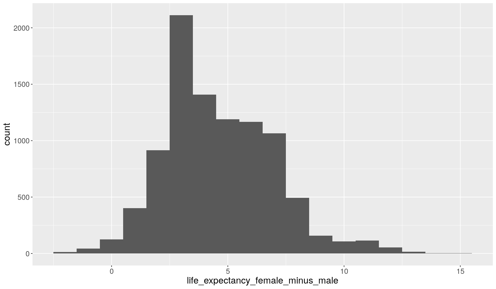
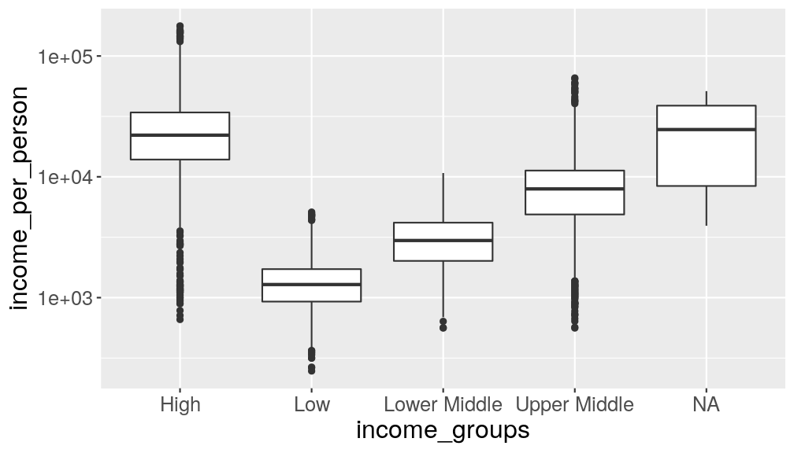
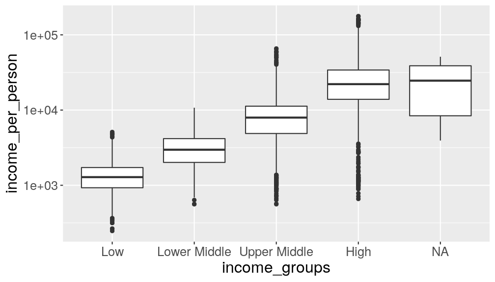

---
# Please do not edit this file directly; it is auto generated.
# Instead, please edit 04-manipulate_variables_dplyr.md in _episodes_rmd/
title: "Manipulating variables (columns) with `dplyr`"
teaching: 50
exercises: 30
questions:
- "How to select and/or rename specific columns from a data frame?"
- "How to create a new column or modify an existing one?"
- "How to 'chain' several commands together with pipes?"
- "How to fix common typos in _character_ variables?"
- "How to reorder values in categorical data?"
objectives: 
- "Use the `dplyr` package to manipulate tabular data (add or modify variables, select and rename columns)."
- "Apply the functions `select()`, `rename()` and `mutate()` to operate on columns."
- "Understand and use 'pipes' as a way to build a chain of operations on data."
- "Discuss some common issues with data cleaning and use functions from the `stringr` package to help solve them."
- "Use factors to order categories and encode ordinal data."
keypoints:
- "Use `dplyr::select()` to select columns from a table."
- "Select a range of columns using `:`, columns matching a string with `contains()`, and _unselect_ columns by using `-`."
- "Rename columns using `dplyr::rename()`."
- "Modify or update columns using `dplyr::mutate()`."
- "Chain several commands together with `%>%` pipes."
- "Use functions from the `stringr` package to manipulate _strings_."
- "Use _factors_ to encode ordinal variables."
source: Rmd
---

In this lesson we're going to learn how to use the `dplyr` package to manipulate columns 
of our data. 

As usual when starting an analysis on a new script, let's start by loading the 
packages and reading the data. In this lesson we're going to start using the 
[full dataset](https://github.com/tavareshugo/r-eda-gapminder/raw/gh-pages/_episodes_rmd/data/gapminder1960to2010_socioeconomic.csv) 
with data from 1960 to 2010:

~~~
library(tidyverse)

# Read the data, specifying how missing values are encoded
gapminder1960to2010 <- read_csv("data/gapminder1960to2010_socioeconomic.csv", 
                                na = "")
~~~
{: .language-r}

## Selecting columns

In an [earlier episode]({{ page.root }}) we've seen how to select columns (and rows) of a data frame 
using the square-bracket operator `[rows, columns]`. 
With the `dplyr` package, there is an alternative function, which offers some flexibility 
in how we choose columns. 

Let's start with a simple example of selecting two columns from our table:

~~~
select(gapminder1960to2010, country, year)
~~~
{: .language-r}

~~~
# A tibble: 9,843 x 2
   country      year
   <chr>       <dbl>
 1 Afghanistan  1960
 2 Afghanistan  1961
 3 Afghanistan  1962
 4 Afghanistan  1963
 5 Afghanistan  1964
 6 Afghanistan  1965
 7 Afghanistan  1966
 8 Afghanistan  1967
 9 Afghanistan  1968
10 Afghanistan  1969
# … with 9,833 more rows
~~~
{: .output}

Using the _base R_ syntax, this is equivalent to `gapminder1960to2010[, c("country", "year")]`. 
Notice that with the `select()` function (and generally with `dplyr` functions) we 
didn't need to quote `"` the column names. This is because the first input to the 
function is the table name, and so everything after is assumed to be column names 
of that table. 

Where `select()` becomes very convenient is when combined with some other helper functions.
For example:

~~~
# Select columns which have the word "_male" in their name
select(gapminder1960to2010, contains("_male"))
~~~
{: .language-r}

~~~
# A tibble: 9,843 x 2
   population_male life_expectancy_male
             <dbl>                <dbl>
 1         4649357                 31.6
 2         4729080                 32.0
 3         4813500                 32.5
 4         4902741                 32.9
 5         4996991                 33.3
 6         5096402                 33.8
 7         5199610                 34.2
 8         5306370                 34.6
 9         5419182                 35.1
10         5541421                 35.5
# … with 9,833 more rows
~~~
{: .output}

~~~
# Select all columns between country and year
select(gapminder1960to2010, country:year)
~~~
{: .language-r}

~~~
# A tibble: 9,843 x 6
   country  world_region economic_organi… income_groups main_religion  year
   <chr>    <chr>        <chr>            <chr>         <chr>         <dbl>
 1 Afghani… south_asia   g77              low_income    muslim         1960
 2 Afghani… south_asia   g77              low_income    muslim         1961
 3 Afghani… south_asia   g77              low_income    Muslim         1962
 4 Afghani… south_asia   g77              low_income    muslim         1963
 5 Afghani… south_asia   g77              low_income    muslim         1964
 6 Afghani… south_asia   g77              low_income    muslim         1965
 7 Afghani… south_asia   g77              low_income    muslim         1966
 8 Afghani… south_asia   g77              low_income    muslim         1967
 9 Afghani… south_asia   g77              low_income    muslim         1968
10 Afghani… south_asia   g77              low_income    muslim         1969
# … with 9,833 more rows
~~~
{: .output}

And these can be combined with each other:

~~~
select(gapminder1960to2010, country, contains("_male"), contains("_men"))
~~~
{: .language-r}

~~~
# A tibble: 9,843 x 4
   country     population_male life_expectancy_male school_years_men
   <chr>                 <dbl>                <dbl>            <dbl>
 1 Afghanistan         4649357                 31.6               NA
 2 Afghanistan         4729080                 32.0               NA
 3 Afghanistan         4813500                 32.5               NA
 4 Afghanistan         4902741                 32.9               NA
 5 Afghanistan         4996991                 33.3               NA
 6 Afghanistan         5096402                 33.8               NA
 7 Afghanistan         5199610                 34.2               NA
 8 Afghanistan         5306370                 34.6               NA
 9 Afghanistan         5419182                 35.1               NA
10 Afghanistan         5541421                 35.5               NA
# … with 9,833 more rows
~~~
{: .output}

To see other helper functions to use with `select()` check the following help page 
`?select_helpers`.

Finally, it can sometimes be helpful to _unselect_ some columns. We can do this 
by appending `-` before the column names we want to exclude, for example try running:

~~~
select(gapminder1960to2010, -country, -income_groups)
~~~
{: .language-r}

> ## `dplyr` syntax
> 
> All `dplyr` functions follow the following convention:
> 
> - The _first input_ to the function is always a `data.frame`/`tibble`.
> - Next come other inputs specific to the function. Column names usually don't need 
>   to be quoted `"`.
> - The _output_ is always a `data.frame`/`tibble`.
{: .callout}

## Renaming columns 

Use the `rename()` function to change column names, with the following syntax:
`rename(my_table, new_column_name = old_column_name)`. For example:

~~~
rename(gapminder1960to2010, 
       country_code = country_id, continent = world_region)
~~~
{: .language-r}

~~~
# A tibble: 9,843 x 19
   country_code country continent economic_organi… income_groups
   <chr>        <chr>   <chr>     <chr>            <chr>        
 1 afg          Afghan… south_as… g77              low_income   
 2 afg          Afghan… south_as… g77              low_income   
 3 afg          Afghan… south_as… g77              low_income   
 4 afg          Afghan… south_as… g77              low_income   
 5 afg          Afghan… south_as… g77              low_income   
 6 afg          Afghan… south_as… g77              low_income   
 7 afg          Afghan… south_as… g77              low_income   
 8 afg          Afghan… south_as… g77              low_income   
 9 afg          Afghan… south_as… g77              low_income   
10 afg          Afghan… south_as… g77              low_income   
# … with 9,833 more rows, and 14 more variables: main_religion <chr>,
#   year <dbl>, population_male <dbl>, population_female <dbl>,
#   income_per_person <dbl>, life_expectancy <dbl>,
#   life_expectancy_female <chr>, life_expectancy_male <dbl>,
#   children_per_woman <dbl>, newborn_mortality <dbl>,
#   child_mortality <dbl>, school_years_men <dbl>,
#   school_years_women <dbl>, hdi_human_development_index <dbl>
~~~
{: .output}

## Creating or modifying columns

To create new columns or modify existing ones, we can use the `mutate()` function. 
Here is an example where we calculate the total population for each country:

~~~
mutate(gapminder1960to2010, 
       population_total = population_male + population_female)
~~~
{: .language-r}

~~~
# A tibble: 9,843 x 20
   country_id country world_region economic_organi… income_groups
   <chr>      <chr>   <chr>        <chr>            <chr>        
 1 afg        Afghan… south_asia   g77              low_income   
 2 afg        Afghan… south_asia   g77              low_income   
 3 afg        Afghan… south_asia   g77              low_income   
 4 afg        Afghan… south_asia   g77              low_income   
 5 afg        Afghan… south_asia   g77              low_income   
 6 afg        Afghan… south_asia   g77              low_income   
 7 afg        Afghan… south_asia   g77              low_income   
 8 afg        Afghan… south_asia   g77              low_income   
 9 afg        Afghan… south_asia   g77              low_income   
10 afg        Afghan… south_asia   g77              low_income   
# … with 9,833 more rows, and 15 more variables: main_religion <chr>,
#   year <dbl>, population_male <dbl>, population_female <dbl>,
#   income_per_person <dbl>, life_expectancy <dbl>,
#   life_expectancy_female <chr>, life_expectancy_male <dbl>,
#   children_per_woman <dbl>, newborn_mortality <dbl>,
#   child_mortality <dbl>, school_years_men <dbl>,
#   school_years_women <dbl>, hdi_human_development_index <dbl>,
#   population_total <dbl>
~~~
{: .output}

The new column is attached to the end of the table. We can't see its values printed here, 
because there are too many columns, but we can see that it is listed at the bottom of 
the printed result.  

Notice that the `gapminder1960to2010` object did not change, because we didn't assign 
(`<-`) the output of `mutate()` to it. To update our table, then we need to do:

~~~
gapminder1960to2010 <- mutate(gapminder1960to2010, 
                              population_total = population_male + population_female)
~~~
{: .language-r}

Now, we can check its values by using `select()`, as we've learned above:

~~~
select(gapminder1960to2010, 
       country, population_male, population_female, population_total)
~~~
{: .language-r}

~~~
# A tibble: 9,843 x 4
   country     population_male population_female population_total
   <chr>                 <dbl>             <dbl>            <dbl>
 1 Afghanistan         4649357           4346986          8996343
 2 Afghanistan         4729080           4437674          9166754
 3 Afghanistan         4813500           4532368          9345868
 4 Afghanistan         4902741           4631211          9533952
 5 Afghanistan         4996991           4734371          9731362
 6 Afghanistan         5096402           4842018          9938420
 7 Afghanistan         5199610           4952723         10152333
 8 Afghanistan         5306370           5066249         10372619
 9 Afghanistan         5419182           5185164         10604346
10 Afghanistan         5541421           5313011         10854432
# … with 9,833 more rows
~~~
{: .output}

## Chaining commands with the `%>%` _pipe_

In the examples above, we saw how to perform each of these operations individually. 
But what if we wanted to mutate, then select some columns and then rename some of those? 

This type of operation, where we want to _chain_ several commands after each other, 
can be done with *pipes*. In `tidyverse` pipes look like `%>%`. 

Let's see an example in action:

~~~
gapminder1960to2010 %>% 
  mutate(., population_total = population_male + population_female) %>% 
  select(., country, world_region, population_total) %>% 
  rename(., continent = world_region)
~~~
{: .language-r}

~~~
# A tibble: 9,843 x 3
   country     continent  population_total
   <chr>       <chr>                 <dbl>
 1 Afghanistan south_asia          8996343
 2 Afghanistan south_asia          9166754
 3 Afghanistan south_asia          9345868
 4 Afghanistan south_asia          9533952
 5 Afghanistan south_asia          9731362
 6 Afghanistan south_asia          9938420
 7 Afghanistan south_asia         10152333
 8 Afghanistan south_asia         10372619
 9 Afghanistan south_asia         10604346
10 Afghanistan south_asia         10854432
# … with 9,833 more rows
~~~
{: .output}

Let's break this down:

- We start with the data, `gapminder1960to2010` and "pipe" it (`%>%`) to the next function, 
  `mutate()`.
- In `mutate()` we used the `.` symbol to indicate the input is coming from the previous pipe. 
  And the output will be again "piped" to the next function, `select()`.
- In `select()` we again used the `.` symbol to indicate the input is coming the from previous pipe 
  (i.e. the table with a new column, `population_total` added to it). And again, we send this to...
- `rename()`, which again receives it's input from the pipe. And our chain of commands ends here. 

You can interpret the `%>%` as meaning "and then", and so we can _read_ the code above as:

> Take the `gapminder1960to2010` table _and then_ add a new column with total population 
> _and then_ select only some of the columns _and then_ rename one of the columns. 

<b>

> ## Using the Dot `.` With `%>%` Pipes 
> 
> In the example above we've explicitly defined that the input to each function 
> is coming from the pipe using the `.` symbol. For example:
> 
> 
> ~~~
> gapminder1960to2010 %>% select(., country, world_regions)
> ~~~
> {: .language-r}
> 
> However, the `.` can often be ommited, as the output of the pipe will automatically 
> be passed on as the _first_ input to the next function. The example above can be 
> therefore be more compactly written as:
> 
> 
> ~~~
> gapminder1960to2010 %>% select(country, world_regions)
> ~~~
> {: .language-r}
> 
> In some cases the use of `.` is needed, if the function that comes after the pipe 
> doesn't take the data frame as it's first argument. For example, the `lm()` function, 
> used to fit _linear models_ (e.g. linear regression) first needs a definition of 
> the model being fitted (the `formula` argument) and only after the data frame 
> (the `data` argument). Check `?lm` documentation to see that this is the case. 
> 
> So, if we want to fit a linear regression between life expectancy and income, 
> using a pipe, this is what we would have to do: 
> 
> 
> ~~~
> gapminder1960to2010 %>% lm(formula = life_expectancy ~ income_per_person, data = .)
> ~~~
> {: .language-r}
> 
> Covering linear models is beyond the scope of this lesson, but the main point is 
> that for this function, because `data` is not the first input to the function, 
> we need to use the `.` explicitly. 
{: .callout}

<b>

The purpose of the pipes is to make the order of the data manipulation steps clear, 
and we will be using them throughout the course. However, they are not mandatory, 
and the same operations could have been done without them. For example, by saving 
the output of each step in a temporary object, which would then be used as input to 
the next function. Here are the same steps as above using this strategy:

~~~
# First mutate the column of interest
gapminder1960to2010_modified <- mutate(gapminder1960to2010,
                                       population_total = population_male + population_female)

# Then select columns of interest from this modified table
gapminder1960to2010_modified <- select(gapminder1960to2010_modified, 
                                       country, world_region, population_total)

# Finally rename the modified table
rename(gapminder1960to2010_modified, continent = world_region)
~~~
{: .language-r}

One clear disadvantage of this approach is that we now have an object `gapminder1960to2010_modified` 
loaded in our _Environment_ (top-right panel of RStudio), which we may actually only 
be interested in temporarily. 

> ## Exercise
> 
> When we [previously explored our data]({{ page.root }}), 
> we realised that `life_expectancy_female` was imported as _character_ rather than _numeric_. 
> 
> 1. Modify this variable by _coercing_ it to numeric type (hint: `as.numeric()`). 
> 2. Make a histogram showing the distribution of the difference between the life expectancy 
>    of the two sexes with a binwidth of 1 year. 
> 3. How did the total income of a country change over time? (hint: calculate the total 
>    income from the total population and income per capita)
> 
> (While doing the excercise, always try to critically evaluate your results!)
> 
> > ## Answer
> > 
> > **A1.** Because we want to modify a column, we use the `mutate()` function. We will also 
> > use the `as.numeric()` function to convert the values of `life_expectancy_female` 
> > to numeric:
> > 
> > 
> > ~~~
> > gapminder1960to2010 <- gapminder1960to2010 %>% 
> >                        mutate(life_expectancy_female = as.numeric(life_expectancy_female))
> > ~~~
> > {: .language-r}
> > 
> > 
> > 
> > ~~~
> > Warning: NAs introduced by coercion
> > ~~~
> > {: .error}
> > 
> > We get a warning from the function indicating that values that could not be 
> > converted to a number were encoded as missing. This is OK in our case, since 
> > what happened in this column is that the missing values had been encoded as "-".
> > 
> > **A2.** To create this plot, we can use pipes, to first create a new column using `mutate()` 
> > and then passing the output of that step to `ggplot`:
> > 
> > 
> > ~~~
> > gapminder1960to2010 %>% 
> >   mutate(life_expectancy_female_minus_male = life_expectancy_female - life_expectancy_male) %>% 
> >   ggplot(aes(life_expectancy_female_minus_male)) +
> >   geom_histogram(binwidth = 1)
> > ~~~
> > {: .language-r}
> > 
> > 
> > 
> > ~~~
> > Warning: Removed 459 rows containing non-finite values (stat_bin).
> > ~~~
> > {: .error}
> > 
> > 
> > 
> > This shows that overall women live longer than men. This trend seems to hold across 
> > all countries and across many years. Although from just the histogram it's not 
> > clear how this changed over time. 
> > 
> > **A3.** We can do all these operations with a pipe:
> > 
> > 
> > ~~~
> > # take the data; and then...
> > gapminder1960to2010 %>% 
> >   # ... add a column with population total; and then...
> >   mutate(population_total = population_male + population_female) %>% 
> >   # ... calculate total income; and then...
> >   mutate(income_total = income_per_person*population_total) %>% 
> >   # ... make the plot
> >   ggplot(aes(year, income_total)) +
> >   geom_line(aes(group = country, colour = world_region))
> > ~~~
> > {: .language-r}
> > 
> > 
> > 
> > ~~~
> > Warning: Removed 459 rows containing missing values (geom_path).
> > ~~~
> > {: .error}
> > 
> > 
> > 
> > It feels like in most countries there is an increase in total income. However, 
> > it's hard to see with this scale, given that there's two countries which really 
> > are outliers from the rest. Given the world region they're from, they're likely 
> > to be China and United States, although this would require further investigation. 
> > 
> {: .solution}
{: .challenge}

## Manipulating categorical data

In this section we're going to use `mutate()` to change some of the categorical 
(character) variables in our dataset. 

The `stringr` package provides several functions to manipulate _strings_ (i.e. character values). 
The functions from that package start with the word `str_`, so they are easy to identify. 

Here is an example:

~~~
gapminder1960to2010 %>% 
  # remove the word "_income" from the income_groups values; and then...
  mutate(world_region = str_remove(income_groups, "_income")) %>% 
  # replace the "_" with a hyphen
  mutate(income_groups = str_replace(income_groups, "_", "-"))
~~~
{: .language-r}

~~~
# A tibble: 9,843 x 20
   country_id country world_region economic_organi… income_groups
   <chr>      <chr>   <chr>        <chr>            <chr>        
 1 afg        Afghan… low          g77              low-income   
 2 afg        Afghan… low          g77              low-income   
 3 afg        Afghan… low          g77              low-income   
 4 afg        Afghan… low          g77              low-income   
 5 afg        Afghan… low          g77              low-income   
 6 afg        Afghan… low          g77              low-income   
 7 afg        Afghan… low          g77              low-income   
 8 afg        Afghan… low          g77              low-income   
 9 afg        Afghan… low          g77              low-income   
10 afg        Afghan… low          g77              low-income   
# … with 9,833 more rows, and 15 more variables: main_religion <chr>,
#   year <dbl>, population_male <dbl>, population_female <dbl>,
#   income_per_person <dbl>, life_expectancy <dbl>,
#   life_expectancy_female <dbl>, life_expectancy_male <dbl>,
#   children_per_woman <dbl>, newborn_mortality <dbl>,
#   child_mortality <dbl>, school_years_men <dbl>,
#   school_years_women <dbl>, hdi_human_development_index <dbl>,
#   population_total <dbl>
~~~
{: .output}

> ## Exercise
> 
> Create a new table called `gapminder_clean`, which fulfils the following requirements:
> 
> - Fix any typos in the `main_religion` values. All values should be in Title Case.
> - The `world_region` column contains values with a space between words (not "_") and in Title Case.
> - The `income_groups` column contains the categories: "Low", "Lower Middle", "Upper Middle", "High".
> - The `life_expectancy` column should be numeric.
> - Include a column `population_total` with the total population of the country. This column should 
>   appear before the `population_male` column (the other columns should remain in the same order).
> 
> (hint: `str_to_title()`, `str_remove()`, `str_replace_all()`, `str_squish()`)
> 
> The final table should contain 9843 observations (rows) and 20 variables (columns), 
> 6 of them character and the rest numeric.
> 
> > ## Answer
> > 
> > 
> > ~~~
> > gapminder_clean <- gapminder1960to2010 %>% 
> >   # fix typos in main_religion and world region
> >   mutate(main_religion = str_to_title(str_squish(main_religion)),
> >          world_region = str_to_title(str_replace_all(world_region, "_", " "))) %>% 
> >   # fit typos in income groups, which needs more steps
> >   mutate(income_groups = str_remove(income_groups, "_income")) %>% 
> >   mutate(income_groups = str_to_title(str_replace_all(income_groups, "_", " "))) %>% 
> >   # fix/create numeric variables
> >   mutate(life_expectancy_female = as.numeric(life_expectancy_female),
> >          population_total = population_male + population_female) %>% 
> >   # select columns in the correct order
> >   select(country_id:year, population_total, population_male:hdi_human_development_index)
> > ~~~
> > {: .language-r}
> > 
> > Finally, check that the final table contains the right number of rows, columns and 
> > variable types using `str()`:
> > ``
> > 
> > ~~~
> > str(gapminder_clean)
> > ~~~
> > {: .language-r}
> > 
> > 
> > 
> > ~~~
> > Classes 'spec_tbl_df', 'tbl_df', 'tbl' and 'data.frame':	9843 obs. of  20 variables:
> >  $ country_id                 : chr  "afg" "afg" "afg" "afg" ...
> >  $ country                    : chr  "Afghanistan" "Afghanistan" "Afghanistan" "Afghanistan" ...
> >  $ world_region               : chr  "South Asia" "South Asia" "South Asia" "South Asia" ...
> >  $ economic_organisation      : chr  "g77" "g77" "g77" "g77" ...
> >  $ income_groups              : chr  "Low" "Low" "Low" "Low" ...
> >  $ main_religion              : chr  "Muslim" "Muslim" "Muslim" "Muslim" ...
> >  $ year                       : num  1960 1961 1962 1963 1964 ...
> >  $ population_total           : num  8996343 9166754 9345868 9533952 9731362 ...
> >  $ population_male            : num  4649357 4729080 4813500 4902741 4996991 ...
> >  $ population_female          : num  4346986 4437674 4532368 4631211 4734371 ...
> >  $ income_per_person          : num  1213 1199 1195 1192 1190 ...
> >  $ life_expectancy            : num  38.6 39.4 40.1 40.8 41.5 ...
> >  $ life_expectancy_female     : num  33.1 33.6 34 34.5 34.9 ...
> >  $ life_expectancy_male       : num  31.6 32 32.5 32.9 33.3 ...
> >  $ children_per_woman         : num  7.45 7.45 7.45 7.45 7.45 7.45 7.45 7.45 7.45 7.45 ...
> >  $ newborn_mortality          : num  NA NA NA NA NA NA NA NA NA NA ...
> >  $ child_mortality            : num  364 358 352 346 340 ...
> >  $ school_years_men           : num  NA NA NA NA NA NA NA NA NA NA ...
> >  $ school_years_women         : num  NA NA NA NA NA NA NA NA NA NA ...
> >  $ hdi_human_development_index: num  NA NA NA NA NA NA NA NA NA NA ...
> > ~~~
> > {: .output}
> {: .solution}
{: .challenge}

#### Using _factors_ to encode _ordinal_ categorical data

As we discussed in a [previous episode](({{ page.root }})), categorical data come in three flavours: 
nominal, ordinal and binary.

While `character` vectors can be used to encode non-ordered (nominal) categories, 
they are not suitable to encode ordered ones. For this, we need to use **factors**, which 
are a special type of vector that stores categorical data. 

Here is an example using a character vector:

~~~
mood <- c("unhappy", "awesome", "ok", "awesome", "unhappy")

# convert mood character vector to a factor
factor(mood)
~~~
{: .language-r}

~~~
[1] unhappy awesome ok      awesome unhappy
Levels: awesome ok unhappy
~~~
{: .output}

Once created, factors can only contain a pre-defined set of values, known as _levels_, 
which correspond to the unique values in the data.  By default, R always sorts levels 
in alphabetical order, like in the example above. 

Sometimes, the order of the levels does not matter, other times you might want
to specify the order because it is meaningful (e.g., "low", "medium", "high"),
it improves your visualization, or it is required by a particular type of
analysis. 

Here is how we would reorder the levels of the `mood` vector:

~~~
factor(mood, levels = c("unhappy", "ok", "awesome"))
~~~
{: .language-r}

~~~
[1] unhappy awesome ok      awesome unhappy
Levels: unhappy ok awesome
~~~
{: .output}

The `forcats` package (part of `tidyverse`) provides several other functions to 
manipulate factors. These functions all start with `fct_`, so they are easy to 
identify. Look at the [package documentation](https://forcats.tidyverse.org/) to 
learn more about it.

## Exercise
> 
> Take the following boxplot showing the distribution of income, per income groups:
> 
> 
> ~~~
> gapminder_clean %>% 
>   ggplot(aes(income_groups, income_per_person)) +
>   geom_boxplot() +
>   scale_y_continuous(trans = "log10")
> ~~~
> {: .language-r}
> 
> 
> 
> The ordering of the categories on the x-axis is alphabetical. In this case, 
> it would make sense to change this order, to reflect it's ranking. 
> 
> Using the `factor()` function, modify the `income_groups` variable to have a 
> more logical order. 
> 
> > ## Answer
> > 
> > We can do this by _mutating_ the variable into a _factor_, where we specify the 
> > levels manually:
> > 
> > 
> > ~~~
> > gapminder_clean %>% 
> >   # convert income groups to a factor
> >   mutate(income_groups = factor(income_groups, 
> >                                 levels = c("Low", 
> >                                            "Lower Middle", 
> >                                            "Upper Middle",
> >                                            "High"))) %>% 
> >   # make the graph
> >   ggplot(aes(income_groups, income_per_person)) +
> >   geom_boxplot() +
> >   scale_y_continuous(trans = "log10")
> > ~~~
> > {: .language-r}
> > 
> > 
> {: .solution}
{: .challenge}
