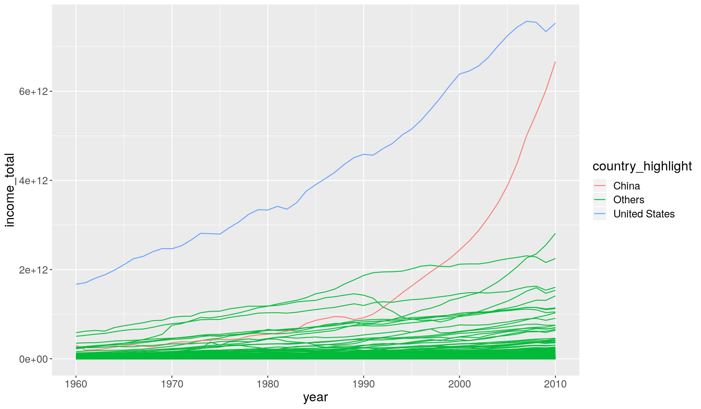

---
# Please do not edit this file directly; it is auto generated.
# Instead, please edit 05-manipulate_observations_dplyr.md in _episodes_rmd/
title: "Manipulating observations (rows) with `dplyr`"
teaching: 50
exercises: 30
questions:
- "How to order rows in a table?"
- "How to retain only unique rows in a table (no duplicates)?"
- "How to choose rows of a table based on certain conditions?"
- "How to use conditions for a range of applications?"
- "How to save data into a file?"
objectives: 
- "Understand how logical comparisons are made and the logical data type."
- "Remember and distinguish between different types of logical operators."
- "Use conditional operations to obtain specific observations from data using the `filter()` function."
- "Apply conditional operations to clean data mistakes and/or highlight elements of interest in graphs using the `ifelse()` function."
- "Save data frame into a file."
keypoints:
- "Order rows in a table using `arrange()`. Use the `desc()` function to sort in descending order."
- "Retain unique rows in a table using `distinct()`."
- "Choose rows based on conditions using `filter()`."
- "Conditions can be set using several operators: `>`, `>=`, `<`, `<=`, `==`, `!=`, `%in%`."
- "Conditions can be combined using `&` and `|`."
- "The function `is.na()` can be used to identify missing values. It can be negated `!is.na()` to find non-missing values."
- "Use the `ifelse()` function to define two different outcomes of a condition."
source: Rmd
---

In this lesson we're going to learn how to use the `dplyr` package to manipulate rows 
of our data. 

As usual when starting an analysis on a new script, let's start by loading the 
packages and reading the data. We will continue with gapminder data from 1960 to 2010:

~~~
library(tidyverse)

# Read the data, specifying how missing values are encoded
gapminder1960to2010 <- read_csv("data/gapminder1960to2010_socioeconomic.csv", 
                                na = "")
~~~
{: .language-r}

## Ordering Rows

Or order the rows of a table based on certain variables, we can use the `arrange()` 
function:

~~~
gapminder1960to2010 %>% 
  select(country, world_region, year) %>% 
  # order by year
  arrange(year)
~~~
{: .language-r}

~~~
# A tibble: 9,843 x 3
   country              world_region              year
   <chr>                <chr>                    <dbl>
 1 Afghanistan          south_asia                1960
 2 Angola               sub_saharan_africa        1960
 3 Albania              europe_central_asia       1960
 4 Andorra              europe_central_asia       1960
 5 United Arab Emirates middle_east_north_africa  1960
 6 Argentina            america                   1960
 7 Armenia              europe_central_asia       1960
 8 Antigua and Barbuda  america                   1960
 9 Australia            east_asia_pacific         1960
10 Austria              europe_central_asia       1960
# … with 9,833 more rows
~~~
{: .output}

In this case, the rows are sorted by _increasing numeric order_ of the variable 
year. 

When ordering by a character variable, the order will be determined alphabetically:

~~~
gapminder1960to2010 %>% 
  select(country, world_region, year) %>% 
  # order by world_region
  arrange(world_region)
~~~
{: .language-r}

~~~
# A tibble: 9,843 x 3
   country   world_region  year
   <chr>     <chr>        <dbl>
 1 Argentina america       1960
 2 Argentina america       1961
 3 Argentina america       1962
 4 Argentina america       1963
 5 Argentina america       1964
 6 Argentina america       1965
 7 Argentina america       1966
 8 Argentina america       1967
 9 Argentina america       1968
10 Argentina america       1969
# … with 9,833 more rows
~~~
{: .output}

To arrange based on _descending_ order, you can wrap the variable in the `desc()`
function:

~~~
gapminder1960to2010 %>% 
  select(country, world_region, year) %>% 
  # order by year
  arrange(desc(year))
~~~
{: .language-r}

~~~
# A tibble: 9,843 x 3
   country              world_region              year
   <chr>                <chr>                    <dbl>
 1 Afghanistan          south_asia                2010
 2 Angola               sub_saharan_africa        2010
 3 Albania              europe_central_asia       2010
 4 Andorra              europe_central_asia       2010
 5 United Arab Emirates middle_east_north_africa  2010
 6 Argentina            america                   2010
 7 Armenia              europe_central_asia       2010
 8 Antigua and Barbuda  america                   2010
 9 Australia            east_asia_pacific         2010
10 Austria              europe_central_asia       2010
# … with 9,833 more rows
~~~
{: .output}

Finally, you can include several variables within `arrange()`, which will sort the 
table by each of them. For example:

~~~
gapminder1960to2010 %>% 
  select(country, world_region, year) %>% 
  # order by year, then by world region (z-a), then country (z-a)
  arrange(year, desc(world_region), desc(country))
~~~
{: .language-r}

~~~
# A tibble: 9,843 x 3
   country      world_region        year
   <chr>        <chr>              <dbl>
 1 Zimbabwe     sub_saharan_africa  1960
 2 Zambia       sub_saharan_africa  1960
 3 Uganda       sub_saharan_africa  1960
 4 Togo         sub_saharan_africa  1960
 5 Tanzania     sub_saharan_africa  1960
 6 Swaziland    sub_saharan_africa  1960
 7 Sudan        sub_saharan_africa  1960
 8 South Sudan  sub_saharan_africa  1960
 9 South Africa sub_saharan_africa  1960
10 Somalia      sub_saharan_africa  1960
# … with 9,833 more rows
~~~
{: .output}

## Retain Unique Rows

Sometimes it is useful to retain rows with unique combinations of some of our variables
(i.e. remove any duplicated rows). This can be done with the `distinct()` function. 

~~~
# get unique combination of main religion and world region
gapminder1960to2010 %>% 
  distinct(main_religion, world_region)
~~~
{: .language-r}

~~~
# A tibble: 27 x 2
   main_religion world_region            
   <chr>         <chr>                   
 1 muslim        south_asia              
 2 Muslim        south_asia              
 3 christian     sub_saharan_africa      
 4 Christian     sub_saharan_africa      
 5 muslim        europe_central_asia     
 6 Muslim        europe_central_asia     
 7 christian     europe_central_asia     
 8 Christian     europe_central_asia     
 9 muslim        middle_east_north_africa
10 Muslim        middle_east_north_africa
# … with 17 more rows
~~~
{: .output}

## Choosing Rows Based on Conditions

To choose rows based on specific criteria, we can use `filter()`. For example, 
to get all the rows of data from the 2000's:

~~~
gapminder1960to2010 %>% 
  select(country, year) %>% 
  filter(year > 2000)
~~~
{: .language-r}

~~~
# A tibble: 1,930 x 2
   country      year
   <chr>       <dbl>
 1 Afghanistan  2001
 2 Afghanistan  2002
 3 Afghanistan  2003
 4 Afghanistan  2004
 5 Afghanistan  2005
 6 Afghanistan  2006
 7 Afghanistan  2007
 8 Afghanistan  2008
 9 Afghanistan  2009
10 Afghanistan  2010
# … with 1,920 more rows
~~~
{: .output}

### Conditional Operations

It is important to understand that when we set a condition like above, the output 
is a _logical vector_. Let's see an example using a small vector.

~~~
some_years <- c(1985, 1990, 1999, 1995, 2010, 2000)
some_years < 2000
~~~
{: .language-r}

~~~
[1]  TRUE  TRUE  TRUE  TRUE FALSE FALSE
~~~
{: .output}

So what the `filter()` function does is evaluate the condition and return the rows 
for which that condition is true. 

It is possible to combine several conditions by using the _logical operators_ 
`&` (AND) and `|` (OR). For example, if we wanted the years between 1990 and 2000:

~~~
# both conditions have to be true
some_years > 1990 & some_years < 2000
~~~
{: .language-r}

~~~
[1] FALSE FALSE  TRUE  TRUE FALSE FALSE
~~~
{: .output}

And if we wanted the years below 1990 or above 2000, then:

~~~
# only one or the other of the conditions has to be true
some_years < 1990 | some_years > 2000
~~~
{: .language-r}

~~~
[1]  TRUE FALSE FALSE FALSE  TRUE FALSE
~~~
{: .output}

> ## Conditional  operators
> 
> To set filtering conditions, use the following _relational operators_:
> 
> - `>` is greater than
> - `>=` is greater than or equal to
> - `<` is less than
> - `<=` is less than or equal to
> - `==` is equal to
> - `!=` is different from
> - `%in%` is contained in
> 
> To combine conditions, use the following _logical operators_:
> 
> - `&` AND
> - `|` OR
> 
> Some functions return logical results and can be used in filtering operations:
> 
> - `is.na(x)` returns _TRUE_ if a value in _x_ is missing
> 
> The `!` can be used to negate a logical condition:
> 
> - `!is.na(x)` returns _TRUE_ if a value in _x_ is NOT missing
> - `!(x %in% y)` returns _TRUE_ if a value in _x_ is NOT present in _y_
{: .callout}

Let's see an example on how we can combine the `filter()` function with plotting. 

In Hans Rosling's TED Talk, he compared the change in `income_per_person` and `child_mortality` 
between three countries: Uganda, Brazil and South Korea. We can filter our dataset 
to retain only these countries by using the `%in%` operator. 

~~~
gapminder1960to2010 %>% 
  filter(country %in% c("Uganda", "Brazil", "South Korea"))
~~~
{: .language-r}

We will pipe this filter to ggplot and use `geom_path()` to look at the change of these 
countries over time. 
This geometry is similar to `geom_line()`, but it connects points in the order they appear 
on the table (which we can sort beforehand with `arrange()`), whereas `geom_line()` connects 
the points based on the order they appear along the x and y axis. 
(Try changing the code below to see the difference)

~~~
gapminder1960to2010 %>% 
  filter(country %in% c("Uganda", "Brazil", "South Korea")) %>% 
  # ensure data is in order of country and year for geom_path
  arrange(country, year) %>% 
  ggplot(aes(income_per_person, child_mortality)) +
  geom_path(aes(colour = country), arrow = arrow())
~~~
{: .language-r}

> ## Exercise
> 
> 1. Fix the following code (where the word "FIXME" appears), to produce the plot shown below. 
> 
> 
> ~~~
> gapminder1960to2010 %>% 
>   mutate(population_total = FIXME) %>% 
>   filter(FIXME) %>% 
>   ggplot(aes(children_per_woman, life_expectancy)) +
>   geom_point(aes(size = population_total, colour = world_region)) +
>   facet_grid(cols = FIXME) +
>   scale_colour_brewer(palette = "Dark2") +
>   labs(x = "Fertility Rate (children per woman)", y = "Life Expectancy (years)", 
>        size = "Total Population", colour = "Region")
> ~~~
> {: .language-r}
> 
> 
> 
> 2. One of the countries seems to stand out from the general trend in 1960. 
> What country is it? 
> 3. Make a line plot showing how the `life_expectancy` of that country changed over 
>    time compared to another country of your choice.
> 
> > ## Answer 
> > 
> > A1. Here is the fixed code:
> > 
> > 
> > ~~~
> > gapminder1960to2010 %>% 
> >   mutate(population_total = population_male + population_female) %>% 
> >   filter(year %in% c(1960, 1990, 2010)) %>% 
> >   ggplot(aes(children_per_woman, life_expectancy)) +
> >   geom_point(aes(size = population_total, colour = world_region)) +
> >   facet_grid(cols = vars(year)) +
> >   scale_colour_brewer(palette = "Dark2") +
> >   labs(x = "Fertility Rate (children per woman)", y = "Life Expectancy (years)", 
> >        size = "Total Population", colour = "Region")
> > ~~~
> > {: .language-r}
> > 
> > A2. Based on the x and y values in the graph, we can set a condition with `filter()`,
> > for example:
> > 
> > 
> > ~~~
> > gapminder1960to2010 %>% 
> >   filter(year == 1960 & children_per_woman < 5 & life_expectancy < 35) %>% 
> >   select(country, year, children_per_woman, life_expectancy)
> > ~~~
> > {: .language-r}
> > 
> > 
> > 
> > ~~~
> > # A tibble: 1 x 4
> >   country  year children_per_woman life_expectancy
> >   <chr>   <dbl>              <dbl>           <dbl>
> > 1 China    1960               3.99            30.9
> > ~~~
> > {: .output}
> > 
> > A3. Here is a comparison between China and another country:
> > 
> > 
> > ~~~
> > gapminder1960to2010 %>% 
> >   filter(country %in% c("China", "Portugal")) %>% 
> >   ggplot(aes(x = year, y = life_expectancy)) +
> >   geom_line(aes(colour = country))
> > ~~~
> > {: .language-r}
> > 
> > 
> {: .solution}
{: .challenge}

<!--
> How did the difference in life expectancy between male and female change over time for each country? 
> (hint: use the aesthetic `group = country` within `geom_line()` to have a line for each country).
> > 
> > Here is the line plot showing the change of this difference over time. 
> > There are two countries that have very abrupt change in the 80s 
> > ([possible reason](https://en.wikipedia.org/wiki/Iran%E2%80%93Iraq_War)). 
> > 
> > 
> > ~~~
> > gapminder1960to2010 %>% 
> >   mutate(life_expectancy_female_minus_male = life_expectancy_female - life_expectancy_male) %>% 
> >   ggplot(aes(year, life_expectancy_female_minus_male)) +
> >   geom_line(aes(group = country))
> > ~~~
> > {: .language-r}
> > 
> > 
> > 
> > ~~~
> > Error in life_expectancy_female - life_expectancy_male: non-numeric argument to binary operator
> > ~~~
> > {: .error}
-->

## Filtering Missing Values

As noted in the callout box above, the `is.na()` function can be used to ask the 
question of whether a value is missing or not (`!is.na()`). 

For example, the following would return the rows where `main_religion` is _not_
missing.

~~~
gapminder1960to2010 %>% 
  filter(!is.na(main_religion))
~~~
{: .language-r}

> ## Exercise 
> 
> - How many observations contain values for both `life_expectancy` _and_ `children_per_woman`?
> 
> > ## Answer
> > 
> > 
> > ~~~
> > gapminder1960to2010 %>% 
> >   filter(!is.na(life_expectancy) & !is.na(children_per_woman)) %>% 
> >   # (optional) pipe the output to nrow() to get the number of rows directly
> >   nrow()
> > ~~~
> > {: .language-r}
> > 
> > 
> > 
> > ~~~
> > [1] 9384
> > ~~~
> > {: .output}
> {: .solution}
{: .challenge}

## Using conditionals with `ifelse`

Conditions are not just useful for filtering rows, but also to modify variables or 
highlight certain observations in the data. 

For example, take the following graph showing the change in income per person:

~~~
gapminder1960to2010 %>% 
  ggplot(aes(x = year, y = income_per_person)) +
  geom_line(aes(group = country))
~~~
{: .language-r}

We can highlight one of the countries by creating a new column (`mutate()`) that stores 
the result of a condition:

~~~
gapminder1960to2010 %>% 
  # the "is_qatar" column will contain TRUE/FALSE values
  mutate(is_qatar = country == "Qatar") %>% 
  ggplot(aes(x = year, y = income_per_person)) +
  geom_line(aes(group = country, colour = is_qatar))
~~~
{: .language-r}

When we want to define two different outcomes from a condition, then the `ifelse()` 
function is very handy. This function takes 3 arguments: the condition we want to test, 
the values it should take if it's TRUE, and the values it should take if it's FALSE. 

For example, earlier we saw that `life_expectancy_male` has missing values encoded as 
-999. 

~~~
summary(gapminder1960to2010$life_expectancy_male)
~~~
{: .language-r}

~~~
   Min. 1st Qu.  Median    Mean 3rd Qu.    Max. 
-999.00   50.24   61.67   10.64   68.11   80.06 
~~~
{: .output}

We can fix this problem using `ifelse()` inside a `mutate()` call:

~~~
gapminder_clean <- gapminder1960to2010 %>% 
  mutate(life_expectancy_male = ifelse(life_expectancy_male == -999, NA, life_expectancy_male))

summary(gapminder_clean$life_expectancy_male)
~~~
{: .language-r}

~~~
   Min. 1st Qu.  Median    Mean 3rd Qu.    Max.    NA's 
  16.29   52.09   62.46   60.03   68.38   80.06     459 
~~~
{: .output}

In the call above we stated: if `life_expectancy_male` is equal to -999 then return 
the value `NA`, otherwise return the respective value of `life_expectancy_male` itself. 

Here is another example, where we highlight two countries in a graph by using `ifelse()`:

~~~
gapminder1960to2010 %>% 
  mutate(income_total = population_male*income_per_person,
         country_highlight = ifelse(country %in% c("China", "United States"), country, "Others")) %>% 
  ggplot(aes(year, income_total)) +
  geom_line(aes(group = country, colour = country_highlight))
~~~
{: .language-r}

> ## Exercise
> 
> Using the main `dplyr` verbs that we have learned about (`select()`, `mutate()`, 
> `filter()`), create a clean version of the table called `gapminder_clean`, that 
> fulfills the following criteria:
> 
> - Does not contain the column `country_id`.
> - Contains a new column called `population_total`, which is the sum of `population_male`
>   and `population_female`.
> - All values in `main_religion` are lowercase and there are no typos. (hint:
>   use `str_*` functions to help)
> - The value -999 in `life_expectancy_male` is encoded as `NA` instead.
> - The `life_expectancy` column is numeric.
> - Remove rows with missing values for `income_groups`.
> 
> Bonus (optional):
> 
> - Make values in `main_religion` Title Case (with a space separating the words).
> - Make the `income_groups` column contain the categories: "Low", "Lower Middle", "Upper Middle", "High".
> - Change the order of the columns so that `population_total` is before the `population_male` 
>   column (the other columns should remain in the same order).
> 
> > ## Answer 
> > 
> > Here is the full pipeline to clean our data:
> > 
> > 
> > ~~~
> > gapminder_clean <- gapminder1960to2010 %>% 
> >   select(-country_id) %>% 
> >   mutate(population_total = population_male + population_female,
> >          main_religion = str_to_lower(str_squish(main_religion)),
> >          life_expectancy_male = ifelse(life_expectancy_male == -999, NA, life_expectancy_male),
> >          life_expectancy_female = as.numeric(life_expectancy_female)) %>% 
> >   filter(!is.na(income_groups))
> > ~~~
> > {: .language-r}
> > 
> > 
> > 
> > ~~~
> > Warning: NAs introduced by coercion
> > ~~~
> > {: .error}
> > 
> > When building such a long chain of commands, it's a good idea to check each step 
> > at a time, to see that we're doing the right thing. 
> > So, let's go through each step at a time and check the results of each operation. 
> > 
> > We used `select()` to _unselect_ the column `coutry_id` (using the `-` sign 
> > before the column name):
> > 
> > 
> > ~~~
> > gapminder1960to2010 %>% 
> >   select(-country)
> > ~~~
> > {: .language-r}
> > 
> > 
> > 
> > ~~~
> > # A tibble: 9,843 x 18
> >    country_id world_region economic_organi… income_groups main_religion
> >    <chr>      <chr>        <chr>            <chr>         <chr>        
> >  1 afg        south_asia   g77              low_income    muslim       
> >  2 afg        south_asia   g77              low_income    muslim       
> >  3 afg        south_asia   g77              low_income    Muslim       
> >  4 afg        south_asia   g77              low_income    muslim       
> >  5 afg        south_asia   g77              low_income    muslim       
> >  6 afg        south_asia   g77              low_income    muslim       
> >  7 afg        south_asia   g77              low_income    muslim       
> >  8 afg        south_asia   g77              low_income    muslim       
> >  9 afg        south_asia   g77              low_income    muslim       
> > 10 afg        south_asia   g77              low_income    muslim       
> > # … with 9,833 more rows, and 13 more variables: year <dbl>,
> > #   population_male <dbl>, population_female <dbl>,
> > #   income_per_person <dbl>, life_expectancy <dbl>,
> > #   life_expectancy_female <chr>, life_expectancy_male <dbl>,
> > #   children_per_woman <dbl>, newborn_mortality <dbl>,
> > #   child_mortality <dbl>, school_years_men <dbl>,
> > #   school_years_women <dbl>, hdi_human_development_index <dbl>
> > ~~~
> > {: .output}
> > 
> > We used mutate to calculate `population_total`. To confirm we're doing the right thing, 
> > we could use the function `select()` to check that we're getting the expected result:
> > 
> > 
> > ~~~
> > gapminder1960to2010 %>% 
> >   mutate(population_total = population_male + population_female) %>% 
> >   select(population_male, population_female, population_total)
> > ~~~
> > {: .language-r}
> > 
> > 
> > 
> > ~~~
> > # A tibble: 9,843 x 3
> >    population_male population_female population_total
> >              <dbl>             <dbl>            <dbl>
> >  1         4649357           4346986          8996343
> >  2         4729080           4437674          9166754
> >  3         4813500           4532368          9345868
> >  4         4902741           4631211          9533952
> >  5         4996991           4734371          9731362
> >  6         5096402           4842018          9938420
> >  7         5199610           4952723         10152333
> >  8         5306370           5066249         10372619
> >  9         5419182           5185164         10604346
> > 10         5541421           5313011         10854432
> > # … with 9,833 more rows
> > ~~~
> > {: .output}
> > 
> > To fix the values in `main_religion` we used functions from the `stringr` package. 
> > We can use the function `distinct()` to check our results:
> > 
> > 
> > ~~~
> > gapminder1960to2010 %>% 
> >   mutate(main_religion = str_to_lower(str_squish(main_religion))) %>% 
> >   distinct(main_religion)
> > ~~~
> > {: .language-r}
> > 
> > 
> > 
> > ~~~
> > # A tibble: 4 x 1
> >   main_religion    
> >   <chr>            
> > 1 muslim           
> > 2 christian        
> > 3 <NA>             
> > 4 eastern religions
> > ~~~
> > {: .output}
> > 
> > To fix `life_expectancy_male` we used an `ifelse()`. We can check that we're 
> > getting the right result by using `arrange()` to sort our table and check that we 
> > no longer have values of -999:
> > 
> > 
> > ~~~
> > gapminder1960to2010 %>% 
> >   mutate(life_expectancy_male = ifelse(life_expectancy_male == -999, NA, life_expectancy_male)) %>% 
> >   arrange(life_expectancy_male) %>% 
> >   select(life_expectancy, life_expectancy_male)
> > ~~~
> > {: .language-r}
> > 
> > 
> > 
> > ~~~
> > # A tibble: 9,843 x 2
> >    life_expectancy life_expectancy_male
> >              <dbl>                <dbl>
> >  1            24.5                 16.3
> >  2            24.2                 17.2
> >  3            24.7                 17.7
> >  4            24.0                 20.3
> >  5            24.8                 20.9
> >  6            52.5                 25.1
> >  7            45.2                 25.4
> >  8            47.2                 26.0
> >  9            47.9                 26.4
> > 10            34.0                 27.4
> > # … with 9,833 more rows
> > ~~~
> > {: .output}
> > 
> > Finally, we can use the `as.numeric()` function to convert `life_expectancy_female` 
> > to numbers. We get a warning  because the function introduces `NA` when it finds 
> > the value "-" (which is impossible to be converted, so it is encoded as missing).
> > Again, we can use the `arrange()` function to check that we no longer get the value 
> > "-" (try running `arrange()` with and without the `mutate()` step).
> > 
> > 
> > ~~~
> > gapminder1960to2010 %>% 
> >   mutate(life_expectancy_female = as.numeric(life_expectancy_female)) %>% 
> >   arrange(life_expectancy_female) %>% 
> >   select(life_expectancy, life_expectancy_female)
> > ~~~
> > {: .language-r}
> > 
> > 
> > 
> > ~~~
> > Warning: NAs introduced by coercion
> > ~~~
> > {: .error}
> > 
> > 
> > 
> > ~~~
> > # A tibble: 9,843 x 2
> >    life_expectancy life_expectancy_female
> >              <dbl>                  <dbl>
> >  1            24.5                   22.4
> >  2            24.2                   23.1
> >  3            24.7                   23.8
> >  4            24.0                   25.9
> >  5            24.8                   27.0
> >  6            34.0                   29.0
> >  7            34.3                   29.2
> >  8            47.2                   29.3
> >  9            34.6                   29.4
> > 10            34.9                   29.7
> > # … with 9,833 more rows
> > ~~~
> > {: .output}
> > 
> > After checking all of these individual steps work correctly, we can then assemble 
> > them together into a chain, as we did above.
> {: .solution}
{: .challenge}

## Saving data

Now that we have a clean version of our table, it's a good idea to save it for 
future use. You can use the `write_*()` family of functions to save data in a variety 
of formats. 

Let's use `write_csv()` as an example. 
The `write_csv()` function needs the name of the table you want to save and then 
_path_ to the file you want to save it in (don't forget the file extension!):

~~~
write_csv(gapminder_clean, "data/processed/gapminder1960to2010_clean.csv")
~~~
{: .language-r}

There are many other functions for saving data, you can check the documentation 
with `?write_delim`. 

> ## Data Tip: Cleaning Data
> 
> The infamous [80/20 rule](https://whatsthebigdata.com/2016/05/01/data-scientists-spend-most-of-their-time-cleaning-data/) 
> in data science suggests that about 80% of the time is spend preparing the data
> for analysis. While this is not really a scientific rule, it does have some relation 
> to the real life experience of data analysts. 
> 
> Although it's a lot of effort, and usually not so much fun, if you make sure to clean
> and format your data correctly, it will make your downstream analysis much more fluid,
> fruitful and pleasant.
> 
{: .discussion}
