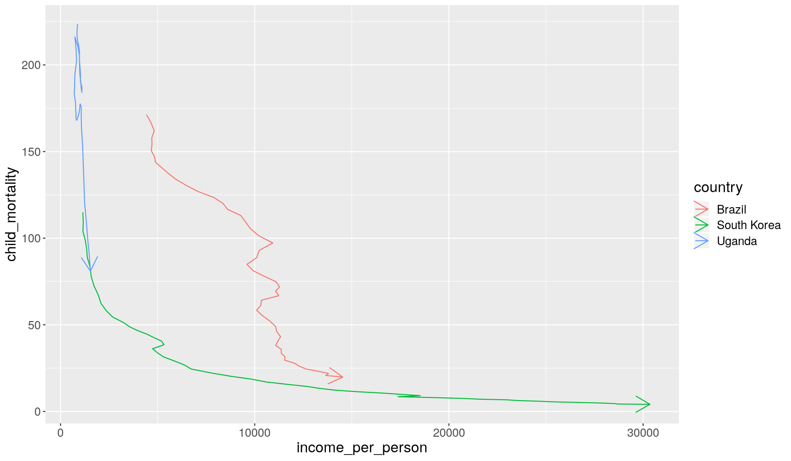

---
# Please do not edit this file directly; it is auto generated.
# Instead, please edit 05-manipulate_observations_dplyr.md in _episodes_rmd/
title: "Manipulating observations (rows) with `dplyr`"
teaching: 50
exercises: 30
questions:
- "How to order rows in a table?"
- "How to retain only unique rows in a table (no duplicates)?"
- "How to choose rows of a table based on certain conditions?"
- "How to use conditions for a range of applications?"
- "How to save data into a file?"
objectives: 
- "Understand how logical comparisons are made and the logical data type."
- "Remember and distinguish between different types of logical operators."
- "Use conditional operations to obtain specific observations from data using the `filter()` function."
- "Apply conditional operations to clean data mistakes and/or highlight elements of interest in graphs using the `ifelse()` function."
- "Save data frame into a file."
keypoints:
- "Order rows in a table using `arrange()`. Use the `desc()` function to sort in descending order."
- "Retain unique rows in a table using `distinct()`."
- "Choose rows based on conditions using `filter()`."
- "Conditions can be set using several operators: `>`, `>=`, `<`, `<=`, `==`, `!=`, `%in%`."
- "Conditions can be combined using `&` and `|`."
- "The function `is.na()` can be used to identify missing values. It can be negated `!is.na()` to find non-missing values."
source: Rmd
---

In this lesson we're going to learn how to use the `dplyr` package to manipulate rows 
of our data. 

As usual when starting an analysis on a new script, let's start by loading the 
packages and reading the data. We will continue with gapminder data from 1960 to 2010:

~~~
library(tidyverse)

# Read the data, specifying how missing values are encoded
gapminder1960to2010 <- read_csv("data/gapminder1960to2010_socioeconomic.csv", 
                                na = "")
~~~
{: .language-r}

## Ordering Rows

Or order the rows of a table based on certain variables, we can use the `arrange()` 
function:

~~~
gapminder1960to2010 %>% 
  select(country, world_region, year) %>% 
  # order by year
  arrange(year)
~~~
{: .language-r}

~~~
# A tibble: 9,843 x 3
   country              world_region              year
   <chr>                <chr>                    <dbl>
 1 Afghanistan          south_asia                1960
 2 Angola               sub_saharan_africa        1960
 3 Albania              europe_central_asia       1960
 4 Andorra              europe_central_asia       1960
 5 United Arab Emirates middle_east_north_africa  1960
 6 Argentina            america                   1960
 7 Armenia              europe_central_asia       1960
 8 Antigua and Barbuda  america                   1960
 9 Australia            east_asia_pacific         1960
10 Austria              europe_central_asia       1960
# … with 9,833 more rows
~~~
{: .output}

In this case, the rows are sorted by _increasing numeric order_ of the variable 
year. 

When ordering by a character variable, the order will be determined alphabetically:

~~~
gapminder1960to2010 %>% 
  select(country, world_region, year) %>% 
  # order by world_region
  arrange(world_region)
~~~
{: .language-r}

~~~
# A tibble: 9,843 x 3
   country   world_region  year
   <chr>     <chr>        <dbl>
 1 Argentina america       1960
 2 Argentina america       1961
 3 Argentina america       1962
 4 Argentina america       1963
 5 Argentina america       1964
 6 Argentina america       1965
 7 Argentina america       1966
 8 Argentina america       1967
 9 Argentina america       1968
10 Argentina america       1969
# … with 9,833 more rows
~~~
{: .output}

To arrange based on _descending_ order, you can wrap the variable in the `desc()`
function:

~~~
gapminder1960to2010 %>% 
  select(country, world_region, year) %>% 
  # order by year
  arrange(desc(year))
~~~
{: .language-r}

~~~
# A tibble: 9,843 x 3
   country              world_region              year
   <chr>                <chr>                    <dbl>
 1 Afghanistan          south_asia                2010
 2 Angola               sub_saharan_africa        2010
 3 Albania              europe_central_asia       2010
 4 Andorra              europe_central_asia       2010
 5 United Arab Emirates middle_east_north_africa  2010
 6 Argentina            america                   2010
 7 Armenia              europe_central_asia       2010
 8 Antigua and Barbuda  america                   2010
 9 Australia            east_asia_pacific         2010
10 Austria              europe_central_asia       2010
# … with 9,833 more rows
~~~
{: .output}

Finally, you can include several variables within `arrange()`, which will sort the 
table by each of them. For example:

~~~
gapminder1960to2010 %>% 
  select(country, world_region, year) %>% 
  # order by year, then by world region, then country from z-a
  arrange(year, world_region, desc(country))
~~~
{: .language-r}

~~~
# A tibble: 9,843 x 3
   country                        world_region  year
   <chr>                          <chr>        <dbl>
 1 Venezuela                      america       1960
 2 Uruguay                        america       1960
 3 United States                  america       1960
 4 Trinidad and Tobago            america       1960
 5 Suriname                       america       1960
 6 St. Vincent and the Grenadines america       1960
 7 St. Lucia                      america       1960
 8 St. Kitts and Nevis            america       1960
 9 Peru                           america       1960
10 Paraguay                       america       1960
# … with 9,833 more rows
~~~
{: .output}

## Retain Unique Rows

Sometimes it is useful to retain rows with unique combinations of some of our variables
(i.e. remove any duplicated rows). This can be done with the `distinct()` function. 

~~~
# get unique combination of country and world region
gapminder1960to2010 %>% 
  distinct(country, world_region)
~~~
{: .language-r}

~~~
# A tibble: 193 x 2
   country              world_region            
   <chr>                <chr>                   
 1 Afghanistan          south_asia              
 2 Angola               sub_saharan_africa      
 3 Albania              europe_central_asia     
 4 Andorra              europe_central_asia     
 5 United Arab Emirates middle_east_north_africa
 6 Argentina            america                 
 7 Armenia              europe_central_asia     
 8 Antigua and Barbuda  america                 
 9 Australia            east_asia_pacific       
10 Austria              europe_central_asia     
# … with 183 more rows
~~~
{: .output}

Notice how the table above has 193 rows (compared to the 9843 of the full dataset). 
That's because now we have a table with only the unique combination of these two variables. 

## Choosing Rows Based on Conditions

To choose rows based on specific criteria, we can use `filter()`. For example, 
to get all the rows of data from the 2000's:

~~~
gapminder1960to2010 %>% 
  select(country, year) %>% 
  filter(year > 2000)
~~~
{: .language-r}

~~~
# A tibble: 1,930 x 2
   country      year
   <chr>       <dbl>
 1 Afghanistan  2001
 2 Afghanistan  2002
 3 Afghanistan  2003
 4 Afghanistan  2004
 5 Afghanistan  2005
 6 Afghanistan  2006
 7 Afghanistan  2007
 8 Afghanistan  2008
 9 Afghanistan  2009
10 Afghanistan  2010
# … with 1,920 more rows
~~~
{: .output}

### Conditional Operations

It is important to understand that when we set a condition like above, the output 
is a _logical vector_. Let's see an example using a small vector.

~~~
some_years <- c(1985, 1990, 1999, 1995, 2010, 2000)
some_years < 2000
~~~
{: .language-r}

~~~
[1]  TRUE  TRUE  TRUE  TRUE FALSE FALSE
~~~
{: .output}

So, what the `filter()` function does is evaluate the condition and return the rows 
for which that condition is true. 

It is possible to combine several conditions by using the _logical operators_ 
`&` (AND) and `|` (OR). For example, if we wanted the years between 1990 and 2000:

~~~
# both conditions have to be true
some_years > 1990 & some_years < 2000
~~~
{: .language-r}

~~~
[1] FALSE FALSE  TRUE  TRUE FALSE FALSE
~~~
{: .output}

And if we wanted the years below 1990 or above 2000, then:

~~~
# only one or the other of the conditions has to be true
some_years < 1990 | some_years > 2000
~~~
{: .language-r}

~~~
[1]  TRUE FALSE FALSE FALSE  TRUE FALSE
~~~
{: .output}

> ## Conditional  operators
> 
> To set filtering conditions, use the following _relational operators_:
> 
> - `>` is greater than
> - `>=` is greater than or equal to
> - `<` is less than
> - `<=` is less than or equal to
> - `==` is equal to
> - `!=` is different from
> - `%in%` is contained in
> 
> To combine conditions, use the following _logical operators_:
> 
> - `&` AND
> - `|` OR
> 
> Some functions return logical results and can be used in filtering operations:
> 
> - `is.na(x)` returns _TRUE_ if a value in _x_ is missing
> 
> The `!` can be used to negate a logical condition:
> 
> - `!is.na(x)` returns _TRUE_ if a value in _x_ is NOT missing
> - `!(x %in% y)` returns _TRUE_ if a value in _x_ is NOT present in _y_
{: .callout}

<!--
Let's see an example on how we can combine the `filter()` function with plotting. 

In Hans Rosling's TED Talk, he compared the change in `income_per_person` and `child_mortality` 
between three countries: Uganda, Brazil and South Korea. 

~~~
gapminder1960to2010 %>% 
  filter(country %in% c("Uganda", "Brazil", "South Korea")) %>% 
  arrange(country, year) %>% 
  ggplot(aes(income_per_person, child_mortality)) +
  geom_path(aes(colour = country), arrow = arrow())
~~~
{: .language-r}

DO THESE AS EXERCISE

How many rows of data are not missing values for `life_expectancy` and `children_per_woman`?

Try and recreate the graph below, which shows the relationship between `children_per_woman`
and `life_expectancy` across three specific decades. 

~~~
gapminder1960to2010 %>% 
  mutate(population_total = population_male + population_female) %>% 
  filter(year %in% c(1960, 1990, 2010)) %>% 
  ggplot(aes(children_per_woman, life_expectancy)) +
  geom_point(aes(size = population_total, colour = world_region)) +
  facet_grid(cols = vars(year)) +
  scale_colour_brewer(palette = "Dark2") +
  labs(x = "Fertility Rate (children per woman)", y = "Life Expectancy (years)", 
       size = "Total Population", colour = "Region")
~~~
{: .language-r}

~~~
Warning: Removed 27 rows containing missing values (geom_point).
~~~
{: .error}

One of the countries seems to stand out from the general trend in 1960. Can you 
identify which country that is? Can you plot how its `life_expectancy` changed 
over time compared to your own country?

~~~
gapminder1960to2010 %>% 
  filter(year == 1960 & children_per_woman < 5 & life_expectancy < 35)
~~~
{: .language-r}

~~~
# A tibble: 1 x 19
  country_id country world_region economic_organi… income_groups
  <chr>      <chr>   <chr>        <chr>            <chr>        
1 chn        China   east_asia_p… g77              upper_middle…
# … with 14 more variables: main_religion <chr>, year <dbl>,
#   population_male <dbl>, population_female <dbl>,
#   income_per_person <dbl>, life_expectancy <dbl>,
#   life_expectancy_female <chr>, life_expectancy_male <dbl>,
#   children_per_woman <dbl>, newborn_mortality <dbl>,
#   child_mortality <dbl>, school_years_men <dbl>,
#   school_years_women <dbl>, hdi_human_development_index <dbl>
~~~
{: .output}

~~~
gapminder1960to2010 %>% 
  filter(country %in% c("China", "Portugal")) %>% 
  ggplot(aes(x = year, y = life_expectancy)) +
  geom_line(aes(colour = country))
~~~
{: .language-r}

USE THIS EXERCISE WITH `filter()` AND `arrange()` TO IDENTIFY THE COUNTRIES

> How did the difference in life expectancy between male and female change over time for each country? 
> (hint: use the aesthetic `group = country` within `geom_line()` to have a line for each country).
> > 
> > Here is the line plot showing the change of this difference over time. 
> > There are two countries that have very abrupt change in the 80s 
> > ([possible reason](https://en.wikipedia.org/wiki/Iran%E2%80%93Iraq_War)). 
> > 
> > 
> > ~~~
> > gapminder1960to2010 %>% 
> >   mutate(life_expectancy_female_minus_male = life_expectancy_female - life_expectancy_male) %>% 
> >   ggplot(aes(year, life_expectancy_female_minus_male)) +
> >   geom_line(aes(group = country))
> > ~~~
> > {: .language-r}
> > 
> > 
> > 
> > ~~~
> > Error in life_expectancy_female - life_expectancy_male: non-numeric argument to binary operator
> > ~~~
> > {: .error}

## Filtering Missing Values

As noted in the callout box above, the `is.na()` function can be used to as the 
question of whether a value is missing or not. 

For example, the following would return the rows where the value 

- include `drop_na()` or not?

## Using `ifelse`

- fix `ifelse(life_expectancy_male == -999, NA, life_expectancy_male)`
- use `ifelse` to highlight a country amidst all other countries
- include `na_if()` or not?

## Exercise

Create a clean version of the table:

- saving cleaned version of our data: `write_csv()`
-->

