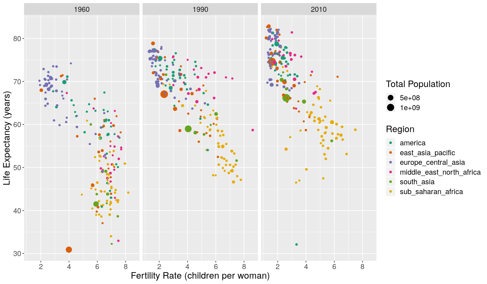
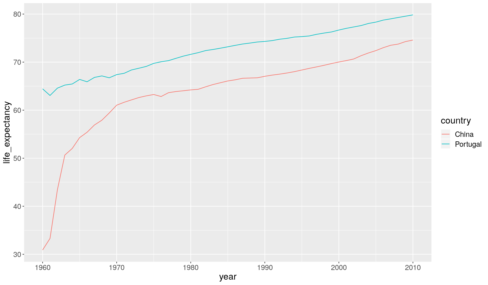
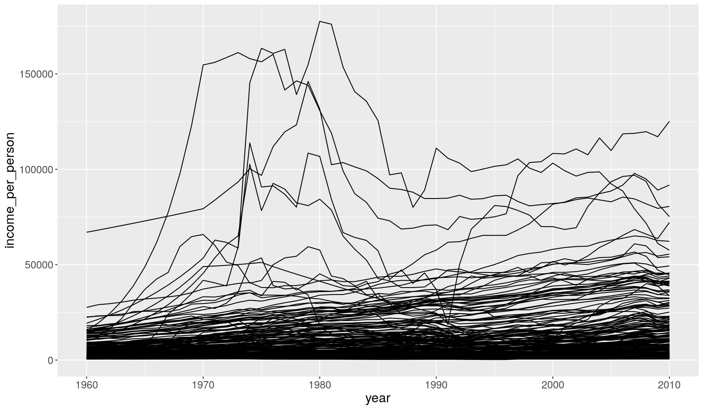
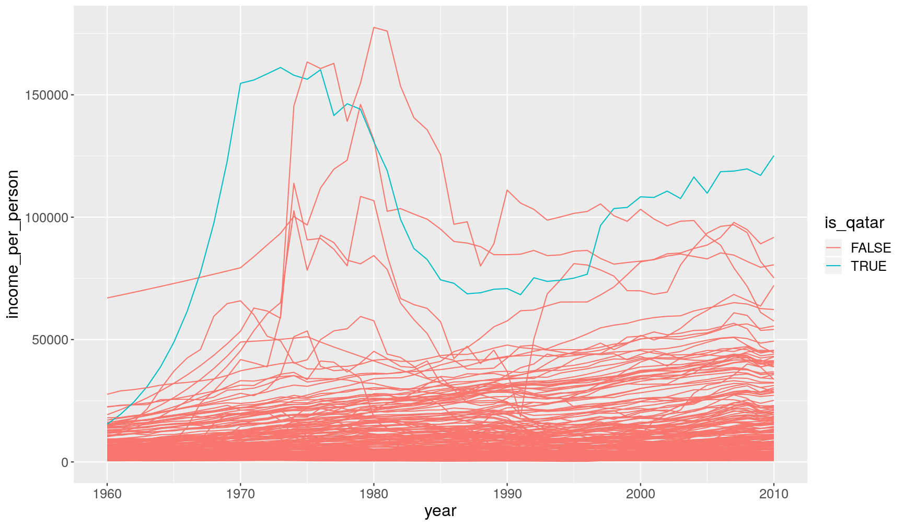
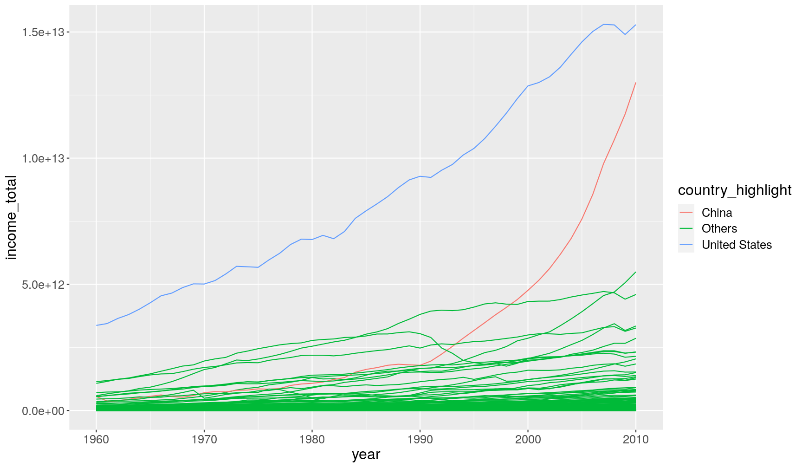

---
# Please do not edit this file directly; it is auto generated.
# Instead, please edit 05-manipulate_observations_dplyr.md in _episodes_rmd/
title: "Manipulating observations (rows) with `dplyr`"
teaching: 40
exercises: 25
questions:
- "How to order rows in a table?"
- "How to retain only unique rows (no duplicates)?"
- "How to identify observations of a dataset that fulfill certain conditions?"
objectives: 
- "Apply the functions `arrange()` `distinct()` and `filter()` to operate on rows."
- "Understand how logical comparisons are made and the logical data type."
- "Remember and distinguish between different types of logical operators."
- "Use conditional operations to obtain specific observations from data using the `filter()` function."
- "Combine the `filter()` and `is.na()` functions to remove missing values."
- "Use the `ifelse()` function to highlight specific observations."
keypoints:
- "Order rows in a table using `arrange()`. Use the `desc()` function to sort in descending order."
- "Retain unique rows in a table using `distinct()`."
- "Choose rows based on conditions using `filter()`."
- "Conditions can be set using several operators: `>`, `>=`, `<`, `<=`, `==`, `!=`, `%in%`."
- "Conditions can be combined using `&` and `|`."
- "The function `is.na()` can be used to identify missing values. It can be negated as `!is.na()` to find non-missing values."
- "Use the `ifelse()` function to define two different outcomes of a condition."
source: Rmd
---

In this lesson we're going to learn how to use the `dplyr` package to manipulate rows 
of our data. 

As usual when starting an analysis on a new script, let's start by loading the 
packages and reading the data. We will continue with gapminder data from 1960 to 2010:

~~~
library(tidyverse)

# Read the data, specifying how missing values are encoded
gapminder1960to2010 <- read_csv("data/raw/gapminder1960to2010_socioeconomic.csv", 
                                na = "")
~~~
{: .language-r}

## Ordering Rows

Or order the rows of a table based on certain variables, we can use the `arrange()` 
function:

~~~
gapminder1960to2010 %>% 
  select(country, world_region, year) %>% 
  # order by year
  arrange(year)
~~~
{: .language-r}

~~~
# A tibble: 9,843 x 3
   country              world_region              year
   <chr>                <chr>                    <dbl>
 1 Afghanistan          south_asia                1960
 2 Angola               sub_saharan_africa        1960
 3 Albania              europe_central_asia       1960
 4 Andorra              europe_central_asia       1960
 5 United Arab Emirates middle_east_north_africa  1960
 6 Argentina            america                   1960
 7 Armenia              europe_central_asia       1960
 8 Antigua and Barbuda  america                   1960
 9 Australia            east_asia_pacific         1960
10 Austria              europe_central_asia       1960
# … with 9,833 more rows
~~~
{: .output}

In this case, the rows are sorted by _increasing numeric order_ of the variable 
year. 

When ordering by a character variable, the order will be determined alphabetically:

~~~
gapminder1960to2010 %>% 
  select(country, world_region, year) %>% 
  # order by world_region
  arrange(world_region)
~~~
{: .language-r}

~~~
# A tibble: 9,843 x 3
   country   world_region  year
   <chr>     <chr>        <dbl>
 1 Argentina america       1960
 2 Argentina america       1961
 3 Argentina america       1962
 4 Argentina america       1963
 5 Argentina america       1964
 6 Argentina america       1965
 7 Argentina america       1966
 8 Argentina america       1967
 9 Argentina america       1968
10 Argentina america       1969
# … with 9,833 more rows
~~~
{: .output}

To arrange based on _descending_ order, you can wrap the variable in the `desc()`
function:

~~~
gapminder1960to2010 %>% 
  select(country, world_region, year) %>% 
  # order by year
  arrange(desc(year))
~~~
{: .language-r}

~~~
# A tibble: 9,843 x 3
   country              world_region              year
   <chr>                <chr>                    <dbl>
 1 Afghanistan          south_asia                2010
 2 Angola               sub_saharan_africa        2010
 3 Albania              europe_central_asia       2010
 4 Andorra              europe_central_asia       2010
 5 United Arab Emirates middle_east_north_africa  2010
 6 Argentina            america                   2010
 7 Armenia              europe_central_asia       2010
 8 Antigua and Barbuda  america                   2010
 9 Australia            east_asia_pacific         2010
10 Austria              europe_central_asia       2010
# … with 9,833 more rows
~~~
{: .output}

Finally, you can include several variables within `arrange()`, which will sort the 
table by each of them. For example:

~~~
gapminder1960to2010 %>% 
  select(country, world_region, year) %>% 
  # order by year, then by world region (z-a), then country (z-a)
  arrange(year, desc(world_region), desc(country))
~~~
{: .language-r}

~~~
# A tibble: 9,843 x 3
   country      world_region        year
   <chr>        <chr>              <dbl>
 1 Zimbabwe     sub_saharan_africa  1960
 2 Zambia       sub_saharan_africa  1960
 3 Uganda       sub_saharan_africa  1960
 4 Togo         sub_saharan_africa  1960
 5 Tanzania     sub_saharan_africa  1960
 6 Sudan        sub_saharan_africa  1960
 7 South Sudan  sub_saharan_africa  1960
 8 South Africa sub_saharan_africa  1960
 9 Somalia      sub_saharan_africa  1960
10 Sierra Leone sub_saharan_africa  1960
# … with 9,833 more rows
~~~
{: .output}

## Retain Unique Rows

Sometimes it is useful to retain rows with unique combinations of some of our variables
(i.e. remove any duplicated rows). This can be done with the `distinct()` function. 

~~~
# get unique combination of main religion and world region
gapminder1960to2010 %>% 
  distinct(main_religion, world_region)
~~~
{: .language-r}

~~~
# A tibble: 27 x 2
   world_region             main_religion
   <chr>                    <chr>        
 1 south_asia               muslim       
 2 south_asia               Muslim       
 3 sub_saharan_africa       christian    
 4 sub_saharan_africa       Christian    
 5 europe_central_asia      muslim       
 6 europe_central_asia      Muslim       
 7 europe_central_asia      christian    
 8 europe_central_asia      Christian    
 9 middle_east_north_africa muslim       
10 middle_east_north_africa Muslim       
# … with 17 more rows
~~~
{: .output}

## Choosing Rows Based on Conditions

To choose rows based on specific criteria, we can use `filter()`. For example, 
to get all the rows of data from the 2000's:

~~~
gapminder1960to2010 %>% 
  select(country, year) %>% 
  filter(year > 2000)
~~~
{: .language-r}

~~~
# A tibble: 1,930 x 2
   country      year
   <chr>       <dbl>
 1 Afghanistan  2001
 2 Afghanistan  2002
 3 Afghanistan  2003
 4 Afghanistan  2004
 5 Afghanistan  2005
 6 Afghanistan  2006
 7 Afghanistan  2007
 8 Afghanistan  2008
 9 Afghanistan  2009
10 Afghanistan  2010
# … with 1,920 more rows
~~~
{: .output}

### Conditional Operations

It is important to understand that when we set a condition like above, the output 
is a _logical vector_. Let's see an example using a small vector.

~~~
some_years <- c(1985, 1990, 1999, 1995, 2010, 2000)
some_years < 2000
~~~
{: .language-r}

~~~
[1]  TRUE  TRUE  TRUE  TRUE FALSE FALSE
~~~
{: .output}

So what the `filter()` function does is evaluate the condition and return the rows 
for which that condition is true. 

It is possible to combine several conditions by using the _logical operators_ 
`&` (AND) and `|` (OR). For example, if we wanted the years between 1990 and 2000:

~~~
# both conditions have to be true
some_years > 1990 & some_years < 2000
~~~
{: .language-r}

~~~
[1] FALSE FALSE  TRUE  TRUE FALSE FALSE
~~~
{: .output}

And if we wanted the years below 1990 or above 2000, then:

~~~
# only one or the other of the conditions has to be true
some_years < 1990 | some_years > 2000
~~~
{: .language-r}

~~~
[1]  TRUE FALSE FALSE FALSE  TRUE FALSE
~~~
{: .output}

> ## Conditional  operators
> 
> To set filtering conditions, use the following _relational operators_:
> 
> - `>` is greater than
> - `>=` is greater than or equal to
> - `<` is less than
> - `<=` is less than or equal to
> - `==` is equal to
> - `!=` is different from
> - `%in%` is contained in
> 
> To combine conditions, use the following _logical operators_:
> 
> - `&` AND
> - `|` OR
> 
> Some functions return logical results and can be used in filtering operations:
> 
> - `is.na(x)` returns _TRUE_ if a value in _x_ is missing
> 
> The `!` can be used to negate a logical condition:
> 
> - `!is.na(x)` returns _TRUE_ if a value in _x_ is NOT missing
> - `!(x %in% y)` returns _TRUE_ if a value in _x_ is NOT present in _y_
{: .callout}

Let's see an example on how we can combine the `filter()` function with plotting. 

In [Hans Rosling's TED Talk](https://www.ted.com/talks/hans_rosling_the_best_stats_you_ve_ever_seen?utm_campaign=tedspread&utm_medium=referral&utm_source=tedcomshare), 
they compared the change in `income_per_person` and `child_mortality` 
between three countries: Uganda, Brazil and South Korea. We can filter our dataset 
to retain only these countries by using the `%in%` operator. 

~~~
gapminder1960to2010 %>% 
  filter(country %in% c("Uganda", "Brazil", "South Korea"))
~~~
{: .language-r}

We will pipe this filter to ggplot and use `geom_path()` to look at the change of these 
countries over time. 
This geometry is similar to `geom_line()`, but it connects points in the order they appear 
on the table (which we can sort beforehand with `arrange()`), whereas `geom_line()` connects 
the points based on the order they appear along the x and y axis. 
(Try changing the code below to see the difference)

~~~
gapminder1960to2010 %>% 
  filter(country %in% c("Uganda", "Brazil", "South Korea")) %>% 
  # ensure data is in order of country and year for geom_path
  arrange(country, year) %>% 
  ggplot(aes(income_per_person, child_mortality)) +
  geom_path(aes(colour = country), arrow = arrow())
~~~
{: .language-r}

> ## Exercise
> 
> 1. Fix the following code (where the word "FIXME" appears), to produce the plot shown below. 
> 
> 
> ~~~
> gapminder1960to2010 %>% 
>   mutate(population_millions = FIXME) %>% 
>   filter(FIXME) %>% 
>   ggplot(aes(children_per_woman, life_expectancy)) +
>   geom_point(aes(size = population_millions, colour = world_region)) +
>   facet_grid(cols = FIXME) +
>   scale_colour_brewer(palette = "Dark2") +
>   labs(x = "Fertility Rate (children per woman)", y = "Life Expectancy (years)", 
>        size = "Total Population (millions)", colour = "Region")
> ~~~
> {: .language-r}
> 
> 
> 
> 2. One of the countries seems to stand out from the general trend in 1960. 
>    Using some conditions inside `filter()`, can you find what country it is? 
> 3. Make a line plot showing how the `life_expectancy` of that country changed over 
>    time compared to another country of your choice.
> 
> > ## Answer 
> > 
> > A1. Here is the fixed code:
> > 
> > 
> > ~~~
> > gapminder1960to2010 %>% 
> >   mutate(population_millions = population/1e6) %>% 
> >   filter(year %in% c(1960, 1990, 2010)) %>% 
> >   ggplot(aes(children_per_woman, life_expectancy)) +
> >   geom_point(aes(size = population_millions, colour = world_region)) +
> >   facet_grid(cols = vars(year)) +
> >   scale_colour_brewer(palette = "Dark2") +
> >   labs(x = "Fertility Rate (children per woman)", y = "Life Expectancy (years)", 
> >        size = "Total Population (millions)", colour = "Region")
> > ~~~
> > {: .language-r}
> > 
> > A2. Based on the x and y values in the graph, we can set a condition with `filter()`,
> > for example:
> > 
> > 
> > ~~~
> > gapminder1960to2010 %>% 
> >   filter(year == 1960 & children_per_woman < 5 & life_expectancy < 35) %>% 
> >   select(country, year, children_per_woman, life_expectancy)
> > ~~~
> > {: .language-r}
> > 
> > 
> > 
> > ~~~
> > # A tibble: 1 x 4
> >   country  year children_per_woman life_expectancy
> >   <chr>   <dbl>              <dbl>           <dbl>
> > 1 China    1960               3.99            31.6
> > ~~~
> > {: .output}
> > 
> > A3. Here is a comparison between China and another country:
> > 
> > 
> > ~~~
> > gapminder1960to2010 %>% 
> >   filter(country %in% c("China", "Portugal")) %>% 
> >   ggplot(aes(x = year, y = life_expectancy)) +
> >   geom_line(aes(colour = country))
> > ~~~
> > {: .language-r}
> > 
> > 
> {: .solution}
{: .challenge}

<!--
> How did the difference in life expectancy between male and female change over time for each country? 
> (hint: use the aesthetic `group = country` within `geom_line()` to have a line for each country).
> > 
> > Here is the line plot showing the change of this difference over time. 
> > There are two countries that have very abrupt change in the 80s 
> > ([possible reason](https://en.wikipedia.org/wiki/Iran%E2%80%93Iraq_War)). 
> > 
> > 
> > ~~~
> > gapminder1960to2010 %>% 
> >   mutate(life_expectancy_female_minus_male = life_expectancy_female - life_expectancy_male) %>% 
> >   ggplot(aes(year, life_expectancy_female_minus_male)) +
> >   geom_line(aes(group = country))
> > ~~~
> > {: .language-r}
> > 
> > 
> > 
> > ~~~
> > Error: Problem with `mutate()` input `life_expectancy_female_minus_male`.
> > ✖ non-numeric argument to binary operator
> > ℹ Input `life_expectancy_female_minus_male` is `life_expectancy_female - life_expectancy_male`.
> > ~~~
> > {: .error}
-->

## Filtering Missing Values

As noted in the callout box above, the `is.na()` function can be used to ask the 
question of whether a value is missing or not (`!is.na()`). 

For example, the following would return the rows where `main_religion` is _not_
missing.

~~~
gapminder1960to2010 %>% 
  filter(!is.na(main_religion))
~~~
{: .language-r}

> ## Exercise 
> 
> - How many observations contain values for both `life_expectancy` _and_ `children_per_woman`?
> 
> > ## Answer
> > 
> > 
> > ~~~
> > gapminder1960to2010 %>% 
> >   filter(!is.na(life_expectancy) & !is.na(children_per_woman)) %>% 
> >   # (optional) pipe the output to nrow() to get the number of rows directly
> >   nrow()
> > ~~~
> > {: .language-r}
> > 
> > 
> > 
> > ~~~
> > [1] 9384
> > ~~~
> > {: .output}
> {: .solution}
{: .challenge}

## Using conditionals with `ifelse`

Conditions are not just useful for filtering rows, but also to modify variables or 
highlight certain observations in the data. 

For example, take the following graph showing the change in income per person:

~~~
gapminder1960to2010 %>% 
  ggplot(aes(x = year, y = income_per_person)) +
  geom_line(aes(group = country))
~~~
{: .language-r}

We can highlight one of the countries by creating a new column (`mutate()`) that stores 
the result of a condition:

~~~
gapminder1960to2010 %>% 
  # the "is_qatar" column will contain TRUE/FALSE values
  mutate(is_qatar = country == "Qatar") %>% 
  ggplot(aes(x = year, y = income_per_person)) +
  geom_line(aes(group = country, colour = is_qatar))
~~~
{: .language-r}

In this case, we used the logical output of that condition as the variable to 
colour our lines with. 

However, sometimes we want more flexibility in defining outcomes from a condition, 
which is where the `ifelse()` is handy. 
This function takes 3 arguments: the condition we want to test, 
the values it should take if it's `TRUE`, and the values it should take if it's `FALSE`. 

For example, let's highlight two countries in the graph and label all the remaining 
countries as "Others" by using `ifelse()`:

~~~
gapminder1960to2010 %>% 
  mutate(income_total = population*income_per_person,
         country_highlight = ifelse(country %in% c("China", "United States"), country, "Others")) %>% 
  ggplot(aes(year, income_total)) +
  geom_line(aes(group = country, colour = country_highlight))
~~~
{: .language-r}

This is what `ifelse()` did for us: 
if the value of `country` is either "China" or "United States" then return 
their respective value, otherwise return the string "Others". 

`ifelse()` works in a _vectorised_ manner, meaning that it evaluates the condition 
at each value and returns the respective result we ask for.

> ## Exercise
> 
> Earlier we saw that `life_expectancy_male` has some values encoded as "-999":
> 
> 
> ~~~
> summary(gapminder1960to2010$life_expectancy_male)
> ~~~
> {: .language-r}
> 
> 
> 
> ~~~
>    Min. 1st Qu.  Median    Mean 3rd Qu.    Max. 
> -999.00   50.03   61.73   10.64   68.15   80.08 
> ~~~
> {: .output}
> 
> Try to fix this issue by using `ifelse()` inside a `mutate()`, replacing the 
> values of `life_expectancy_male` with `NA` if they are equal to "-999" and keeping 
> the original value otherwise. 
> 
> Save the result by updating `gapminder1960to2010` and check that the issue 
> is solved by using the `summary()` function like above. 
> 
> > ## Answer
> > 
> > 
> > ~~~
> > # create new data.frame with missing values for life_expectancy_male
> > gapminder1960to2010 <- gapminder1960to2010 %>% 
> >   mutate(life_expectancy_male = ifelse(life_expectancy_male == -999, NA, life_expectancy_male))
> > 
> > # check the result
> > summary(gapminder1960to2010$life_expectancy_male)
> > ~~~
> > {: .language-r}
> > 
> > 
> > 
> > ~~~
> >    Min. 1st Qu.  Median    Mean 3rd Qu.    Max.    NA's 
> >   16.29   51.80   62.56   60.02   68.41   80.08     459 
> > ~~~
> > {: .output}
> > This is what `ifelse()` did for us: 
> > if the value of `life_expectancy_male` is equal to -999 then return 
> > the value `NA`, otherwise return the respective value of `life_expectancy_male`. 
> > 
> {: .solution}
{: .challenge}
