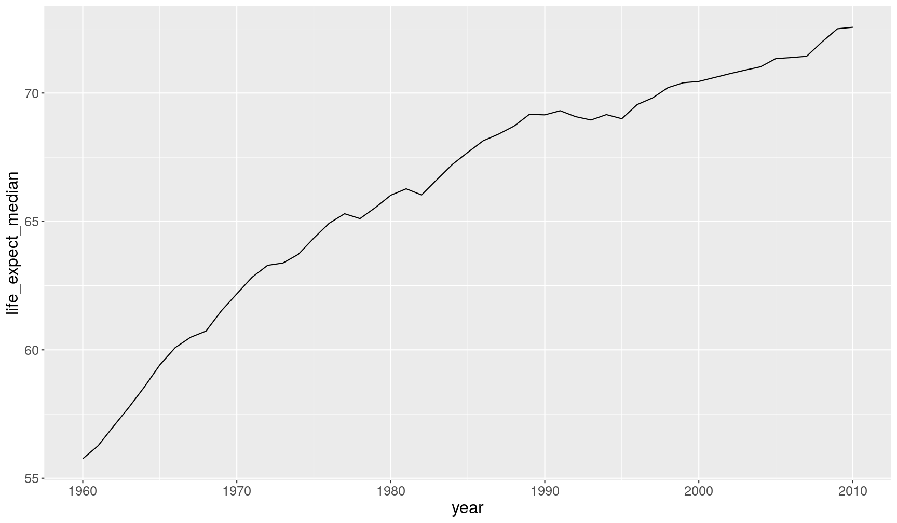
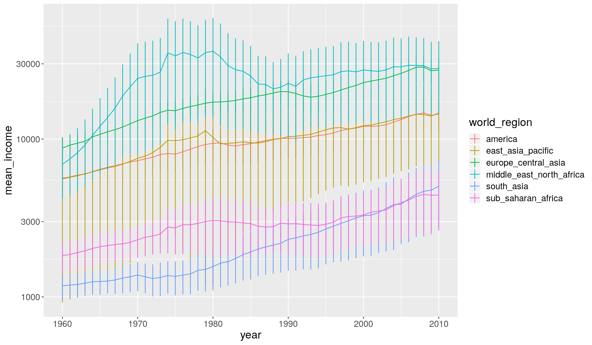
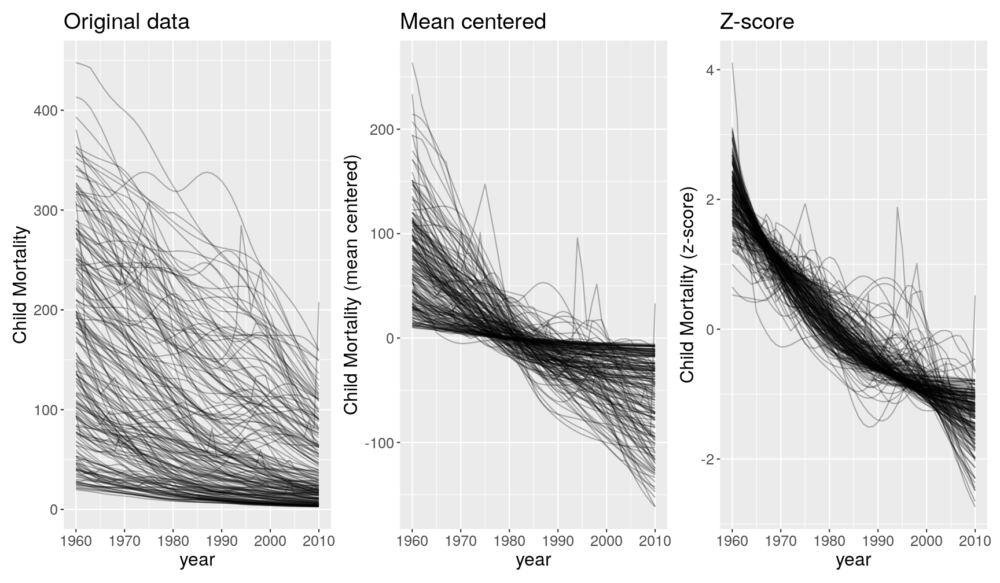
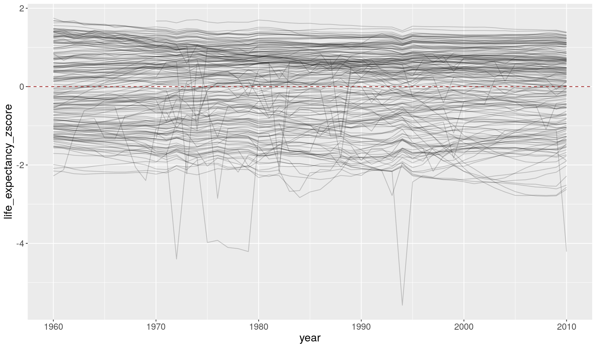

---
# Please do not edit this file directly; it is auto generated.
# Instead, please edit 06-grouped_operations_dplyr.md in _episodes_rmd/
title: "Grouped operations using `dplyr`"
teaching: 50
exercises: 30
questions:
- "How to calculate summary statistics from a dataset?"
- "How to apply those summaries to groups within the data?"
- "How to apply other data manipulation steps to groups within the data?"
objectives: 
- "Recognise when to use grouped operations in data analysis."
- "Differentiate between grouped summaries and other types of grouped operations."
- "Apply grouped summaries using the `group_by()` + `summarise()` functions."
- "Apply other grouped operations such as: `group_by()` + `filter()` and `group_by()` + `mutate()`."
- "Recognise the importance of the `ungroup()` function."
keypoints:
- "Use `summarise()` to calculate summary statistics in your data (e.g. mean, median, maximum, minimum, quantiles, etc.)."
- "Chain together `group_by() %>% summarise()` to calculate those summaries across groups in the data (e.g. countries, years, world regions)."
- "Chain together `group_by() %>% mutate()` or `group_by() %>% filter()` to apply these functions based on groups in the data."
- "As a safety measure, always remember to `ungroup()` tables after using `group_by()` operations."
source: Rmd
---

In this lesson we're going to learn how to use the `dplyr` package to make calculations 
for sub-groups in our data.

As usual when starting an analysis on a new script, let's start by loading the 
packages and reading the data. In this case, let's use the clean dataset that we 
created in the last exercise of the 
[previous episode]({{ page.root }}).

~~~
# load the package
library(tidyverse)

# Read the data, specifying how missing values are encoded
gapminder_clean <- read_csv("data/processed/gapminder1960to2010_socioeconomic_clean.csv", 
                            na = "")
~~~
{: .language-r}

If you haven't completed that exercise, here's how you can recreate the clean dataset:

~~~
gapminder_clean <- read_csv("data/gapminder1960to2010_socioeconomic.csv", na = "") %>% 
  select(-country_id) %>% 
  mutate(population_total = population_male + population_female,
         main_religion = str_to_lower(str_squish(main_religion)),
         life_expectancy_male = ifelse(life_expectancy_male == -999, NA, life_expectancy_male),
         life_expectancy_female = as.numeric(life_expectancy_female)) %>% 
  filter(!is.na(income_groups))
~~~
{: .language-r}

## Summarising data

A common task in data analysis is to summarise variables to get a sense of their 
average and variation. 

We can achieve this task using the `summarise()` function. For example, let's calculate 
what the mean and standard deviation are for life expectancy:

~~~
gapminder_clean %>% 
  summarise(life_expect_mean = mean(life_expectancy, na.rm = TRUE),
            life_expect_sd = sd(life_expectancy, na.rm = TRUE))
~~~
{: .language-r}

~~~
# A tibble: 1 x 2
  life_expect_mean life_expect_sd
             <dbl>          <dbl>
1             64.0           10.1
~~~
{: .output}

A couple of things to notice:

- The output of summarise is a new table, where each column is named according to the 
  input to `summarise()`.
- Within `summarise()` we should use functions for which the output is a single value. 

Also notice that, above, we used the `na.rm` option within the summary functions,
so that they ignored missing values when calculating the respective statistics. 

> ## Summary functions
> 
> There are many functions whose input is a vector (or a column in a table) and the 
> output is a single number. Here are several common ones:
> 
> - `mean(x)` - [arithmetic mean](https://en.wikipedia.org/wiki/Arithmetic_mean)
> - `median(x)` - [median](https://en.wikipedia.org/wiki/Median)
> - `sd(x)` - [standard deviation](https://en.wikipedia.org/wiki/Standard_deviation)
> - `var(x)` - [variance](https://en.wikipedia.org/wiki/Variance) 
> - `IQR(x)` - [interquartile range](https://en.wikipedia.org/wiki/Interquartile_range)
> - `mad(x)` - [median absolute deviation](https://en.wikipedia.org/wiki/Median_absolute_deviation)
> - `min(x)` and `max(x)` - [minimum and maximum](https://en.wikipedia.org/wiki/Sample_maximum_and_minimum)
> - `quantile(x, probs = 0.75)` - [quantile](https://en.wikipedia.org/wiki/Quantile)
>   (use the `probs` option to set the quantile of your choosing)
> - `sum(x)` - addition of all values in "x"
> - `n_distinct(x)` (from `dplyr`) - the number of distinct values in the vector "x"
> 
> All of these have the option `na.rm`, which tells the function remove missing values 
> before doing the calculation.
> 
{: .callout}

### Grouped summaries

In most cases we want to calculate summary statistics within _groups_ of our data. 
We can achieve this by combining `summarise()` with the `group_by()` function. 
For example, let's modify the previous example to calculate the summary for each 
income_group:

~~~
gapminder_clean %>% 
  group_by(income_groups) %>% 
  summarise(life_expect_mean = mean(life_expectancy, na.rm = TRUE),
            life_expect_sd = sd(life_expectancy, na.rm = TRUE))
~~~
{: .language-r}

~~~
# A tibble: 4 x 3
  income_groups       life_expect_mean life_expect_sd
  <chr>                          <dbl>          <dbl>
1 high_income                     72.5           6.02
2 low_income                      52.3           7.26
3 lower_middle_income             60.4           7.93
4 upper_middle_income             66.8           7.34
~~~
{: .output}

- The table output now includes both the columns we defined within `summarise()` 
  as well as the grouping columns defined within `group_by()`.

> ## Exercise 
> 
> 1. Calculate the median `life_expectancy` across the years. Can you graph how it 
>    changed over time?
> 2. Modify the previous code to calculate the median `life_expectancy` per year and 
>    world region. Can you graph how each world region changed over time?
> 3. Fix the following code (where "FIXME" appears) to recreate the graph below.
> 
> 
> ~~~
> gapminder_clean %>% 
>   # remove rows with missing values for children_per_woman
>   filter(FIXME) %>% 
>   # grouped summary
>   group_by(year) %>% 
>   summarise(q5 = quantile(children_per_woman, probs = 0.05),
>             q25 = quantile(children_per_woman, probs = 0.25),
>             median = median(children_per_woman),
>             q75 = quantile(children_per_woman, FIXME),
>             q95 = quantile(children_per_woman, FIXME)) %>% 
>   # plot
>   ggplot(aes(year, median)) +
>   geom_ribbon(aes(ymin = q5, ymax = q95), alpha = 0.2) + 
>   geom_ribbon(aes(ymin = FIXME, ymax = q75), alpha = 0.2) +
>   geom_line() +
>   theme_minimal() +
>   labs(FIXME)
> ~~~
> {: .language-r}
> 
> 
> 
> > ## Answer
> > 
> > A1. To calculate the median per year, we combine `group_by()` and `summarise()`:
> > 
> > 
> > ~~~
> > gapminder_clean %>% 
> >   group_by(year) %>% 
> >   summarise(life_expect_median = median(life_expectancy, na.rm = TRUE))
> > ~~~
> > {: .language-r}
> > 
> > 
> > 
> > ~~~
> > # A tibble: 51 x 2
> >     year life_expect_median
> >    <dbl>              <dbl>
> >  1  1960               55.8
> >  2  1961               56.3
> >  3  1962               57.0
> >  4  1963               57.8
> >  5  1964               58.6
> >  6  1965               59.4
> >  7  1966               60.1
> >  8  1967               60.5
> >  9  1968               60.7
> > 10  1969               61.5
> > # … with 41 more rows
> > ~~~
> > {: .output}
> > 
> > To create the desired plot, we could _pipe_ the previous code directly to ggplot:
> > 
> > 
> > ~~~
> > gapminder_clean %>% 
> >   group_by(year) %>% 
> >   summarise(life_expect_median = median(life_expectancy, na.rm = TRUE)) %>% 
> >   ggplot(aes(year, life_expect_median)) +
> >   geom_line()
> > ~~~
> > {: .language-r}
> > 
> > 
> > 
> > A2. To get the change per year and also world region, we can add `world_region` to 
> > `group_by()`:
> > 
> > 
> > ~~~
> > gapminder_clean %>% 
> >   group_by(year, world_region) %>% 
> >   summarise(life_expect_median = median(life_expectancy, na.rm = TRUE))
> > ~~~
> > {: .language-r}
> > 
> > 
> > 
> > ~~~
> > # A tibble: 306 x 3
> > # Groups:   year [51]
> >     year world_region             life_expect_median
> >    <dbl> <chr>                                 <dbl>
> >  1  1960 america                                60.8
> >  2  1960 east_asia_pacific                      55  
> >  3  1960 europe_central_asia                    68.7
> >  4  1960 middle_east_north_africa               52.7
> >  5  1960 south_asia                             42.8
> >  6  1960 sub_saharan_africa                     44.8
> >  7  1961 america                                61.3
> >  8  1961 east_asia_pacific                      55.5
> >  9  1961 europe_central_asia                    68.9
> > 10  1961 middle_east_north_africa               53.7
> > # … with 296 more rows
> > ~~~
> > {: .output}
> > 
> > And we can modify our previous graph, by adding a colour aesthetic to `geom_line()`:
> > 
> > 
> > ~~~
> > gapminder_clean %>% 
> >   group_by(year, world_region) %>% 
> >   summarise(life_expect_median = median(life_expectancy, na.rm = TRUE)) %>% 
> >   ggplot(aes(year, life_expect_median)) +
> >   geom_line(aes(colour = world_region))
> > ~~~
> > {: .language-r}
> > 
> > 
> > 
> > 
> > A3. Here is the fixed code:
> > 
> > 
> > ~~~
> > gapminder_clean %>% 
> >   # remove rows with missing values for children_per_woman
> >   filter(!is.na(children_per_woman)) %>% 
> >   # grouped summary
> >   group_by(year) %>% 
> >   summarise(q5 = quantile(children_per_woman, probs = 0.05),
> >             q25 = quantile(children_per_woman, probs = 0.25),
> >             median = median(children_per_woman),
> >             q75 = quantile(children_per_woman, probs = 0.75),
> >             q95 = quantile(children_per_woman, probs = 0.95)) %>% 
> >   # plot
> >   ggplot(aes(year, median)) +
> >   geom_ribbon(aes(ymin = q5, ymax = q95), alpha = 0.2) + 
> >   geom_ribbon(aes(ymin = q25, ymax = q75), alpha = 0.2) +
> >   geom_line() +
> >   theme_minimal() +
> >   labs(FIXME, 
> >        title = "Median, 50% and 90% percentiles"
> > ~~~
> > {: .language-r}
> {: .solution}
{: .challenge}

## Counting observations per group 

One common question when summarising data in this way, is to know how many observations 
(rows) there are for each group. We can achieve this with the special `n()` function, 
which is specifically designed to be used within `summarise()`. 

For example, let's take our previous summary of life expectancy per income group 
and add the number of observations (rows) in each group:

~~~
gapminder_clean %>% 
  group_by(income_groups) %>% 
  summarise(life_expect_mean = mean(life_expectancy, na.rm = TRUE),
            life_expect_sd = sd(life_expectancy, na.rm = TRUE),
            n_obs = n())
~~~
{: .language-r}

~~~
# A tibble: 4 x 4
  income_groups       life_expect_mean life_expect_sd n_obs
  <chr>                          <dbl>          <dbl> <int>
1 high_income                     72.5           6.02  2805
2 low_income                      52.3           7.26  1836
3 lower_middle_income             60.4           7.93  2397
4 upper_middle_income             66.8           7.34  2754
~~~
{: .output}

Notice that this gives you the _total number of rows_ per group. But because of missing 
data, we might have less observations with actual life expectancy information. 

To count how many values had complete data for `life_expectancy`, we can use a trick 
by combining the `sum()` and `is.na()` functions in the following way:

~~~
gapminder_clean %>% 
  group_by(income_groups) %>% 
  summarise(life_expect_mean = mean(life_expectancy, na.rm = TRUE),
            life_expect_sd = sd(life_expectancy, na.rm = TRUE),
            n_obs_total = n(),
            n_obs_life_expect = sum(!is.na(life_expectancy)))
~~~
{: .language-r}

~~~
# A tibble: 4 x 5
  income_groups     life_expect_mean life_expect_sd n_obs_total n_obs_life_expe…
  <chr>                        <dbl>          <dbl>       <int>            <int>
1 high_income                   72.5           6.02        2805             2642
2 low_income                    52.3           7.26        1836             1836
3 lower_middle_inc…             60.4           7.93        2397             2397
4 upper_middle_inc…             66.8           7.34        2754             2632
~~~
{: .output}

But what is that `sum(!is.na(life_expectancy))`? Let's use a simpler example with 
a vector to understand what is happening.

~~~
some_numbers <- c(1, 2, NA, 30, NA, 22)
~~~
{: .language-r}

The first thing to remember is that `is.na()` returns a logical vector:

~~~
# returns TRUE if value is NOT missing (remember the exclamation mark)
!is.na(some_numbers)
~~~
{: .language-r}

~~~
[1]  TRUE  TRUE FALSE  TRUE FALSE  TRUE
~~~
{: .output}

Because _R_ encodes `TRUE` as the value 1 and `FALSE` as the value 0, we can use the 
`sum()` function, which will add up the value 1 for all the TRUEs, which effectively
is the same as counting how many values are not missing:

~~~
sum(!is.na(some_numbers))
~~~
{: .language-r}

~~~
[1] 4
~~~
{: .output}

This trick can be used with any kind of logical vector. For example, if we wanted 
to know how many numbers were above 10:

~~~
# this is the condition - note the missing values in the output
some_numbers > 10
~~~
{: .language-r}

~~~
[1] FALSE FALSE    NA  TRUE    NA  TRUE
~~~
{: .output}

~~~
# this is how many cases are TRUE - note we need to tell the function to remove NAs
sum(some_numbers > 10, na.rm = TRUE)
~~~
{: .language-r}

~~~
[1] 2
~~~
{: .output}

> ## Exercise
> 
> Using `group_by()` & `summarise()`, calculate the following for each `year` and 
> `world_region` (save the output in a new table called `income_summary`:
> 
> - The mean and standard deviation of income.
> - The total number of observations (in our case this corresponds to number of countries) 
>   (hint: `n()`).
> - The number of observations that have data for `income_per_person` 
>   (hint: `sum(!is.na(your_variable))`).
> - The number of observations for which `income_per_person` is _less than_ 365*2 ($2 per day).
> 
> (optional) Graph the output as a line chart showing the change of each variable 
> over time. 
> 
> > ## Answer
> > 
> > Here is the solution, we `group_by(year, world_region)` and then pipe the grouped 
> > table to `summarise()`, where we use calculate the requested statistics:
> > 
> > 
> > ~~~
> > income_summary <- gapminder_clean %>% 
> >   group_by(year, world_region) %>% 
> >   summarise(mean_income = mean(income_per_person, na.rm = TRUE),
> >             sd_income = sd(income_per_person, na.rm = TRUE),
> >             n_total = n(),
> >             n_income = sum(!is.na(income_per_person)),
> >             n_income_below_2dollar = sum(income_per_person < 365*2, na.rm = TRUE))
> > ~~~
> > {: .language-r}
> > 
> > For example, here we show the proportion of countries that have income less than $2,
> > so we divide `n_income_below_2dollar` (number of countries below this income) by 
> > `n_income` (number of countries with non-missing data for income):
> > 
> > 
> > ~~~
> > income_summary %>% 
> >   ggplot(aes(year, n_income_below_2dollar/n_income)) +
> >   geom_line(aes(colour = world_region))
> > ~~~
> > {: .language-r}
> > 
> > 
> > 
> > And here we graph the mean and its [standard error](https://en.wikipedia.org/wiki/Standard_error) 
> > (= standard deviation divided by the square-root of the number of observations). 
> > We multiply the SEM by 2, which gives an rough 95% confidence interval 
> > ([with some assumptions...](https://en.wikipedia.org/wiki/Standard_error#Assumptions_and_usage)):
> > 
> > 
> > ~~~
> > income_summary %>% 
> >   # calculate standard error
> >   mutate(se_income = sd_income/sqrt(n_income)) %>% 
> >   # make the graph
> >   ggplot(aes(year, mean_income, colour = world_region)) +
> >   geom_line() +
> >   # this adds the error bars
> >   geom_linerange(aes(ymin = mean_income - 2*se_income, ymax = mean_income + 2*se_income)) +
> >   scale_y_continuous(trans = "log10")
> > ~~~
> > {: .language-r}
> > 
> > 
> {: .solution}
{: .challenge}

## Grouped `mutate()` 

Let's say we wanted to calculate the population of each country as a percentage of the 
total population (across all countries) for each year. In other words, we want to 
_add a new column_ to our table, which is a job for `mutate()`.

Here's the example:

~~~
gapminder_clean %>% 
  group_by(year) %>% 
  mutate(population_pct = population_total/sum(population_total, na.rm = TRUE)*100) %>% 
  # select a few columns for readability purpose only
  select(country, year, population_total, population_pct)
~~~
{: .language-r}

~~~
# A tibble: 9,792 x 4
# Groups:   year [51]
   country      year population_total population_pct
   <chr>       <dbl>            <dbl>          <dbl>
 1 Afghanistan  1960          8996343          0.298
 2 Afghanistan  1961          9166754          0.298
 3 Afghanistan  1962          9345868          0.299
 4 Afghanistan  1963          9533952          0.299
 5 Afghanistan  1964          9731362          0.299
 6 Afghanistan  1965          9938420          0.299
 7 Afghanistan  1966         10152333          0.300
 8 Afghanistan  1967         10372619          0.300
 9 Afghanistan  1968         10604346          0.301
10 Afghanistan  1969         10854432          0.301
# … with 9,782 more rows
~~~
{: .output}

And, as usual, we could have piped this to a graph (try running it):

~~~
gapminder_clean %>% 
  group_by(year) %>% 
  mutate(population_pct = population_total/sum(population_total, na.rm = TRUE)*100) %>% 
  # make a graph
  ggplot(aes(year, population_pct)) +
  geom_line(aes(group = country))
~~~
{: .language-r}

> ## Data Tip: Standardising Variables 
> 
> Often it's useful to standardise your variables, so that they are on a scale that 
> can be interpreted and/or compared more easily. 
> Here are some commonly used metrics:
> 
> - Percentage (or fraction). This has no units.
> - Mean-centering (each value minus the mean of the group). This has the same units 
>   as the original variable. It's interpreted as the deviation of that observation 
>   from the group's mean.
> - [Standard score (Z-score)](https://en.wikipedia.org/wiki/Standard_score). This 
>   has no units. It can be interpreted as the number of standard deviations away 
>   from the mean.
> 
> Take the following graphs as an example: 
> 
> 
> 
> These 3 graphs show different perspectives of the data:
> 
> - The first graph tells us how many children die in each country across years. 
> - The second graph tells us how many children die in each country as a deviation 
>   from the country's mean (e.g. 200 children above the mean or -100 children below 
>   the mean).
> - The third graph tells us how many children die in each country on a scale that 
>   is _relative_ to the variation in that country (e.g. 2 standard deviations above 
>   the mean and -2 standard deviations below the mean).
> 
> Which view of the data one chooses, depends on the underlying questions, and it's up 
> for the analyst to decide. In this case, if what I'm interested in is how many 
> children still die across the world, then I'd choose the graph on the left. 
> But if I'm interested in understanding how countries compare in their relative efforts 
> to reduce child mortality, then the 3rd graph migth be more adequate.
> 
{: .discussion}

<!--

Example of mean-centering and z-score calculation: 

~~~
gapminder_clean %>% 
  select(country, year, life_expectancy) %>% 
  group_by(year) %>% 
  mutate(life_expectancy_mean = mean(life_expectancy, na.rm = TRUE),
         life_expectancy_sd = sd(life_expectancy, na.rm = TRUE)) %>% 
  mutate(life_expectancy_centered = life_expectancy - life_expectancy_mean,
         life_expectancy_zscore = (life_expectancy - life_expectancy_mean)/life_expectancy_sd) %>% 
  ggplot(aes(year, life_expectancy_zscore)) +
  geom_line(aes(group = country), alpha = 0.2) +
  geom_hline(yintercept = 0, linetype = "dashed", colour = "brown")
~~~
{: .language-r}

~~~
Warning: Removed 285 rows containing missing values (geom_path).
~~~
{: .error}

-->

## Grouped `filter()`

Let's say we wanted to get the rows of our table where the income was the lowest 
for that year. For _getting rows based on a condition_ we use `filter()`. 
Here is an example:

~~~
gapminder_clean %>% 
  group_by(year) %>% 
  filter(income_per_person == min(income_per_person, na.rm = TRUE))
~~~
{: .language-r}

~~~
# A tibble: 51 x 19
# Groups:   year [51]
   country world_region economic_organi… income_groups main_religion  year
   <chr>   <chr>        <chr>            <chr>         <chr>         <dbl>
 1 Congo,… sub_saharan… g77              low_income    christian      2000
 2 Congo,… sub_saharan… g77              low_income    christian      2001
 3 Congo,… sub_saharan… g77              low_income    christian      2002
 4 Congo,… sub_saharan… g77              low_income    christian      2003
 5 Congo,… sub_saharan… g77              low_income    christian      2004
 6 Congo,… sub_saharan… g77              low_income    christian      2005
 7 Congo,… sub_saharan… g77              low_income    christian      2006
 8 Congo,… sub_saharan… g77              low_income    christian      2007
 9 Congo,… sub_saharan… g77              low_income    christian      2008
10 Congo,… sub_saharan… g77              low_income    christian      2009
# … with 41 more rows, and 13 more variables: population_male <dbl>,
#   population_female <dbl>, income_per_person <dbl>, life_expectancy <dbl>,
#   life_expectancy_female <dbl>, life_expectancy_male <dbl>,
#   children_per_woman <dbl>, newborn_mortality <dbl>, child_mortality <dbl>,
#   school_years_men <dbl>, school_years_women <dbl>,
#   hdi_human_development_index <dbl>, population_total <dbl>
~~~
{: .output}

> ## Exercise
> 
> The following graph shows the change in child mortality over the years:
> 
> 
> ~~~
> gapminder_clean %>%
>   filter(!is.na(child_mortality)) %>% 
>   # group_by(year) %>%
>   # mutate(child_mortality = child_mortality - mean(child_mortality)) %>%
>   ggplot(aes(x = year, y = child_mortality)) +
>   geom_line(aes(group = country))
> ~~~
> {: .language-r}
> 
> 
> 
> Fix the code below, to graph the change in child mortality centered on the mean of 
> each year:
> 
> 
> ~~~
> gapminder_clean %>%
>   filter(!is.na(child_mortality)) %>% 
>   group_by(FIXME) %>%
>   mutate(child_mortality_centered = FIXME) %>%
>   ggplot(aes(x = year, y = child_mortality_centered)) +
>   geom_line(aes(group = country)) +
>   # adds an horizontal line
>   geom_hline(yintercept = 0, colour = "firebrick", size = 1)
> ~~~
> {: .language-r}
> 
> > ## Answer
> > 
> > Here is the fixed code:
> > 
> > 
> > ~~~
> > gapminder_clean %>%
> >   filter(!is.na(child_mortality)) %>% 
> >   # group by year
> >   group_by(year) %>%
> >   # subtract the mean from each value of child mortality
> >   mutate(child_mortality_centered = child_mortality - mean(child_mortality)) %>%
> >   ggplot(aes(x = year, y = child_mortality_centered)) +
> >   geom_line(aes(group = country)) +
> >   geom_hline(yintercept = 0, colour = "firebrick", size = 1)
> > ~~~
> > {: .language-r}
> > 
> > 
> > 
> > This graph shows a different perspective of the data, which is now centered 
> > around the mean of each year (highlighted by the horizontal line at zero). 
> > While in 1960 countries were very variable, with some countries well below 
> > the mean and others well above it, in 2010 the coutries are all much more 
> > tightly distributed around the mean. 
> > The world is "converging" towards the same average value.
> {: .solution}
{: .challenge}

## Remove groups with `ungroup()`

Whenever one does a grouping operation, it's always a good practice to remove 
the groups afterwards, otherwise we may unintentonally be doing operations within 
groups later on. 

Take this example, where we calculate the total income of each world region and 
year (and save it in a new object):

~~~
total_incomes <- gapminder_clean %>% 
  group_by(world_region, year) %>% 
  summarise(total_income = sum(income_per_person))

total_incomes
~~~
{: .language-r}

~~~
# A tibble: 306 x 3
# Groups:   world_region [6]
   world_region  year total_income
   <chr>        <dbl>        <dbl>
 1 america       1960       197929
 2 america       1961       201360
 3 america       1962       207046
 4 america       1963       209785
 5 america       1964       217924
 6 america       1965       225248
 7 america       1966       231937
 8 america       1967       237498
 9 america       1968       243673
10 america       1969       251068
# … with 296 more rows
~~~
{: .output}

As you see in the output, the grouping by `world_region` was retained (by default  
`summarise()` drops the last grouping variable). Now, let's say that I wanted to transform 
the `total_income` variable to a percentage of the total. 
I can use `mutate()` to update my table:

~~~
total_incomes <- total_incomes %>% 
  mutate(total_income_pct = total_income/sum(total_income)*100)
~~~
{: .language-r}

So, I should expect that `total_income_pct` adds up to 100%:

~~~
sum(total_incomes$total_income_pct)
~~~
{: .language-r}

~~~
[1] 600
~~~
{: .output}

But it adds up to 600% instead! Why? Because the table was still grouped by `world_region`, 
the percentages were calculated per world region. And there's 6 of them, therefore my 
percentages in this case add up to 100% _within_ each world region, or 600% in total. 

The way to resolve this is to ensure we remove any groups from our table, which we 
can do with `ungroup()`. Here's the full string of commands, with the ungrouping 
step added:

~~~
total_incomes <- gapminder_clean %>% 
  group_by(world_region, year) %>% 
  # this calculates total income per world_region and year
  summarise(total_income = sum(income_per_person)) %>% 
  # this removes any leftover groups
  ungroup() %>% 
  # now we calculate the total income as a percentage
  mutate(total_income_pct = total_income/sum(total_income)*100)
~~~
{: .language-r}

And we can check our percentages now add up to 100%:

~~~
sum(total_incomes$total_income_pct)
~~~
{: .language-r}

~~~
[1] 100
~~~
{: .output}

## (optional) Advanced Examples 

This section briefly demonstrates slightly more advanced examples of using 
grouped operations, mixed with visualisation. The explanations are brief, but 
can hopefully demonstrate the range of questions that we can ask from our data.

* We can use conditional vector subsetting (with `[]`) inside these functions. 
  In this example, we find the `country` where the `income_per_person` is lowest,
  per year.

~~~
gapminder_clean %>% 
  # remove missing values
  filter(!is.na(income_per_person)) %>% 
  # for each year
  group_by(year) %>% 
  # calculate the minimum income and the country where income is equal to the minimum
  summarise(income_min = min(income_per_person),
            country = country[income_per_person == min(income_per_person)]) %>% 
  # visualise
  ggplot(aes(year, income_min)) +
  geom_line() +
  geom_point(aes(colour = country))
~~~
{: .language-r}

* The `lead()` and `lag()` functions shift vectors by one value, so that we can use 
  them for example to compare values ahead or behind the current value. 
  The following example calculates the change in child mortality between the current 
  year and the previous one.

~~~
gapminder_clean %>% 
  # for each country
  group_by(country) %>% 
  # order the table by year
  arrange(year) %>% 
  # calculate difference between current and "lagged" child_mortality
  mutate(child_mortality_dif = child_mortality - lag(child_mortality)) %>% 
  # plot
  ggplot(aes(year, child_mortality_dif)) +
  geom_line(aes(group = country), alpha = 0.1) +
  geom_hline(yintercept = 0, colour = "brown")
~~~
{: .language-r}

~~~
Warning: Removed 316 rows containing missing values (geom_path).
~~~
{: .error}

* The `cumsum()` function can be used to calculate cumulative sums (see more 
  cumulative functions in [dplyr's cheat sheet](https://github.com/rstudio/cheatsheets/raw/master/data-transformation.pdf))

~~~
gapminder_clean %>% 
  # remove missing values
  filter(!is.na(income_per_person)) %>% 
  # for each country
  group_by(country) %>% 
  # order by year
  arrange(year) %>% 
  # calculate cumulative income_per_person
  mutate(cumulative_wealth = cumsum(income_per_person)) %>% 
  # plot
  ggplot(aes(year, cumulative_wealth)) +
  geom_line(aes(group = country)) +
  scale_y_continuous(trans = "log10")
~~~
{: .language-r}

