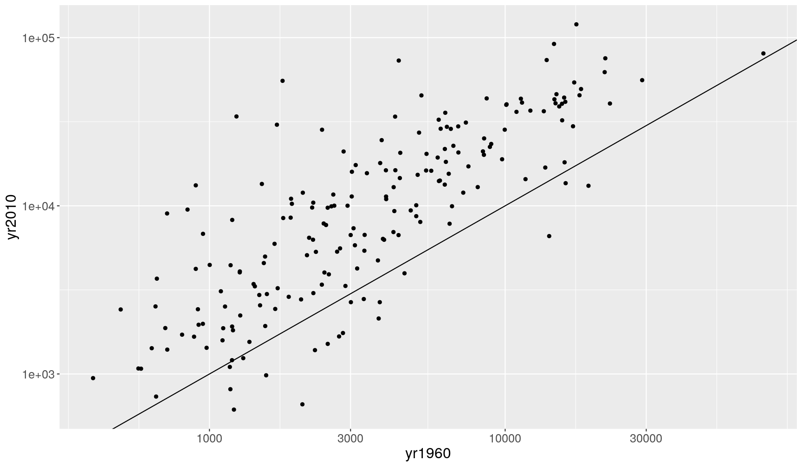
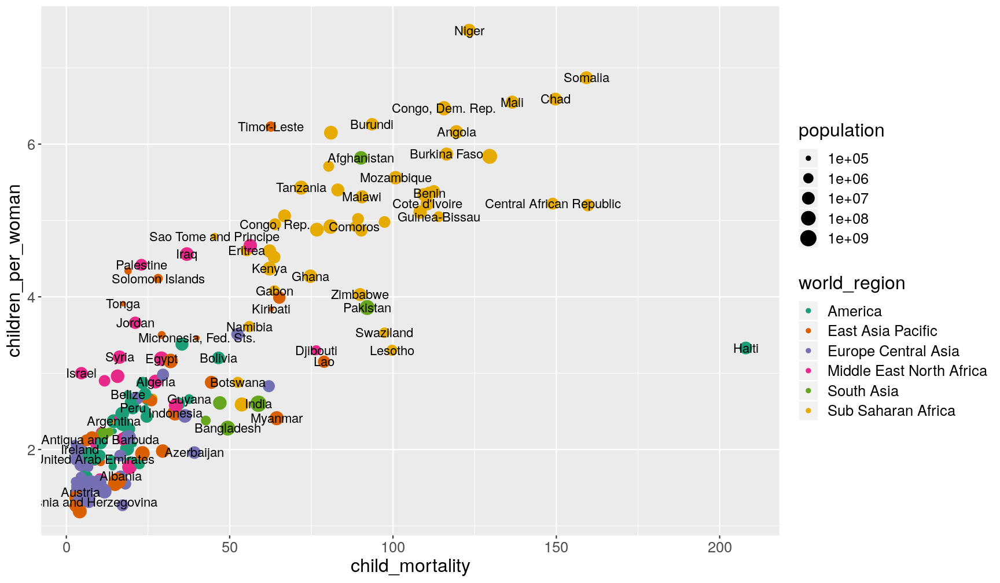
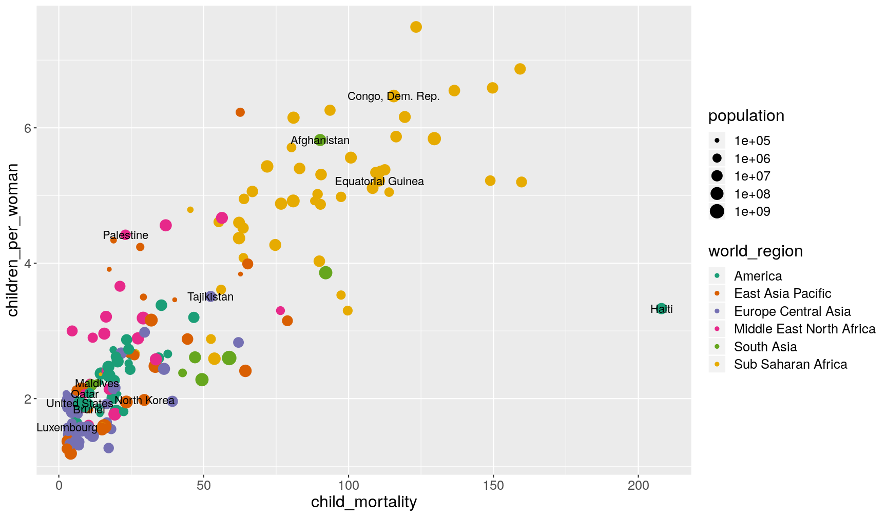

---
# Please do not edit this file directly; it is auto generated.
# Instead, please edit 09-reshaping.md in _episodes_rmd/
title: "Data reshaping: from wide to long and back"
teaching: 20
exercises: 15
questions:
- "How to change the shape of a table from a 'wide' to a 'long' format?"
- "When is one or the other format more suitable for analysis?"
objectives: 
- "Apply the `pivot_wider()` and `pivot_longer()` functions to reshape data frames."
- "Recognise some cases when using a wide or long format is desirable."
keypoints:
- "Use `pivot_wider()` to reshape a table from _long_ to _wide_ format."
- "Use `pivot_longer()` to reshape a table from _wide_ to _long_ format."
- "To figure out which data format is more suited for a given analysis, it can help to think about what visualisation you want to make with `ggplot`: any aesthetics needed to build the graph should exist as columns of your table."
source: Rmd
---

In this lesson we're going to learn how to use functions from the `tidyr` package 
(part of `tidyverse`) to help us change the shape of our data to suit our needs.

As usual when starting an analysis on a new script, let's start by loading the 
packages and reading the data. In this case, let's use the clean dataset that we 
created in the last exercise of our 
[previous episode]({{ page.root }}).

~~~
# load the package
library(tidyverse)
# Read the data, specifying how missing values are encoded
gapminder_clean <- read_csv("data/processed/gapminder1960to2010_socioeconomic_clean.csv", 
                            na = "")
~~~
{: .language-r}

If you haven't completed that exercise, here's how you can recreate the clean dataset:

~~~
gapminder_clean <- read_csv("data/raw/gapminder1960to2010_socioeconomic.csv", na = "") %>% 
 # fix typos in main_religion and world region
 mutate(main_religion = str_to_title(str_squish(main_religion)),
        world_region = str_to_title(str_replace_all(world_region, "_", " "))) %>% 
 # fit typos in income groups, which needs more steps
 mutate(income_groups = str_remove(income_groups, "_income")) %>% 
 mutate(income_groups = str_to_title(str_replace_all(income_groups, "_", " "))) %>% 
 # fix/create numeric variables
 mutate(life_expectancy_female = as.numeric(life_expectancy_female),
        life_expectancy_male = ifelse(life_expectancy_male == -999, NA, life_expectancy_male))
~~~
{: .language-r}

## Data reshaping

What we mean by "the shape of our data" is how the values are distributed across rows or 
columns. Here's a visual representation of the same data in two different shapes:

- "Long" format is where we have a column for each of the types of things we measured 
  or recorded in our data. In other words, each _variable_ has its own column.
- "Wide" format occurs when we have data relating to the same measured thing in 
  different columns. In this case, we have values related to our "metric" spread 
  across multiple columns (a column each for a year). 
  
Neither of these formats is necessarily more correct than the other: it will depend 
on what analysis you intend on doing. 
However, it is worth mentioning that the "long" format is often preferred, as it 
is clearer how many distinct types of variables we have in the data. 

To figure out which format you might need, it may help to think of which visualisations 
you may want to build with `ggplot2`. Taking the above example:

- If one was interested in looking at the change of the "metric" across years for each country,
  then the long format is more suitable to define each _aesthetic_ of such a graph: 
  `aes(x = year, y = metric, colour = country)`.
- If one was interested in the _correlation_ of this metric between 1960 and 2010, then the 
  wide format would be more suitable: `aes(x = yr1960, y = yr2010, colour = country)`.

### Using the `pivot` functions

Let's look at how we can reshape our data in practice. There are two functions in the 
`tidyr` package (part of `tidyverse`) that can help us with this:

- `pivot_wider()`: from _long_ to _wide_ format.
- `pivot_longer()`: from _wide_ to _long_ format.

Here is the same picture with added code: 

Let's say we'd like to look at the correlation of `income_per_person` between 1960 and 
2010 across all the countries in our dataset. 
To achieve this, we will need to create a "wide" version of our table, where each row 
is a country and each column a year, with values of `income_per_person` in each cell 
of the table.

~~~
income_wide <- gapminder_clean %>% 
  # select only the columns we're interested in
  select(country, year, income_per_person) %>% 
  # use pivot_wider to go from long to wide format
  pivot_wider(names_from = "year", 
              names_prefix = "yr",
              values_from = "income_per_person")
income_wide
~~~
{: .language-r}

~~~
# A tibble: 193 x 52
   country yr1960 yr1961 yr1962 yr1963 yr1964 yr1965 yr1966 yr1967 yr1968 yr1969
   <chr>    <dbl>  <dbl>  <dbl>  <dbl>  <dbl>  <dbl>  <dbl>  <dbl>  <dbl>  <dbl>
 1 Afghan…   2744   2702   2683   2665   2649   2641   2598   2601   2623   2594
 2 Angola    3861   4313   4134   4284   4695   4974   5187   5408   5247   5318
 3 Albania   2585   2607   2693   2785   2880   2985   3098   3215   3331   3444
 4 Andorra  15234  16469  17805  19248  20809  22496  24320  26291  28422  30726
 5 United…   1767   1973   2203   2863   4871   8285  14092  23968  28831  34679
 6 Argent…   9765  10299   9976   9589  10418  11202  11116  11257  11574  12385
 7 Armenia   3003   3120   3153   3034   3378   3524   3651   3769   3946   3959
 8 Antigu…   4419   4571   4727   4888   5055   5227   5405   5588   5777   5973
 9 Austra…  15972  15678  16311  16939  17700  18195  18305  19131  19817  20494
10 Austria  11302  11865  12105  12547  13242  13566  14262  14620  15226  16164
# … with 183 more rows, and 41 more variables: yr1970 <dbl>, yr1971 <dbl>,
#   yr1972 <dbl>, yr1973 <dbl>, yr1974 <dbl>, yr1975 <dbl>, yr1976 <dbl>,
#   yr1977 <dbl>, yr1978 <dbl>, yr1979 <dbl>, yr1980 <dbl>, yr1981 <dbl>,
#   yr1982 <dbl>, yr1983 <dbl>, yr1984 <dbl>, yr1985 <dbl>, yr1986 <dbl>,
#   yr1987 <dbl>, yr1988 <dbl>, yr1989 <dbl>, yr1990 <dbl>, yr1991 <dbl>,
#   yr1992 <dbl>, yr1993 <dbl>, yr1994 <dbl>, yr1995 <dbl>, yr1996 <dbl>,
#   yr1997 <dbl>, yr1998 <dbl>, yr1999 <dbl>, yr2000 <dbl>, yr2001 <dbl>,
#   yr2002 <dbl>, yr2003 <dbl>, yr2004 <dbl>, yr2005 <dbl>, yr2006 <dbl>,
#   yr2007 <dbl>, yr2008 <dbl>, yr2009 <dbl>, yr2010 <dbl>
~~~
{: .output}

Note that the `names_prefix` argument is optional. Here, we've used it because it's a
good idea to avoid column names that start with a number. In other cases you can omit it.

Now, we could answer our question of interest:

~~~
income_wide %>% 
  ggplot(aes(yr1960, yr2010)) +
  geom_point() +
  geom_abline() +
  scale_x_continuous(trans = "log10") +
  scale_y_continuous(trans = "log10")
~~~
{: .language-r}

The oposite of this operation can be achieved with the `pivot_longer()` function. 
Let's reverse the reshaping we did above:

~~~
income_wide %>% 
  pivot_longer(cols = yr1960:yr2010,
               names_to = "year", 
               values_to = "income_per_person")
~~~
{: .language-r}

~~~
# A tibble: 9,843 x 3
   country     year   income_per_person
   <chr>       <chr>              <dbl>
 1 Afghanistan yr1960              2744
 2 Afghanistan yr1961              2702
 3 Afghanistan yr1962              2683
 4 Afghanistan yr1963              2665
 5 Afghanistan yr1964              2649
 6 Afghanistan yr1965              2641
 7 Afghanistan yr1966              2598
 8 Afghanistan yr1967              2601
 9 Afghanistan yr1968              2623
10 Afghanistan yr1969              2594
# … with 9,833 more rows
~~~
{: .output}

Note that the `cols` argument of `pivot_longer()` accepts column specifications in a 
similar way to the `select()` function discussed in an earlier episode. For example, 
in this case we could have also used `contains("yr")` to use all the columns containing 
the string "yr".

> ## Exercise
> 
> - Create a "wide" table of `life_expectancy` values, with a row for each year and a column 
>   for each country.
> 
> - Fix the _pivoting_ step in the following code, which should allow making the graph
>   below.
>   
> 
> ~~~
> gapminder_clean %>% 
>   # retain data from a few years only
>   filter(year %in% c(1960, 1970, 1980, 1990, 2010)) %>% 
>   # select columns of interest
>   select(country, year, life_expectancy_female, life_expectancy_male) %>% 
>   # reshape the table
>   pivot_longer(cols = FIXME, 
>                names_to = "FIXME", 
>                values_to = "FIXME") %>% 
>   ggplot(aes(factor(year), life_expect)) +
>   geom_boxplot(aes(fill = sex))
> ~~~
> {: .language-r}
> 
> 
> 
> > ## Answer
> > 
> > 
> > ~~~
> > gapminder_clean %>% 
> >   select(country, year, life_expectancy) %>% 
> >   pivot_wider(names_from = "country", values_from = "life_expectancy")
> > ~~~
> > {: .language-r}
> > 
> > 
> > 
> > ~~~
> > # A tibble: 51 x 194
> >     year Afghanistan Angola Albania Andorra `United Arab Em… Argentina Armenia
> >    <dbl>       <dbl>  <dbl>   <dbl>   <dbl>            <dbl>     <dbl>   <dbl>
> >  1  1960        39.3   40.6    62.2      NA             53.9      64.2    61.9
> >  2  1961        40.0   41.1    63.3      NA             55.0      64.4    62.2
> >  3  1962        40.8   41.7    64.2      NA             56.1      64.4    62.6
> >  4  1963        41.5   42.3    64.9      NA             57.2      64.5    62.9
> >  5  1964        42.2   42.9    65.4      NA             58.3      64.6    63.3
> >  6  1965        43.0   43.5    65.8      NA             59.3      64.6    63.7
> >  7  1966        43.7   44.1    66.1      NA             60.3      64.8    64.0
> >  8  1967        44.5   44.7    66.3      NA             61.3      64.9    64.4
> >  9  1968        45.2   45.3    66.4      NA             62.2      65.1    64.7
> > 10  1969        45.9   45.9    66.6      NA             63.1      65.3    65.0
> > # … with 41 more rows, and 186 more variables: `Antigua and Barbuda` <dbl>,
> > #   Australia <dbl>, Austria <dbl>, Azerbaijan <dbl>, Burundi <dbl>,
> > #   Belgium <dbl>, Benin <dbl>, `Burkina Faso` <dbl>, Bangladesh <dbl>,
> > #   Bulgaria <dbl>, Bahrain <dbl>, Bahamas <dbl>, `Bosnia and
> > #   Herzegovina` <dbl>, Belarus <dbl>, Belize <dbl>, Bolivia <dbl>,
> > #   Brazil <dbl>, Barbados <dbl>, Brunei <dbl>, Bhutan <dbl>, Botswana <dbl>,
> > #   `Central African Republic` <dbl>, Canada <dbl>, Switzerland <dbl>,
> > #   Chile <dbl>, China <dbl>, `Cote d'Ivoire` <dbl>, Cameroon <dbl>, `Congo,
> > #   Dem. Rep.` <dbl>, `Congo, Rep.` <dbl>, Colombia <dbl>, Comoros <dbl>, `Cape
> > #   Verde` <dbl>, `Costa Rica` <dbl>, Cuba <dbl>, Cyprus <dbl>, `Czech
> > #   Republic` <dbl>, Germany <dbl>, Djibouti <dbl>, Dominica <dbl>,
> > #   Denmark <dbl>, `Dominican Republic` <dbl>, Algeria <dbl>, Ecuador <dbl>,
> > #   Egypt <dbl>, Eritrea <dbl>, Spain <dbl>, Estonia <dbl>, Ethiopia <dbl>,
> > #   Finland <dbl>, Fiji <dbl>, France <dbl>, `Micronesia, Fed. Sts.` <dbl>,
> > #   Gabon <dbl>, `United Kingdom` <dbl>, Georgia <dbl>, Ghana <dbl>,
> > #   Guinea <dbl>, Gambia <dbl>, `Guinea-Bissau` <dbl>, `Equatorial
> > #   Guinea` <dbl>, Greece <dbl>, Grenada <dbl>, Guatemala <dbl>, Guyana <dbl>,
> > #   Honduras <dbl>, Croatia <dbl>, Haiti <dbl>, Hungary <dbl>, Indonesia <dbl>,
> > #   India <dbl>, Ireland <dbl>, Iran <dbl>, Iraq <dbl>, Iceland <dbl>,
> > #   Israel <dbl>, Italy <dbl>, Jamaica <dbl>, Jordan <dbl>, Japan <dbl>,
> > #   Kazakhstan <dbl>, Kenya <dbl>, `Kyrgyz Republic` <dbl>, Cambodia <dbl>,
> > #   Kiribati <dbl>, `St. Kitts and Nevis` <dbl>, `South Korea` <dbl>,
> > #   Kuwait <dbl>, Lao <dbl>, Lebanon <dbl>, Liberia <dbl>, Libya <dbl>, `St.
> > #   Lucia` <dbl>, `Sri Lanka` <dbl>, Lesotho <dbl>, Lithuania <dbl>,
> > #   Luxembourg <dbl>, Latvia <dbl>, Morocco <dbl>, Monaco <dbl>, …
> > ~~~
> > {: .output}
> > 
> > 
> > 
> > ~~~
> > gapminder_clean %>% 
> >   filter(year %in% c(1960, 1970, 1980, 1990, 2010)) %>% 
> >   select(country, year, life_expectancy_female, life_expectancy_male) %>% 
> >   pivot_longer(cols = life_expectancy_female:life_expectancy_male, 
> >                names_to = "sex", values_to = "life_expect") %>% 
> >   ggplot(aes(factor(year), life_expect)) +
> >   geom_boxplot(aes(fill = sex))
> > ~~~
> > {: .language-r}
> > 
> > 
> {: .solution}
{: .challenge}
