---
# Please do not edit this file directly; it is auto generated.
# Instead, please edit 10-data_vis_partII.md in _episodes_rmd/
title: "Data visualisation with `ggplot2` - part II"
teaching: 50
exercises: 30
questions:
  - "How can we fully customise a plot, by adding annotations, labels, control the axis limits, and change its overall look?"
  - "How can we compose several plots together?"
objectives: 
  - "Add labelling and annotations to a ggplot using `labs()`, `annotate()`, `geom_text()`, `geom_hline()`, `geom_vline()`, `geom_abline()` and `geom_smooth()`."
  - "Customise the overall look of a plot using the `theme()` family of functions."
  - "Use the `patchwork` package to compose a grid of plots."
keypoints:
  - "Use `labs()` to customise the labels of your plot's aesthetics (e.g. `x`, `y`, `colour`, `fill`, `size`, etc.)."
  - "Use `annotate()` to freely add text, segments or rectangles to your plot."
  - "Use built-in `theme_*()` functions to change the overall look of your graphs."
  - "Use `theme()` to change the look of every single element of the graph."
  - "Use `set_theme()` to change the theme for the rest of your R session."
  - "Use the `patchwork` package to compose graphs, using the `|` and `/` operators to place two plots side-by-side or top-and-bottom, respectively."
  - "The `plot_layout()` function can be used to adjust your plot arrangement. Useful options are `widths` and `heights` to adjust the relative size of the panels, and `guides = 'collect'` to make a single legend common to the whole figure." 
  - "Use `plot_annotation(tag = 'A')` to automatically add a letter tag to each panel."
source: Rmd
---

In this episode we're going to expand on our skills using the `ggplot2` package, 
which will allow us to further customise our plots. 
We're also going to learn how to assemble several plots together, and export them in 
a publication-ready manner.

For this lesson, we'll use the smaller 2010 dataset. Let's read it into R, 
along with loading the `tidyverse` package. We also include some data cleaning 
steps (using some of the tricks we've learned before):

~~~
# load package
library(tidyverse)

# read data - specify that missing values are encoded as an empty value
gapminder2010 <- read_csv("data/raw/gapminder2010_socioeconomic.csv", na = "")

# data cleaning
gapminder2010 <- gapminder2010 %>% 
  # make the world region labels "prettier"
  # and calculate total population
  mutate(world_region = str_to_title(str_replace_all(world_region, "_", " "))) %>% 
  # retain only a few columns of interest
  select(country, world_region, population, 
         income_per_person, child_mortality, life_expectancy, children_per_woman)
~~~
{: .language-r}

Let's also start by making an initial graph, which includes features that we've 
learned about in the [introduction to ggplot episode]():

~~~
ggplot(data = gapminder2010, 
       aes(x = child_mortality, y = children_per_woman)) +
  geom_point(aes(colour = world_region, size = population)) +
  scale_colour_brewer(palette = "Dark2") +
  scale_size_continuous(trans = "log10")
~~~
{: .language-r}

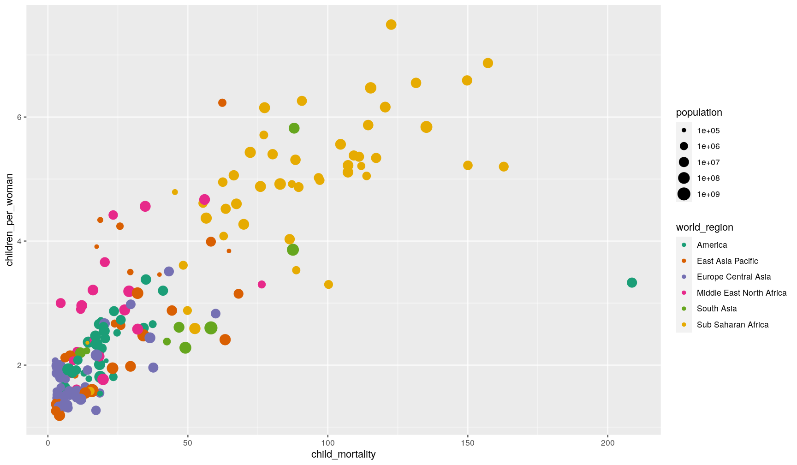

Let's revise what we've done here:

- We've defined `gapminder2010` as the data frame to be used as data
- We used the `geom_point()` to draw points on the graph
- We defined four aesthetics from columns of our data within `aes()`:
  - `x` axis with `child_mortality`
  - `y` axis with `children_per_woman`
  - `colour` with `world_region`
  - `size` with `population`
- We changed our colour scale:
  - Using `scale_colour_brewer()` we accessed one of the palettes provided by the 
    `RColorBrewer` package (check them out
    [here](https://r4ds.had.co.nz/graphics-for-communication.html#fig:brewer))
  - Using `scale_size_continuous()` we transformed the data of this aesthetic to 
    be on a log-scale (this helps with visualisation of very skewed data).

Let's save this graph in an object (you can do this with _ggplot_ graphs). 
This is optional, but often convenient when we want try different customisations 
or when assembling different plots together, as we will see later on. 

~~~
# save our graph within an object called `p1`
p1 <- ggplot(data = gapminder2010, 
             aes(x = child_mortality, y = children_per_woman)) +
  geom_point(aes(colour = world_region, size = population)) +
  scale_colour_brewer(palette = "Dark2") +
  scale_size_continuous(trans = "log10")
~~~
{: .language-r}

To view the plot, you can type it's name on the console:

~~~
p1
~~~
{: .language-r}

## Annotating your graphs

### Labels

We can change the labels of every aesthetic using the `labs()` function, added on to 
the graph. 

For example:

~~~
p1 + 
  labs(x = "Child mortality (per 1000 births)", 
       y = "Children per woman", 
       size = "Population",
       colour = "Region",
       tag = "A", 
       title = "Relationship between child mortality and fertility rate", 
       subtitle = "Based on Gapminder data from 2010",
       caption = "done with ggplot2 in R")
~~~
{: .language-r}

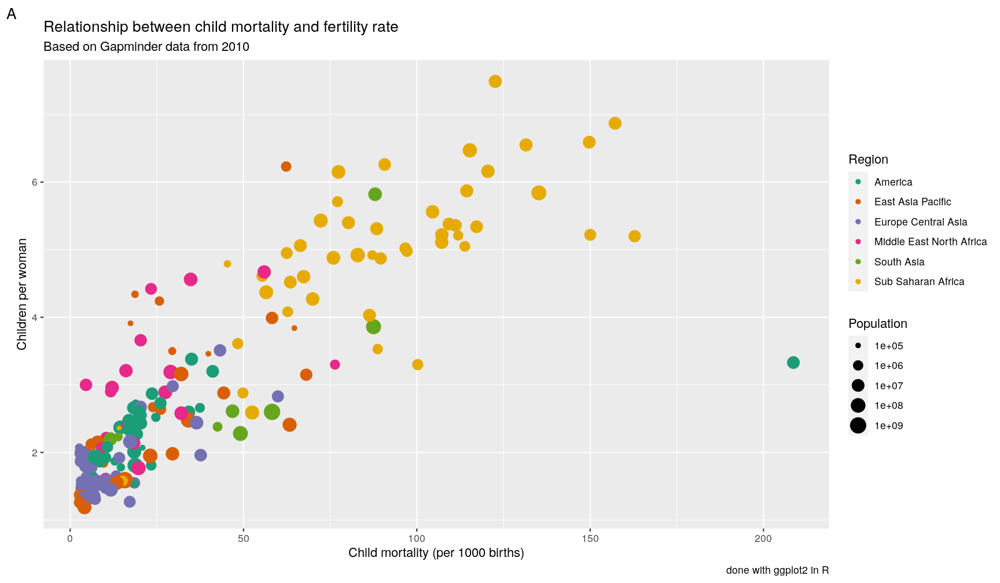

**Note:** the `tag` label is particularly useful for numbering panels in composite figures.
However, we will see an even more convenient way of doing it later on using the `patchwork` package.

### Labelling data points 

You can use the `geom_text()` or `geom_label()` functions to add labels to your data 
points. These two geometries work similarly to `geom_point()`, except they also need 
an aesthetic called `label` to indicate which variable should be used as the text to 
plot. 

For example, let's label each of our countries with their respective name:

~~~
p1 +
  geom_text(aes(label = country))
~~~
{: .language-r}

Wow! That's a bit too much, and not very informative. We can do better, by telling the 
geometry to check for overlaps:

~~~
p1 + 
  geom_text(aes(label = country), check_overlap = TRUE)
~~~
{: .language-r}

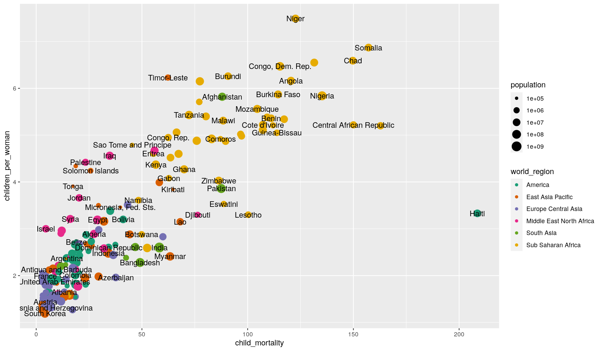

Another strategy to annotate points, is to take advantage of the fact that **geometries 
can take different data as their input**. 

For example, let's create a new table containing the countries with the highest and 
lowest incomes in each world region (we can use a grouped filter for this):

~~~
extreme_income <- gapminder2010 %>% 
  # remove missing values in this variable, and then...
  filter(!is.na(income_per_person)) %>% 
  # group by world region, and then...
  group_by(world_region) %>% 
  # retain cases that have the maximum or minimum income observed, and then...
  filter(income_per_person == max(income_per_person) | income_per_person == min(income_per_person)) %>% 
  # remove grouping information
  ungroup()

# we have 12 rows of data in this filtered table
# makes sense as we expect to have a min and max for each of 6 world regions
extreme_income
~~~
{: .language-r}

~~~
# A tibble: 12 x 7
   country world_region population income_per_pers… child_mortality
   <chr>   <chr>             <dbl>            <dbl>           <dbl>
 1 Afghan… South Asia     29185511             1672           88.0 
 2 Brunei  East Asia P…     388634            80556            9.66
 3 Djibou… Middle East…     840194             2673           76.4 
 4 Equato… Sub Saharan…     943640            33990          112.  
 5 Haiti   America         9949318             1510          209.  
 6 Luxemb… Europe Cent…     507890            91743            2.99
 7 Maldiv… South Asia       365730            11965           13.8 
 8 North … East Asia P…   24548840             1713           29.5 
 9 Qatar   Middle East…    1856329           119974            9   
10 Somalia Sub Saharan…   12043886              614          157.  
11 Tajiki… Europe Cent…    7527397             2138           43.2 
12 United… America       309011469            49479            7.33
# … with 2 more variables: life_expectancy <dbl>, children_per_woman <dbl>
~~~
{: .output}

Now, we add the `geom_text()` like before, but tell it to use this new table as its data:

~~~
p1 + 
  geom_text(data = extreme_income,
            aes(label = country))
~~~
{: .language-r}

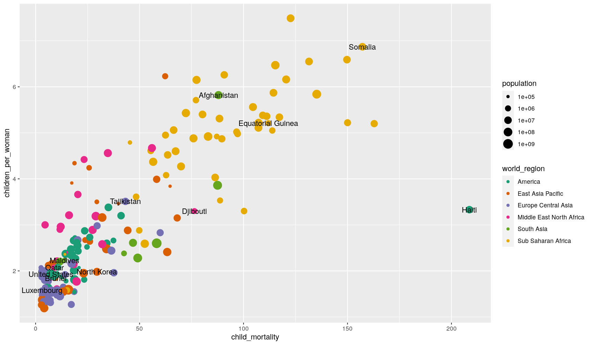

It's still not a perfect visualisation (there's still some overlap and some of the 
labels fall out of the plotting area). For situations like this, it may help 
to use the [`ggrepel` package](https://cran.r-project.org/web/packages/ggrepel/vignettes/ggrepel.html),
with its `geom_text_repel()` and `geom_label_repel()` geometries).

### Free annotations

You can also use the more general `annotate()` function to add any kind of geometry 
to your graph. 

Here's an example with 3 distinct annotations, each using a different geometry:

~~~
p1 + 
  # add rectangle
  annotate(geom = "rect", alpha = 0.3,
           xmin = 50, xmax = 170, ymin = 6, ymax = 8) +
  # add a segment
  annotate(geom = "segment", x = 170, xend = 200, y = 2.5, yend = 3.1) +
  # add some text
  annotate(geom = "text", x = 150, y = 2.3, label = "Clear outlier")
~~~
{: .language-r}

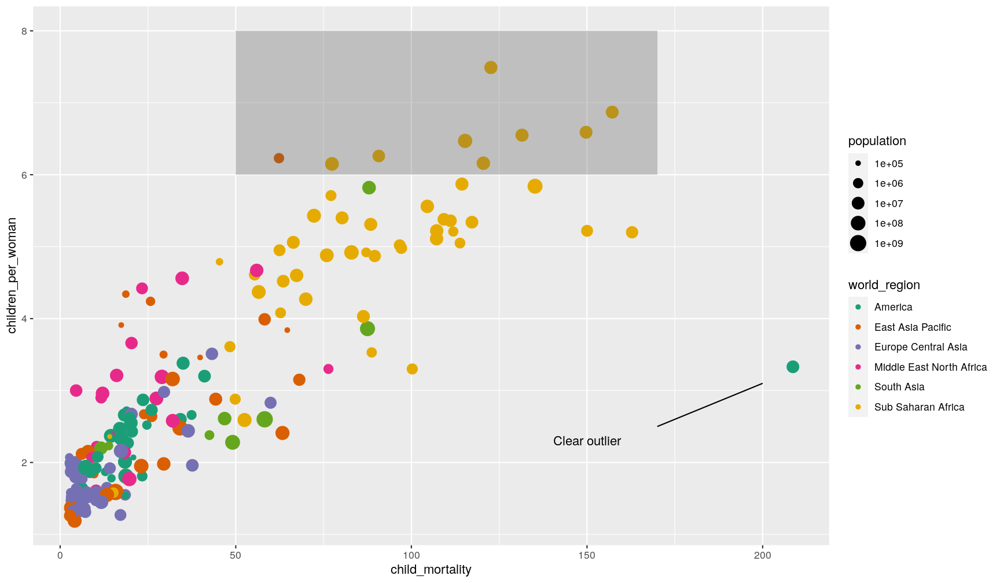

Adding annotations "manually" can be tedious, as it requires a lot of trial-and-error 
to get it just right, but it can be convenient when we want to highlight something 
very specific in our graph.

### Adding horizontal, vertical, sloped and trend lines

You can use `geom_hline()` and `geom_vline()` to add horizontal and vertical lines, 
respectively. These can be useful, for example, to mark thresholds that you want to 
highlight. 

~~~
# Highlight regions with child mortality over/below 50
# and fertility over/below 3 children
p1 +
  geom_hline(yintercept = 3, size = 1) +
  geom_vline(xintercept = 50, size = 1)
~~~
{: .language-r}

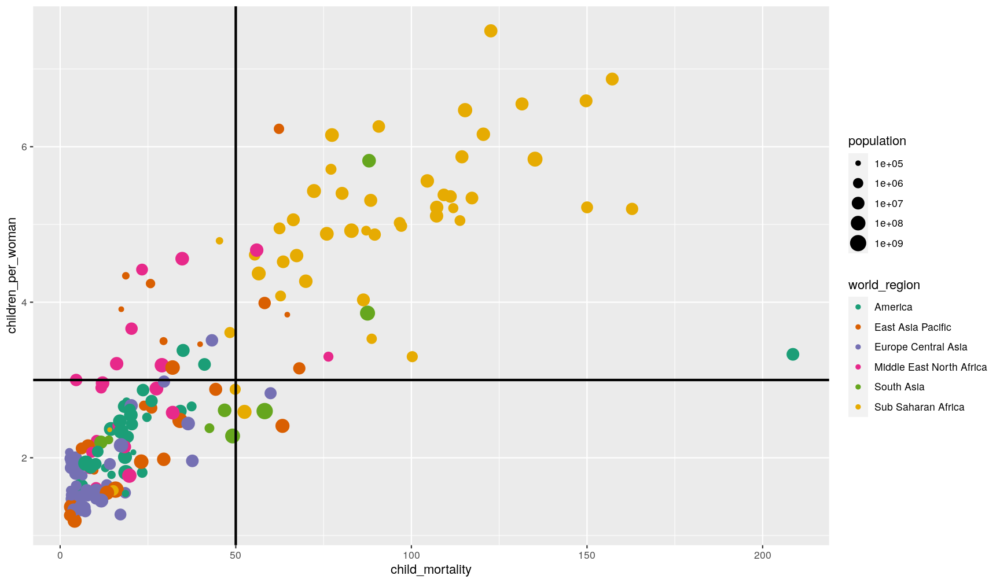

You can also add a sloped line, using `geom_abline()`, which needs information about 
the y-intercept and slope of the line:

~~~
p1 +
  geom_abline(intercept = 0, slope = 0.05, size = 2)
~~~
{: .language-r}

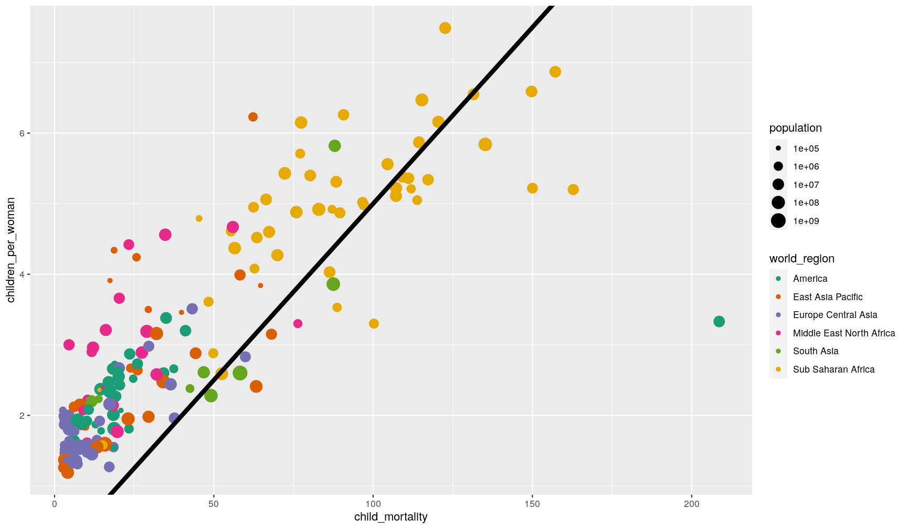

This function is often useful to use when looking at the correlation between two 
variables on the same scale, and thus highlighting x = y (`intercept = 0, slope = 1`,
which is the default of the function).

Finally, you can also use `geom_smooth()` to add a trendline to your data. 

~~~
p1 + geom_smooth()
~~~
{: .language-r}

~~~
`geom_smooth()` using method = 'loess' and formula 'y ~ x'
~~~
{: .output}

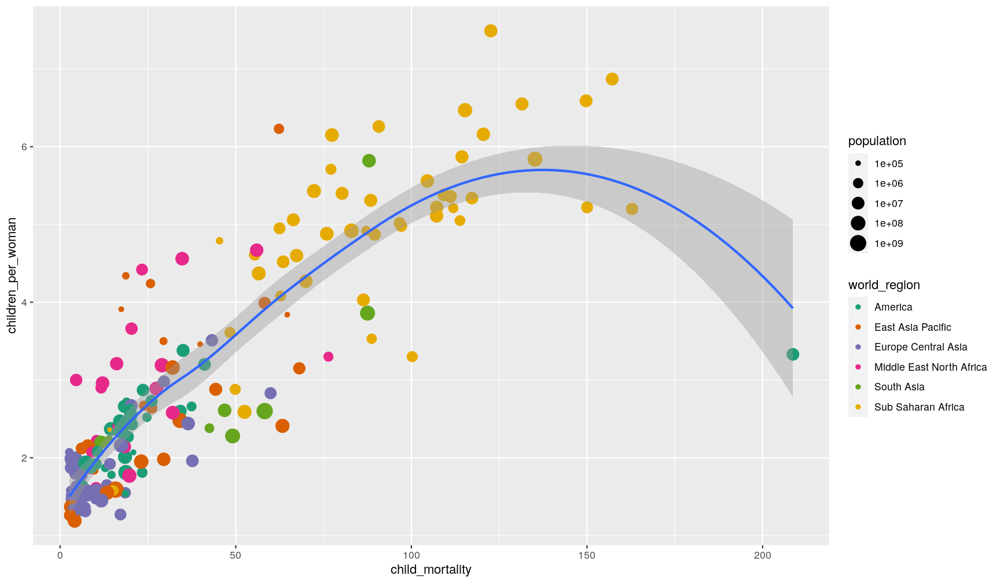

What `geom_smooth()` does is fit a model to the data, and then graphs the mean prediction 
(with error estimate) from that model. By default, the model used is a 
[LOESS regression](https://youtu.be/Vf7oJ6z2LCc). Another common usage is to display 
the result of a [linear regression](https://youtu.be/PaFPbb66DxQ) fit to the data,
in which case we can change the `method` option to "lm" (to use the linear model 
function from R):

~~~
p1 + geom_smooth(method = "lm")
~~~
{: .language-r}

~~~
`geom_smooth()` using formula 'y ~ x'
~~~
{: .output}

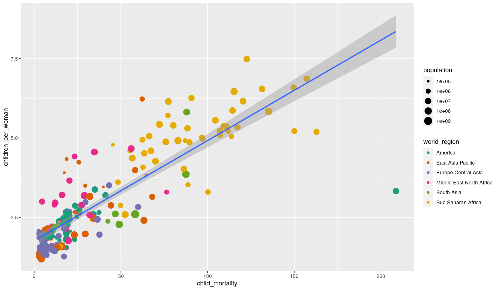

You can also remove the standard error by setting `se = FALSE` inside the function.

## Adjusting axis limits (zooming)

You can use the `coord_cartesian()` function to adjust x and y limits. For example, 
let's highlight the countries with lower fertility and mortality rates
(using the `geom_text()` showing countries extreme incomes from a previous graph):

~~~
p1 + 
  geom_text(data = extreme_income, aes(label = country)) +
  coord_cartesian(xlim = c(0, 25), ylim = c(1, 3))
~~~
{: .language-r}

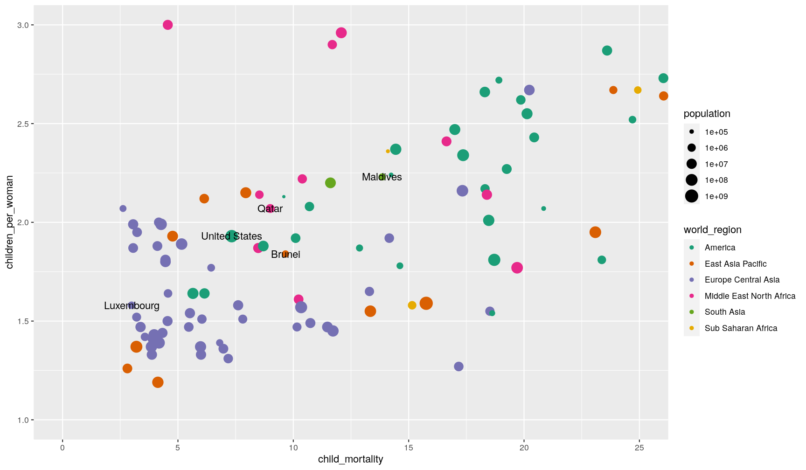

## Themes

You can change the overall look of your graphs by customising the so-called **theme**
used by `ggplot2`. 

### Using built-in themes

`ggplot2` comes with some pre-defined _themes_, which can be accessed using 
the `theme_*` family of functions. For example, let's use `theme_classic()` 
for a cleaner-looking graph:

~~~
p1 + 
  theme_classic()
~~~
{: .language-r}

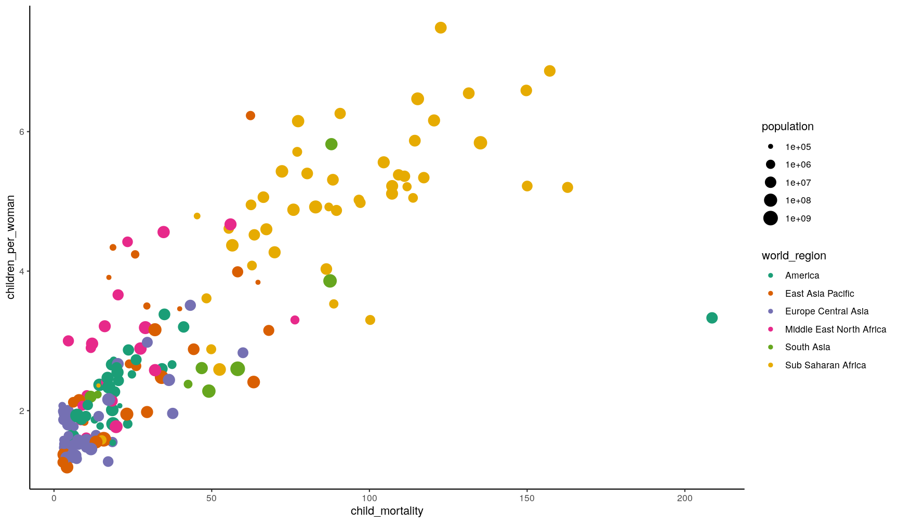

Here's the themes available with `ggplot2`:

There are also packages that provide with other themes. One of them is the 
[`ggthemes` package](https://yutannihilation.github.io/allYourFigureAreBelongToUs/ggthemes/)
(you can install it with `install.packages("ggthemes")`), which also provides 
some aditional colour scales, including colour blind friendly ones.

### Finer customisation with `theme()`

To tune individual elements of the graph, you can use the generic `theme()` function. 
This allows you to change the look of _every single aspect_ of the graph, so we cannot 
cover it all here (look at `?theme` documentation to see how many things you can 
customise!). With this function you can essentially make your own theme.  

Here's some uses of this function that might be useful (try running them yourself!):

~~~
# Change the font size
p1 + theme(text = element_text(size = 16))

# Remove legend
p1 + theme(legend.position = "none") # can also use "top", "bottom", "left"

# Change orientation of the x-axis text
p1 + theme(axis.text.x = element_text(angle = 45, hjust = 1))

# Adjust each grid line
p1 + theme(panel.grid.minor.x = element_blank(),
           panel.grid.major.x = element_blank(),
           panel.grid.minor.y = element_blank(),
           panel.grid.major.y = element_line(colour = "black", linetype = "dotted"))
~~~
{: .language-r}

In most cases, the way to figure out how to do these customisations is to do a web search. 
For example searching for "ggplot2 how to change axis text orientation" returns 
[this stackoverflow answer](https://stackoverflow.com/questions/13297995/changing-font-size-and-direction-of-axes-text-in-ggplot2) 
as one of the top results. 

### Setting up a custom theme

To avoid having to add the `theme` functions to every graph you make, you can set 
the default theme you want to use for your graphs using the `theme_set()` function. 

Usually, it may be a good idea to include this at the top of your script, just after 
you load the libraries:

~~~
# Use the "classic" theme as the basis, 
# with horizontal gridlines for the y axis and a bigger font
theme_set(theme_classic() + 
            theme(panel.grid.major.y = element_line(colour = "black", linetype = "dotted"),
                  text = element_text(size = 16)))
~~~
{: .language-r}

Now, every time you display your graphs, they will use the theme set in this way:

~~~
p1
~~~
{: .language-r}

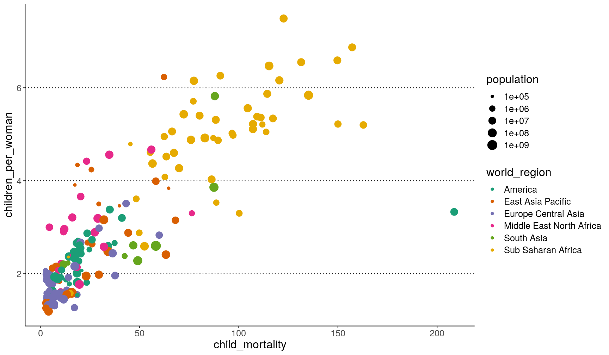

> ## Exercise
> 
> Combining what we've learned so far, try and create the following 3 graphs, 
> which should be saved as `p1`, `p2` and `p3`.
> 
> Hints: 
> 
> - update your `p1` graph by adding an _annotation_ with a rectangle with 
>   `xmin = 0, xmax = 25, ymin = 1, ymax = 3`. Also add labels to the axis and scales.
> - `p2` is identical to `p1`, that it's "zoomed-in" on the area defined by the box in `p1`.
> - for `p3`, make sure the y-axis is on a log scale (using `scale_y_continuous()`); 
>   use the `annotate_logticks()` function to add the ticks on the y-axis; 
>   and use the `theme()` function to ensure the legend doesn't show and that the x-axis 
>   labels are at a 45 degree angle. 
> 
> 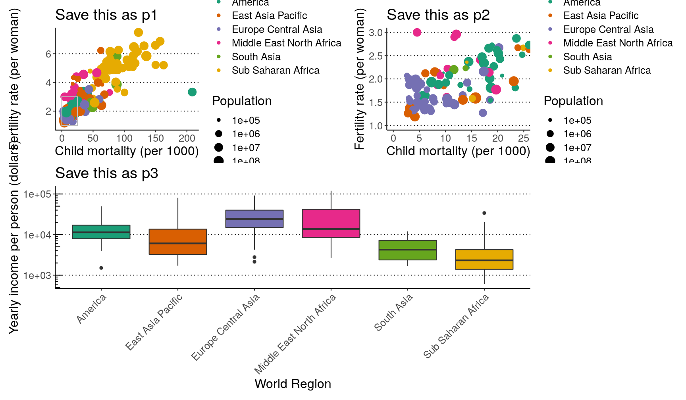
> 
> > ## Answer
> > 
> > Here is the full code for each plot:
> > 
> > 
> > ~~~
> > p1 <- ggplot(data = gapminder2010, 
> >              aes(x = child_mortality, y = children_per_woman)) +
> >   geom_point(aes(colour = world_region, size = population)) +
> >   scale_colour_brewer(palette = "Dark2") +
> >   scale_size_continuous(trans = "log10") +
> >   annotate(geom = "rect", xmin = 0, xmax = 25, ymin = 1, ymax = 3,
> >            colour = "grey", fill = NA) +
> >   labs(x = "Child mortality (per 1000)", y = "Fertility rate (per woman)",
> >        colour = "Income", size = "Population")
> > 
> > p2 <- ggplot(data = gapminder2010, 
> >              aes(x = child_mortality, y = children_per_woman)) +
> >   geom_point(aes(colour = world_region, size = population)) +
> >   scale_colour_brewer(palette = "Dark2") +
> >   scale_size_continuous(trans = "log10") +
> >   coord_cartesian(xlim = c(0, 25), ylim = c(1, 3)) +
> >   labs(x = "Child mortality (per 1000)", y = "Fertility rate (per woman)",
> >        colour = "Income", size = "Population")
> > 
> > p3 <- gapminder2010 %>% 
> >   ggplot(aes(world_region, income_per_person)) +
> >   geom_boxplot(aes(fill = world_region)) +
> >   scale_fill_brewer(palette = "Dark2") +
> >   scale_y_continuous(trans = "log10") +
> >   annotation_logticks(sides = "l") +
> >   labs(x = "World Region", y = "Yearly income per person (dollars)") +
> >   theme(legend.position = "none",
> >         axis.text.x = element_text(angle = 45, hjust = 1))
> > ~~~
> > {: .language-r}
> {: .solution}
{: .challenge}

## Composing plots 

To compose several plots together, we will use the 
[`patchwork` package](https://patchwork.data-imaginist.com/) (check it's documentation, 
which is full of excelent examples of its usage). 

The easiest way to use the package is to first save the individual plots we want to 
assemble in different objects. Let's use the plots we made in our exercise. 

There are different ways in which you can specify how to put graphs together using 
`patchwork`, but the way we're going to use in this lesson uses these two operators:

- `p1 | p2` puts the first plot on the _left_ and the second on the _right_
- `p1 / p2` puts the first plot on the _top_ and the second on the _bottom_

Here is an example using the plots we've made on our exercise:

~~~
# side by side
p1 | p2
~~~
{: .language-r}

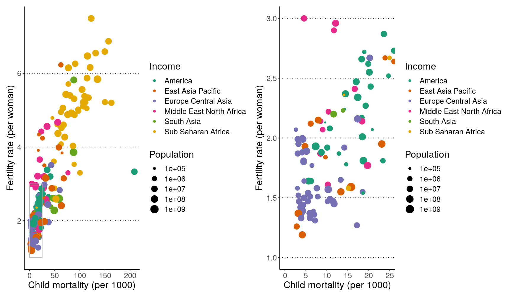

~~~
# top and bottom
p1 / p2
~~~
{: .language-r}

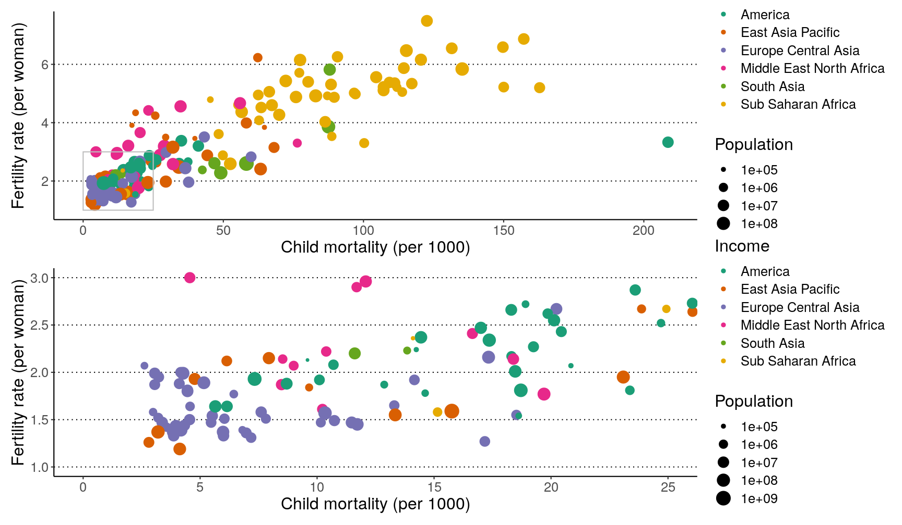

We can combine these two operators for more complex arrangements, by wrapping 
different parts of the grid of plots with `()`. For example:

~~~
# Put p1 and p2 side by side. Then put those on the top and p3 on the bottom
(p1 | p2) / p3
~~~
{: .language-r}

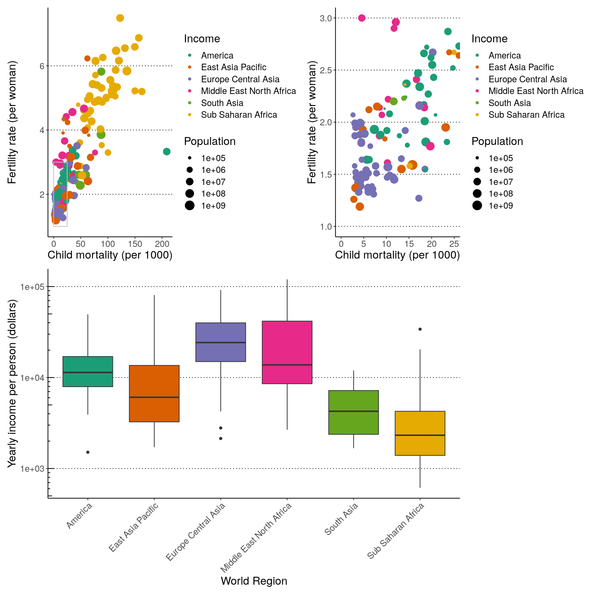

Finally, you can customise these arrangements in several ways using the `plot_layout()` 
function. For example, we can "colect" the legends and define the relative height of 
each panel:

~~~
( (p1 | p2) / p3 ) + 
  plot_layout(guides = "collect", heights = c(2, 1))
~~~
{: .language-r}

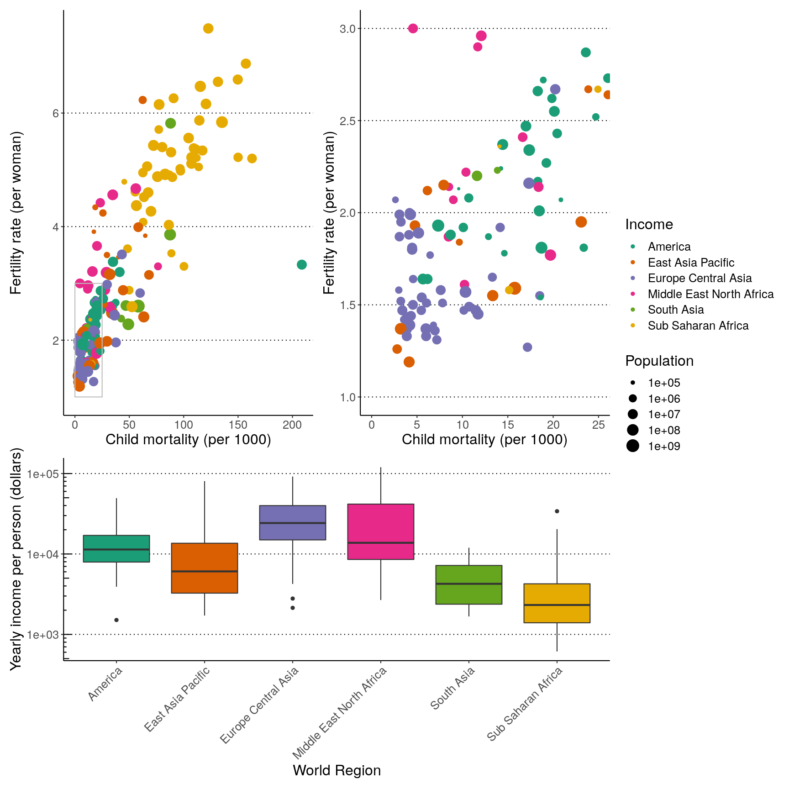

We can use `plot_spacer()` to add an empty space to our graph, which can 
be useful if we want to add something else later on using another program (e.g. 
an image).

For example, let's put a "blank" space where the second plot should be

~~~
( (p1 | plot_spacer()) / p3 ) + 
  plot_layout(guides = "collect", heights = c(2, 1))
~~~
{: .language-r}

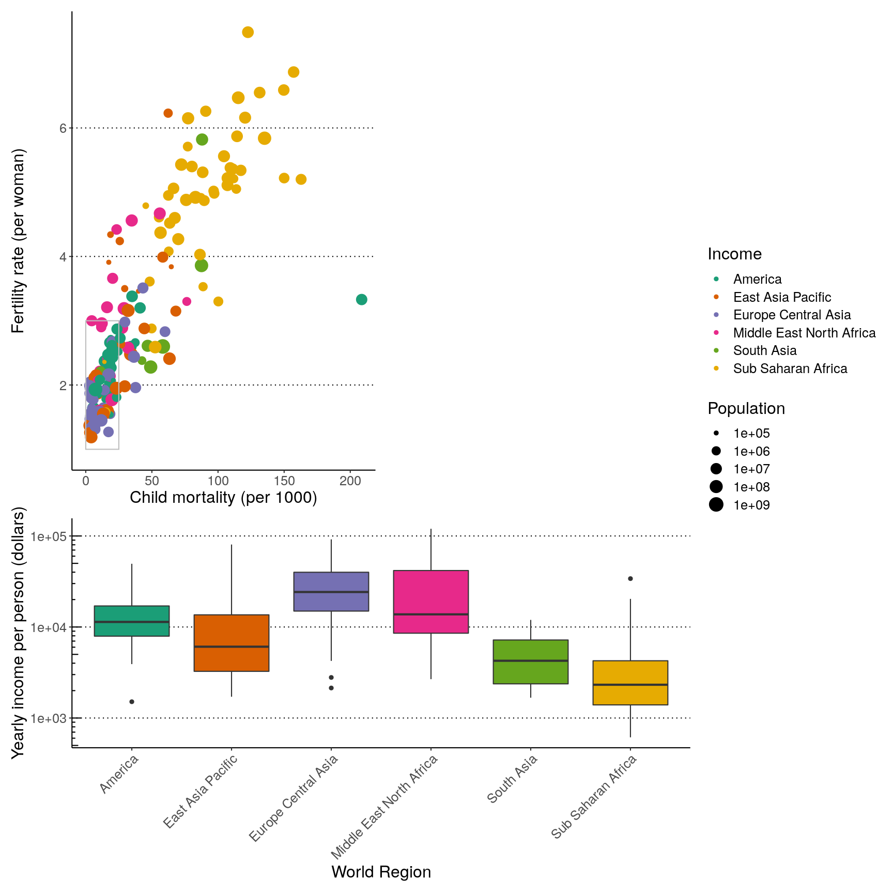

Finally, we can also add annotations, which is very useful to add automatic "tags" 
to each panel:

~~~
( (p1 | p2) / p3 ) + 
  plot_layout(guides = "collect", heights = c(2, 1)) + 
  plot_annotation(tag_levels = "A", 
                  title = "Figure 1")
~~~
{: .language-r}

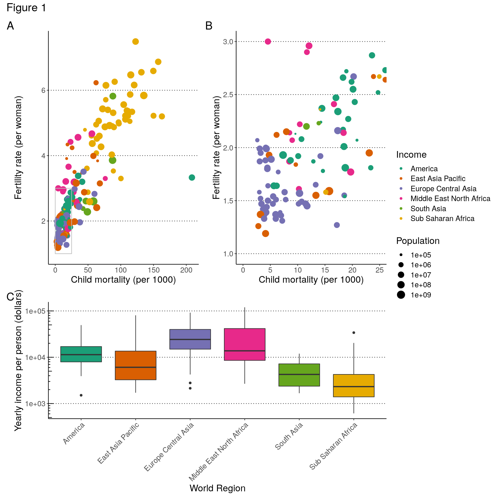

## Saving graphs

We've already covered how to use the `ggsave()` function in the [first ggplot2 lesson]().
To save assembled graphs, you can do a similar thing, but instead of saving a single 
graph, you can save the whole assembly into an object, and then pass that to `ggsave()`:

~~~
# Save the "patch" of graphs into an object called fig1
fig1 <- ( (p1 | p2) / p3 ) + 
  plot_layout(guides = "collect", heights = c(2, 1)) + 
  plot_annotation(tag_levels = "A", 
                  title = "Figure 1")

# save it as PDF using 15cm x 7cm
ggsave(filename = "figures/socio_economic_graphs.pdf",
       plot = fig1, 
       width = 15, 
       height = 7, 
       units = "cm")
~~~
{: .language-r}

## Extra functionality 

**this section is still under development, but you can peek at the code to get 
some new tricks**

### Adding summaries

We've seen how to summarise data using `group_by() %>% summarise()`. However, sometimes 
it is useful to calculate and display a summary metric directly on the graph. 

~~~
gapminder2010 %>% 
  ggplot(aes(world_region, children_per_woman)) +
  geom_violin(scale = "width", fill = "grey") +
  geom_pointrange(stat = "summary", fun.data = "mean_cl_boot") +
  geom_line(stat = "summary", fun.data = "mean_cl_boot", aes(group = 1)) +
  theme(axis.text.x = element_text(angle = 45, hjust = 1)) +
  labs(x = "World Region", y = "Fertility rate")
~~~
{: .language-r}

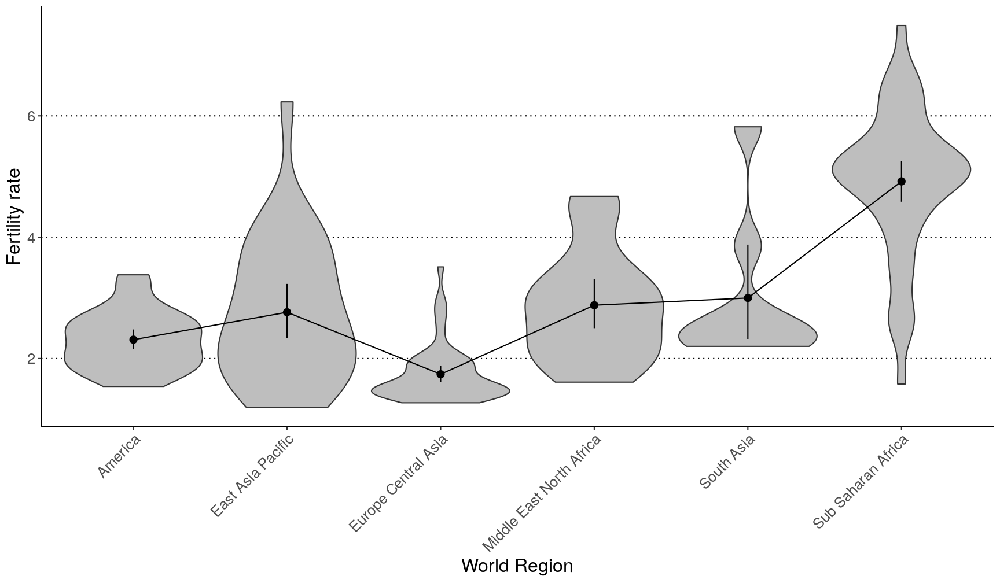

### Using factors to improve visualisation

This is OK, but a bit disorganised:

~~~
gapminder2010 %>% 
  count(world_region) %>% 
  ggplot(aes(x = world_region, y = n)) +
  geom_col() +
  coord_flip()
~~~
{: .language-r}

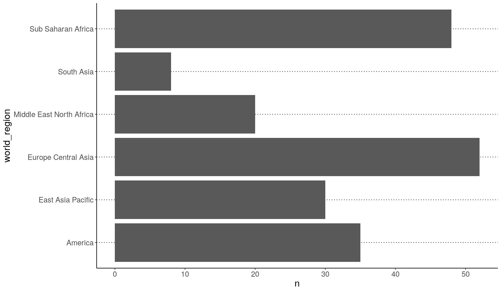

This is much better:

~~~
gapminder2010 %>% 
  count(world_region) %>% 
  # turn world region into an ordered factor
  mutate(world_region = fct_reorder(world_region, n)) %>% 
  ggplot(aes(x = world_region, y = n)) +
  geom_col() +
  coord_flip()
~~~
{: .language-r}

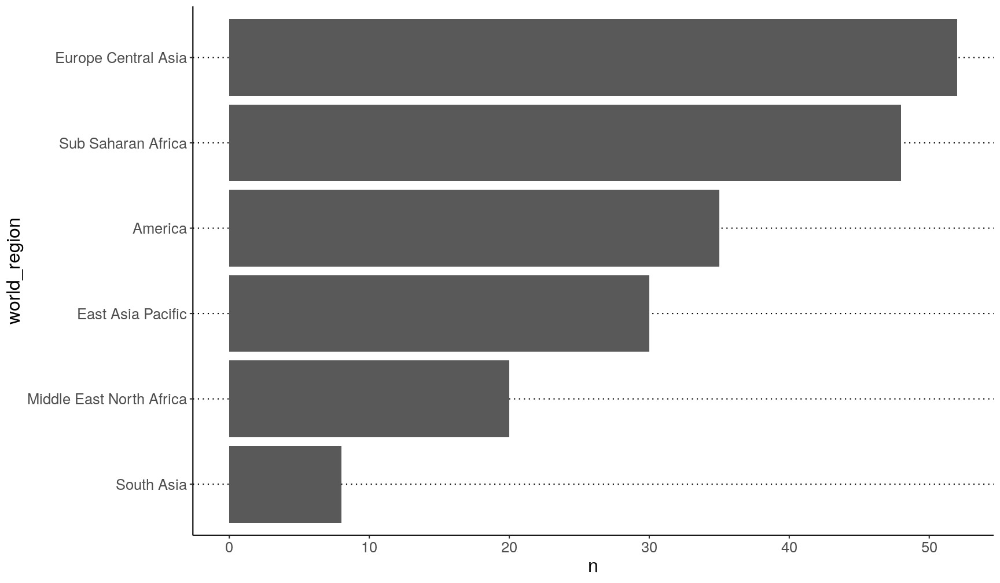


